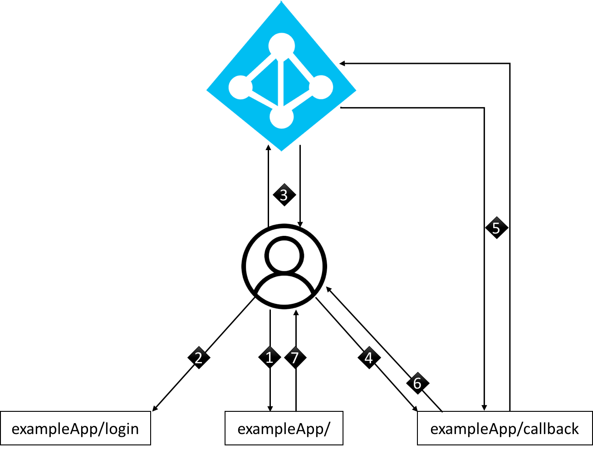

# OAuth flow

## Using Azure Active Directory

Although not strictly a platform service, Azure AD is the preferred way to provide Single Sign On, end user auth{n,z}, and ensure secure service-to-service communication for applications running on the platform. This pattern can also be used to securely traverse firewall perimeter borders without using external security mechanisms, such as `security-gw` or `api-gw`.

_A broad outline of this flow_

* The application sends the user to authenticate with Azure AD
* Azure AD provides an authentication code which the application can use to fetch access tokens for underlying services
* The underlying services validates and grants access based on the access token

There is a [self service repository](https://github.com/navikt/IaC/tree/master/Azure/registerApplication) for registering an Azure AD application \(private repository\). The documentation for the repository can be found below.

## NAV's Azure AD authorization flow

> Authorize access to Azure Active Directory web applications using OAuth 2.0 code grant flow.

### General description of Azure AD Authentication for NAV applications

1. Login request for the application. The application redirects the user to Azure AD with relevant configuration parameters
2. Azure AD provides an `authorization_code` and redirects the client back to the application
3. The client presents its `authorization_code` to the application, which in turn exchanges the code for an `id_token` and a `refresh_token`. The application also validates the token and authenticates the user based on the content of the `id_token`
4. For every service accessed by the application, an `access_token` will be requested for each specific backend using the user's `refresh_token`
5. Azure AD returns an `access_token` based on the content of the request
6. The application adds the `access_token` as an authorization header in the request to the backend
7. The backend service validates the `access_token` using the signing certificate referenced in the `access_token`
8. The signing certificate is returned to the backend application, which verifies that the `access_token`'s signature is valid

## Choice of Authorization flow

There are many authorization flows available in Azure AD and OIDC/OAuth2. The choice of flow determines what AAD will return \(code and/or id\_token\), how it will be returned, and what it can be used for after a successful login. For optimal security [Authorization Code flow](https://docs.microsoft.com/en-us/azure/active-directory/develop/v2-oauth2-auth-code-flow) should be used, and only `authorization_code` \(`responseType = Code`\) should be requested from Azure AD, not `id_token`. This will ensure that neither `id_token`, `access_token` nor `refresh_token` has ever been accessible to the client before they reach the application.

## Authorization Code

`authorization_code` is a short lived token \(default 10 minutes\) whose only use case is when fetching a new `id_token` or `access_token`. Using `responseType = Code`, `authorization_code` will be the only item in the response from Azure AD. The `authorization_code` will be returned as a parameter in the URL redirecting the client back to the application's callback endpoint. In the application's callback endpoint, the application will in turn exchange the `authorization_code` for `access_token` and `refresh_token` as needed. This ensures the only compromisable entity is the `authorization_code`.

## [ID Token](https://docs.microsoft.com/en-us/azure/active-directory/develop/id-tokens)

An `id_token` is only meant to be used for authenticating the user in a frontend application. In practice, this means fetching information about the user, like username, name, email, etc. The `id_token` has a default lifetime of 1 hour and cannot be renewed after expiry unless the user makes a new login to Azure AD. `id_token` is normally not used in an [Authorization Code flow](https://docs.microsoft.com/en-us/azure/active-directory/develop/v2-oauth2-auth-code-flow).

## [Access Token](https://docs.microsoft.com/en-us/azure/active-directory/develop/access-tokens)

An `access_token` is used to grant access to frontend applications or backend services. The `access_token` is issued for a specific resource or service. If the user requires access to a different set of services, a separate `access_token` should be requested; one `access_token` per service.

An `access_token` has a default lifetime of 1 hour, but can be renewed on expiry using the `refresh_token`. This routine is implemented in the application itself.

## [Refresh Token](https://docs.microsoft.com/en-us/azure/active-directory/develop/access-tokens)

The `refresh_token`'s sole purpose is to renew `access_token`s. A `refresh_token` has a default lifetime of 14 days. In contrast to `id_token` and `access_token`, a `refresh_token` can be revoked, voiding its validity.

## Stateless configuration

To achieve stateless logon to an application, the `refresh_token` is written to a session cookie.

The `access_token` is cached in the application itself, and is never presented to or accessible in the browser. If the application has lost its state, the new application instance is able to retrieve a new `access_token` using the `refresh_token` stored in the user's session cookie. This process is transparent to the end-user.

For every backend call, the `access_token`'s validity should be verified. If an `access_token` is about to expire, the application should retrieve a fresh `access_token` using the `refresh_token`.

If a browser session expires, the application should redirect the user to do a new log in on Azure AD. Given that this is the same browser the user originally logged in to Azure AD with, Azure AD will recognize the user and do a transparent login without demanding username and password before redirecting the user back to the application.

## Company user login vs. Consumer user login

#### Consumer user login

To enable consumer user login, it is required to use Azure AD B2C \(business-to-consumer\) and integrate it with [id\_porten](https://eid.difi.no/nb/id-porten) Azure AD B2C supports the [Authorization Code](oauth-flow.md#authorization-code) flow in the same way as Azure AD.

One limitation with Azure AD B2C is that it does not support "on behalf of flow", where a backend service can use the `access_token` to request a new `access_token` to another backend service, on behalf of the user. With Azure AD B2C this only works with the `refresh_token`. An alternative solution is to request and use a service-to-service `access_token` instead.

#### Company user login

An employee in NAV use their e-mail address as username to log in to the application with Azure AD. In some circumstances Multi Factor Authentication will be required. From a company managed Windows 10 computer, the user will have full Single Sign-On to Azure AD integrated applications, no typing of username and password will be necessary.

To achieve proper access management to the applications, they should be directly integrated with Azure AD. Only then, the permissions to the application can be controlled by Azure AD. Azure AD can give access to the applications based on user groups, or even map user groups to specific application roles. This roles will then be found in the token as an attribute. Use of application roles from Azure AD instead of user group mapping inside the application will reduce the size of the `access_token`.

Direct integration with Azure AD is also the only way to utilize Conditional Access in Azure AD. With Conditional Access one can configure certain requirements for access to the application. For instance

* a login request must come from a specific network \(i.e the company network\),
* logins from smartphones can be denied,
* control if and when MFA should be required,
* control if the client should be a company managed client to allow login,
* and so on!

## App registration in Azure AD

For the application to be able to communicate with Azure AD for actions such as logging users in, and requesting `access_token`s, the application must have a valid `client_id` and `client_secret`. This is achieved through [registering the application](https://github.com/navikt/IaC/tree/master/Azure/registerApplication) in Azure AD.

The application's access to other services like the Microsoft Graph API is controlled by permissions on the application registered in Azure AD. This is also where one can control who has permission to log in to the application.

All backend services which need an `access_token` must also be registered with an app in Azure AD. Only `app_id` known by Azure AD will be able to retrieve an `access_token`. The `app_id` will then be in the `aud:` attribute in the `access_token`.

## Security considerations

#### Exposure of the `id_token`

In Authentication flows where the `id_token` is returned as a part of the reply url, the `id_token` will be exposed for theft by malware or other malicious use. To minimize risk for such malicious use, the [Authorization Code](oauth-flow.md#authorization-code) flow is recommended.

#### How hard is it necessarily to protect the `refresh_token`?

The `refresh_token` is long-lived \(normally 14 days\) and can be used to request new `access_token`s, but not without a valid `client_id` and `client_secret`. It can not be used to get access to backend services by itself like an `access_token` can. If it is suspected that the `refresh_token` is compromised, it can be revoked by a user on the team, or an administrator.

On the basis of these characteristics it should be safe to store the `refresh_token` in a session cookie.

The cookie should anyway

* be encrypted with strong encryption keys
* Be tied to relevant domain
* Be created only when https is used

## Application implementation details

> An example application flow based on express using passport.js

1. When the user first attempts to access the application, the request will go through a [`ensureAuthenticated()`](https://github.com/navikt/basta-frontend/blob/master/api/src/controllers/authenticate.js#L46-L64) method, where it can be seen if the user already `isAuthenticated()`.
   * If the user is authenticated,  [`validateRefreshAndGetToken()`](https://github.com/navikt/basta-frontend/blob/master/api/src/controllers/token.js#L51-L95) is called to  ensure the token's validity and expiry date.
   * As this is the first time the user accesses the application, there is no  valid user session and the user is redirected to `/login`
2. /login triggers the [`authenticateAzure()`](https://github.com/navikt/basta-frontend/blob/master/api/src/controllers/authenticate.js#L7-L28) method, where an [authorization URL](https://github.com/navikt/basta-frontend/blob/master/api/src/controllers/authenticate.js#L16) will be built based on the [passport configuration](https://github.com/navikt/basta-frontend/blob/master/api/src/config/passport.js). The user is then redirected to the generated user specific authorization URL on Azure AD.
3. When the user has successfully logged in, Azure AD will redirect the user to the application's `/callback` endpoint with `authorization_code` as a url parameter.
4. The application's /callback endpoint will [`authenticateAzureCallback()`](https://github.com/navikt/basta-frontend/blob/master/api/src/controllers/authenticate.js#L30-L42)
5. passport will fetch the user's `id_token` and `refresh_token` using the provided `authorization_code` from Azure AD.
6. The user's details, along with the `refresh_token`, will be saved in the local user storage. Additionally, the `refresh_token` will be stored in a session cookie.
7. Once passport has finished [`authenticateAzureCallback()`](https://github.com/navikt/basta-frontend/blob/master/api/src/controllers/authenticate.js#L16), the user will be redirected back to `/` \(or to the URI the user was on before login was triggered\), and [`ensureAuthenticated()`](https://github.com/navikt/basta-frontend/blob/master/api/src/controllers/authenticate.js#L46-L64) will recognize that the user `isAuthenticated()` and serve the frontend application.

### NAVs AAD Example App

There is an example app which is easy to test and gain experience with the authorization flow.

[NAVs AAD Example App](https://github.com/navikt/navs-aad-authorization-flow/tree/master/NAVS-AAD-Example-APP)

### Contact

Any questions about this article, solution or example app can be directed to:

* [PIG-sikkerhet](https://github.com/navikt/pig/tree/master/PIG-Sikkerhet)
* \(@pig-sikkerhet on Slack\)

For NAV-employees questions can be asked on Slack in the channel \#aura.

