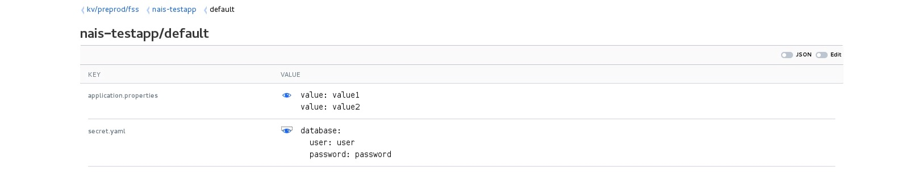

# README

## Vault

Vault by Hashicorp is a tool for managing secrets. To make use of Vault as a secret backend you need to:

1. Give your application access to Vault.
2. Give yourself or your team access to Vault.
3. Provide the the secrets for your application to consume.
4. Enable Vault integration in your NAIS manifest config. 

The first three requirements are covered by a pull request to the following repo: [vault-iac](https://github.com/navikt/vault-iac/tree/master/terraform) Enabling Vault integration in a NAIS application is covered below.

### NAIS manifest config

```text
vault:
  enabled: true
```

This is best illustrated using an example

Given the following secrets in Vault:



The application _**nais-testapp**_ deployed to the _**preprod-fss**_ cluster in _**default**_ namespace will get the secrets injected as files with _**key**_ as filename and _**value**_ as file content:

```text
~ # ls -lt /var/run/secrets/nais.io/vault/
total 8
-rw-r--r--    1 root     root            27 Sep 19 12:19 application.properties
-rw-r--r--    1 root     root            43 Sep 19 12:19 secret.yaml

~ # cat /var/run/secrets/nais.io/vault/application.properties 
value: value1
value: value2

~ # cat /var/run/secrets/nais.io/vault/secret.yaml 
database:
  user: user
  password: password
```

### Multiple KV stores

If you need to inject secrets from an additional KV store, you can do so by specifying the `paths` field.

Note that when you modify this field, the default behavior of mounting `/kv/environment/zone/application/namespace` to `/var/run/secrets/nais.io/vault` is no longer active, and if you need these secrets you need to specify them yourself.

```text
vault:
  enabled: true
  paths:
    - kvPath: /secret/with/custom/path
      mountPath: /path/on/filesystem
    - kvPath: /kv/preprod/fss/nais-testapp/default  # default behavior
      mountPath: /var/run/secrets/nais.io/vault     # default behavior
```

### Java apps

Base your Docker image on `navikt/java` and the secrets from Vault will by default be made available for you as environment variables.

When migrating from `naisd` you can name the Vault keys as they were in named in Fasit so that your application do not need to be rewritten in order to use the Vault secrets.

## Native Kubernetes Secrets \(only available in GCP\)

When running in GCP, you also have the option of using [Kubernetes `Secrets`](https://kubernetes.io/docs/concepts/configuration/secret) directly instead of \(or in combination with\) Vault.

To get started using this, you simply [create your secret\(s\)](https://kubernetes.io/docs/concepts/configuration/secret/#creating-your-own-secrets). This can be either key-value pairs or files and can be exposed to the application as environment variables or files.

### Example

Create your secret

```text
$ kubectl create secret generic my-secret --from-literal=key1=supersecret
secret/my-secret created
```

Refer to `my-secret` in `nais.yaml`

```text
spec:
  secrets:
    - name: my-secret
  ...
```

And you're done. When your application is running, the environment variable `key1` will have the value `supersecret`.

See the official [Kubernetes documentation](https://kubernetes.io/docs/concepts/configuration/secret) or by running `kubectl create secret generic --help` for more details on creating and managing your secrets.

