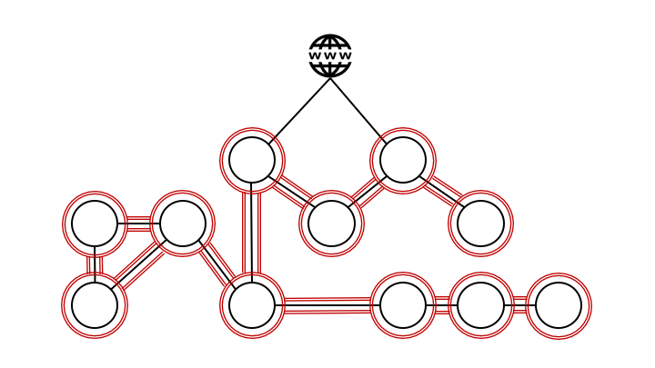

# Platform security

## TL;DR

Adding the configuration parameters below to your `Application` will enable NetworkPolicies and Istio RBAC for your application  
_\(note: Only available in GKE so far\)_

```text
...
metadata:
  name: d
  namespace: default
spec: 
  ...
  accessPolicy:
    inbound:
      - application: a
        namespace: default # optional, defaults to 'metadata.namespace'
      - application: b
      - application: c
        namespace: othernamespace
```

Securing applications by placing them in a defined perimiter behind a firewall is a common approach. However, relying on an external perimiter implies trusting everything behind the perimiter, and this is an unsafe assumption. If one application behind the firewall has been compromised, the other applications are left vulnerable as their security relies on firewalls stopping attackers from entering the perimiter. 

## Network policies

The use of network policies allow us to define a firewall perimiter around each pod, where we can explicitly express which pods are allowed to communicate with eachother.  
The platform takes care of implementing and maintaining these policies dynamically using [Calico](https://www.projectcalico.org/calico-network-policy-comes-to-kubernetes/) 

## Istio RBAC

Even though we've got control over which pods are allowed to communicate on the network layer, we still need to ensure that the communication between the pods is safe. Using Istio RBAC, every pod can prove their identity cryptographically and data can be transported with [mTLS](https://istio.io/docs/tasks/security/mutual-tls/)  


## Pod Security Policy

