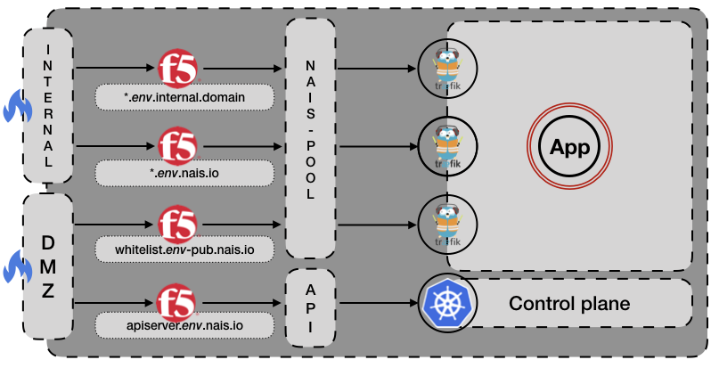

# Traffic routing

## Public end-user traffic routing

Public facing applications are named *appname*.*clustername*.nais.io by default, and a wildcard DNS entry will make sure this hostname resolves to the cloud provider's load-balancer.   
(_Additional names can be added as a configuration parameter in the `Application` definition._)   
The loadbalancer will forward traffic to the cluster's public Istio [ingress gateway](https://istio.io/docs/tasks/traffic-management/ingress/), who in turn sends traffic to the application.

## Private end-user traffic routing
The same application will also receive a name and and ingress that is only accessible from a private network *appname*.*clustername*__-int__.nais.io.
The difference from the public facing route, is that the application's internal URI's are exposed.
Internal URI's can be defined in the `Application` definition and is enforced by an Istio [virtual service](https://istio.io/docs/reference/config/istio.networking.v1alpha3/) 

## External to internal service routing
If an application running in a public cloud environment needs to communicate with an on-premise application, a configuration parameter needs to be added to the `Application` definition.
This will create an Istio [destination rule](https://istio.io/docs/reference/config/istio.networking.v1alpha3/#DestinationRule) that allows egress traffic from the cluster.
Once traffic has been allowed out of the cluster, it will traverse a VPN connection terminated on-premise.
The only services available directly on the VPN are those who have implemented the [Azure AD token authorization](/content/authnz/) flow.

On-prem applications that haven't yet implemented token authentication will only be available through the use of either API-gateway or service-gateway.

## Public end-user traffic to on-prem cluster
When routing end-user traffic to on-prem cluster, applications will be presented on _default-sub-domain_.nav.no/_appname_, and the default policy is to forward traffic to the AM policy enforcement point.
If the path match `not-enforced-urls` or has a valid token, the traffic will be forwarded to the internal loadbalancer, which in turn directs the traffic to the cluster's ingress controller.

All default routing is automatically configured for the application, but AM configuration is required: [AM configuration](/content/authnz/am.md)

## Internal traffic cluster flow
For our internal cluster we have four separate loadbalancers in front.
Two of them are only exposed on our internal network, and all applications with an ingress on the cluster will be exposed on both _appname.env_._internal.domain and _appname.env_.nais.io.
The two remaining loadbalancers are exposed to external networks.   
One of them is a dedicated virtual server in front of the API-server, the other is for applications that are secured using [Azure AD token authorization](/content/authnz/) 

