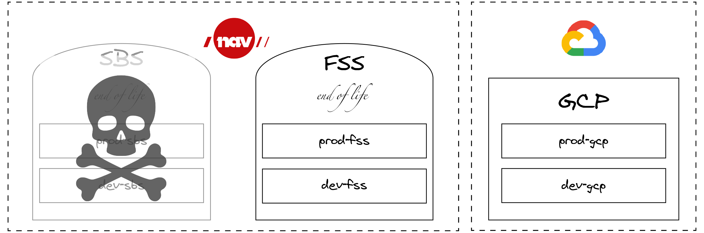

# Introduction

### A top level overview of NAIS describing the larger moving parts and concepts.
**Warning:** _Readers may experience both tounge & cheek in this document_  
_(5 minute read) [(or you can fast forward to the nuts & bolts)](basics/access.md) ⏩_ 

## Why NAIS exists

When you have a large development organisation, providing the developers with turn-key solutions for their most common needs is a good investment.

### "Swiss Army Knife"
At the core of NAIS lies [*Kubernetes*](https://kubernetes.io), which can be described as a Swiss army knife of tools. Each of these tools comes with its own set of instructions and in sum this adds up and makes for a bit of a mess in terms of choices and considerations. 

Our goal is to lift this burden from our developers, and in order to do so we've condensed the essential parts into a single configuration file that we use to generate all the underlying Kubernetes resources. In nais terms this file is most commonly referred to as [nais.yaml](https://doc.nais.io/nais-application/example/)

The services included are (but not limited to) logging, metrics, alerts, deployment, operators and a runtime environment (across on-premise and Google Cloud Platform).

To make this all happen we leverage open source projects best suited to our needs and provide them with usable abstractions, sane defaults and the required security hardening.

## Clusters
In ye olde days of yore, NAVs security model was based on network segmentation and zones. (And if we are being honest this still holds true for parts of our operation). Our goal (and strategy) however is to move everything to "Public Cloud". So anything described as on-prem is scheduled to be taken out behind the barn at some point and new apps, services or products are destined to exist in GCP (for now). 

### FSS

Many of our older systems, and systems with a high degree of sensitive content were placed in a dedicated zone with very strict restrictions: Fagsystemsone (FSS).
Connectivity to and from this zone is very limited - no connectivity to the internet, inbound connections have to go through security gateways. However - connectivity inside this zone is not restricted in any way, shape or form. Everyone can connect with everyone else - like a true hippie community. (As many of these applications were written in the seventies, it sort of makes sense)

### SBS

There came a day when NAV discovered this thing called "the Internet", and that this was something we could use to provide Norwegian citizens with services directly.
This created the demand for a separate zone, as allowing traffic from the internet directly in to our hippie commune called FSS seemed unwise.
Thus Selvbetjeningssonen (SBS) was born.
SBS is less restricted than FSS and applications have access to the internet (almost) - and can be exposed to the internet as well.
However - since most of NAVs data reside in FSS, most applications in SBS rely on data from FSS to be able to do anything meaningful.
In order to get the data they need they have to jump through several burning rings of fire, pray to the almighty DataPower-gods and perform several ancient rites and rituals.

### NAIS on-premises

When we started building NAIS, we built it to exist in this world, and have separate clusters in each of these two zones.
We further divided our clusters in to development and production clusters to maintain a healthy separation.
Thus the four clusters we've got on-premises are: `dev-fss`, `dev-sbs`, `prod-fss` and `prod-sbs` (and a fifth called nais-ci, but that's just for us to test stuff)

### NAIS GCP

Luckily the world has moved on from zones and segmentation.
When we built NAIS in GCP we wanted the applications to be able to communicate without jumping over hurdles and figured we'd adopt a [zero-trust-model](https://doc.nais.io/appendix/zero-trust/), where applications specify with whom they want to communicate, and who is allowed to communicate with them in their application manifest.
And so the two GCP clusters `dev-gcp` and `prod-gcp` were born.
There are a couple of additional clusters in GCP as well, though - `ci-gcp` for us to test changes and `labs-gcp` where the teams can experiment.

## Teams

NAIS is for the development teams.

We believe that a team should be able to take full responsibility for what they build - in the entirety of its lifecycle. 
This creates better software and happier teams.

To achieve this, we ensure that each team has their own space where they can experiment, develop and host the stuff they build.
Here they have the full set of permissions, and are only limited by their own imagination.

Details about the technology to logically group users, their access and permissions is described [here](basics/teams).

## Access from laptop

In the extended NAIS universe we also have a component called naisdevice. This is a cross plattform mechanism that provices access to NAIS services. The product adheres to the same principles as are decribed [here](https://honest.security) and takes aim at securing our operations without getting in our devs way. 

## Contact the NAIS team
The team can be found on [Slack](https://nav-it.slack.com/messages/C5KUST8N6/).
Also, follow us on Twitter [@nais\_io](https://twitter.com/nais_io)!

