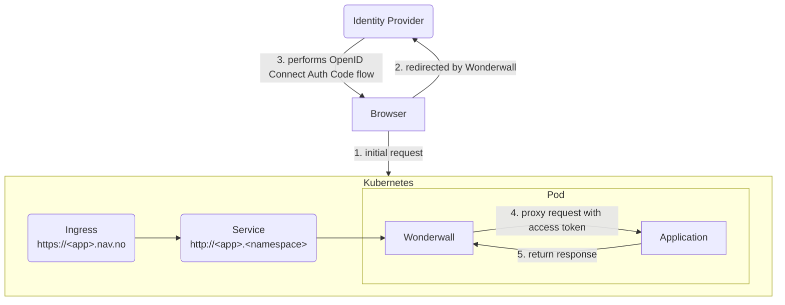
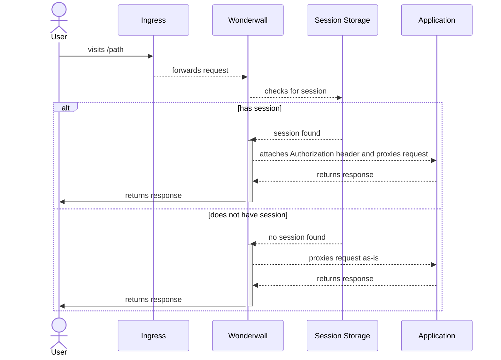

# Wonderwall (sidecar for authentication)

[Wonderwall](https://github.com/nais/wonderwall) is an application that implements an OpenID Connect (OIDC)
[Relying Party (client)](../security/auth/concepts/actors.md#client) in a way that makes it easy to plug into Kubernetes
as a _sidecar_.

!!! abstract

    Wonderwall functions as a reverse proxy that intercepts and proxies requests to your application. It provides endpoints
    to perform logins and logouts for end users, along with session management - so that your application does not have to.

    All HTTP requests to the application will be intercepted by Wonderwall, which is attached to your application's pod as a
    sidecar.

    If the user does _not_ have a valid local session with the sidecar, the request will be proxied as-is without modifications to the application container.

    In order to obtain a local session, the user must be redirected to the `/oauth2/login` endpoint, which performs the
    [OpenID Connect Authorization Code Flow](../security/auth/concepts/protocols.md#openid-connect).

    If the user successfully completed the login flow, the sidecar creates and stores a session. A corresponding session 
    cookie is created and set before finally redirecting user agent to the application. All requests that 
    are forwarded to the application container will now contain an `Authorization` header with the user's `access_token`:

    ```
    Authorization: Bearer <JWT_ACCESS_TOKEN>
    ```

    **Your application is [responsible](#3-token-validation) for validating the `access_token`.**

!!! warning "Availability"
    This feature is only available in **dev-gcp** and **prod-gcp**.

## Overview

The diagram below shows the overall architecture of an application when using Wonderwall as a sidecar:



The sequence diagram below shows the default behavior of the sidecar:



Generally speaking, the recommended approach when using the Wonderwall sidecar is to put it in front of 
your backend-for-frontend server that serves your frontend. Otherwise, you might run into issues with the cookie 
configuration and allowed redirects - these are both effectively restricted to only match the domain and path for your 
application's ingress.

## Endpoints

The sidecar provides these endpoints under your application's [ingress](../nais-application/application.md#ingresses):

| Path                           | Description                                                                | Note              |
|--------------------------------|----------------------------------------------------------------------------|-------------------|
| `GET /oauth2/login`            | Initiates the OpenID Connect Authorization Code flow                       |                   |
| `GET /oauth2/logout`           | Performs local logout and redirects the user to global/single-logout       |                   |
| `GET /oauth2/logout/local`     | Performs local logout only                                                 | Only for Azure AD |
| `GET /oauth2/session`          | Returns the current user's session metadata                                |                   |
| `POST /oauth2/session/refresh` | Refreshes the tokens and returns the session metadata for the current user |                   |

## Usage

### Overview

The contract for usage of the sidecar is fairly simple. 

For any endpoint that requires authentication:

1. Validate the `Authorization` header as specified in the [application guidelines](#3-token-validation).
2. If the `Authorization` header is missing, redirect the user to the [login endpoint](#1-initiate-login).
3. If the JWT `access_token` in the `Authorization` header is invalid or expired, redirect the user to
  the [login endpoint](#1-initiate-login).
4. If you need to log out a user, redirect the user to the [logout endpoint](#2-initiate-logout).

### Providers

Refer to the specific identity provider documentation for additional details that apply to the given provider:

- [Azure AD](../security/auth/azure-ad/sidecar.md)
- [ID-porten](../security/auth/idporten.md)

---

### 1. Initiate Login

When you must authenticate a user, redirect to the user to:

```
https://<ingress>/oauth2/login
```

The user will be sent to the [identity provider] for authentication and then back to the sidecar's callback endpoint.

#### 1.1. Redirect after Login

After the callback is handled and the user is successfully authenticated, the user will be redirected in this priority:

1. The URL or absolute path set in the query parameter `redirect` in the initial login request, e.g:
```
https://<ingress>/oauth2/login?redirect=/some/path
```
If you include query parameters, ensure that they are URL encoded. 
The host and scheme (if provided) are stripped from the redirect URL, which effectively only allows redirects to paths
within your own ingress.

2. The root context path for your application's ingress. E.g. `/` for `https://<app>.nav.no`, or `/path` for `https://nav.no/path`.

#### 1.2. Autologin

If enabled, the `autoLogin` option will configure Wonderwall to intercept all HTTP `GET` requests.

If the user does not have a valid session, the request will short-circuit and the response code will be set to `302 Found` with the `Location` header set to the login endpoint.

Example configuration:

=== "ID-porten"

    ```yaml hl_lines="4"
    spec:
      idporten:
        sidecar:
          autoLogin: true
    ```
=== "Azure AD"

    ```yaml hl_lines="4"
    spec:
      azure:
        sidecar:
          autoLogin: true
    ```

!!! danger "Auto-login does not guarantee that requests are authenticated"

    You should always check the `Authorization` header for a token and validate the token within as specified in [the application guidelines](#3-token-validation).
    This is especially important as auto-logins will **only trigger for `GET` requests**. Requests such as `POST` or `PUT` are ignored by auto-login.

    To ensure smooth end-user experiences whenever their session expires, your application must thus actively validate and properly handle such requests.
    The server-side application may respond with a `401 Unauthorized` to allow frontends to cache or store payloads before doing a client-side redirect to the login endpoint.

!!! warning "Auto-login and client-side requests"

    Using auto-login with client-side requests (e.g. `fetch`, `XMLHttpRequest`/`XHR`, `AJAX`) is generally **not** recommended.

    If the request is performed with an expired or unauthenticated session, the browser will receive a `302 Found` response with a `Location` header set to the login endpoint.
    
    You want the browser to _navigate_ to the login endpoint.
    Instead, client-side requests will usually _follow_ the redirect to the URL found in the `Location` header; a _new request_ is thus performed in an attempt to retrieve the original requested resource.
    This ends with a CORS error as request is redirected to an external identity provider.

    Common strategies for handling client-side requests. Either:

    1. Exclude paths that are used for client-side requests from auto-login, or
        - See [autologin exclusions](#121-autologin-exclusions) below
    2. Disable auto-login entirely, or
        - Respond with a `401 Unauthorized` from the server
        - Implement client-side logic to _navigate_ to the login endpoint (e.g. using `window.location.href` or `location.assign()`)
    3. Manually handle the `302 Found` response at the client-side
        - If the `Location` header is set to the login endpoint, _navigate_ the browser to the new page (e.g. using `window.location.href` or `location.assign()`)
        - Otherwise, follow the redirect to the URL found in the `Location` header

##### 1.2.1. Autologin Exclusions

Autologin will by default match all paths for your application's ingresses, except the following:

- `/oauth2/*`
- [`spec.prometheus.path`](../nais-application/application.md#prometheuspath), if defined
- [`spec.liveness.path`](../nais-application/application.md#livenesspath), if defined
- [`spec.readiness.path`](../nais-application/application.md#readinesspath), if defined

You can also define additional paths or patterns to be excluded: 

=== "ID-porten"

    ```yaml hl_lines="5-8"
    spec:
      idporten:
        sidecar:
          autoLogin: true
          autoLoginIgnorePaths:
            - /internal/*
            - /some/public/path
            - /static/stylesheet.css
    ```

=== "Azure AD"

    ```yaml hl_lines="5-8"
    spec:
      azure:
        sidecar:
          autoLogin: true
          autoLoginIgnorePaths:
            - /internal/*
            - /some/public/path
            - /static/stylesheet.css
    ```

The paths must be absolute paths. The match patterns use glob-style matching.

??? example "Example match patterns"

    - `/allowed` or `/allowed/`
        - Trailing slashes in paths and patterns are effectively ignored during matching.
        - ✅ matches:
            - `/allowed`
            - `/allowed/`
        - ❌ does not match:
            - `/allowed/nope`
            - `/allowed/nope/`
    - `/public/*`
        - A single asterisk after a path means any subpath _directly_ below the path, excluding itself and any nested paths.
        - ✅ matches:
            - `/public/a`
        - ❌ does not match:
            - `/public`
            - `/public/a/b`
    - `/public/**`
        - Double asterisks means any subpath below the path, including itself and any nested paths.
        - ✅ matches:
            - `/public`
            - `/public/a`
            - `/public/a/b`
        - ❌ does not match:
            - `/not/public`
            - `/not/public/a`
    - `/any*`
        - ✅ matches:
            - `/any`
            - `/anything`
            - `/anywho`
        - ❌ does not match:
            - `/any/thing`
            - `/anywho/mst/ve`
    - `/a/*/*`
        - ✅ matches:
            - `/a/b/c`
            - `/a/bee/cee`
        - ❌ does not match:
            - `/a`
            - `/a/b`
            - `/a/b/c/d`
    - `/static/**/*.js`
        - ✅ matches:
            - `/static/bundle.js`
            - `/static/min/bundle.js`
            - `/static/vendor/min/bundle.js`
        - ❌ does not match:
            - `/static`
            - `/static/some.css`
            - `/static/min`
            - `/static/min/some.css`
            - `/static/vendor/min/some.css`

---

### 2. Initiate Logout

When you must log a user out, **redirect** to the user to:

```
https://<ingress>/oauth2/logout
```

The user's session with the sidecar will be cleared, and the user will be redirected to the identity provider for 
global/single-logout, if logged in with SSO (single sign-on) at the identity provider.

#### 2.1 Local Logout

!!! info "Limited Availability"
    This feature is only available for [Azure AD](../security/auth/azure-ad/sidecar.md)

If you only want to perform a _local logout_ for the user, perform a `GET` request from the user's browser / user agent:

```
https://<ingress>/oauth2/logout/local
```

This will only clear the user's local session (i.e. remove the cookies) with the sidecar, without performing global logout at the identity provider. 
The endpoint responds with a HTTP 204 after successful logout. It will **not** respond with a redirect.

A local logout is useful for scenarios where users frequently switch between multiple accounts. 
This means that they do not have to re-enter their credentials (e.g. username, password, 2FA) between each local logout, as they still have an SSO-session logged in with the identity provider.
If the user is using a shared device with other users, only performing a local logout is thus a security risk.

**Ensure you understand the difference in intentions between the two logout endpoints. If you're unsure, use `/oauth2/logout`.**

---

### 3. Token Validation

!!! danger "Secure your endpoints"
    **Your application is responsible for securing its own endpoints.**
    
    - If a request does not contain an `Authorization` header, the request should be considered unauthenticated and access should be denied.
    - If a request has an `Authorization` header that contains a [JWT], the token must be validated before access is granted.

Your application should [validate the claims and signature](../security/auth/concepts/tokens.md#token-validation)
for the JWT Bearer `access_token` attached by the sidecar in the `Authorization` header.

Each provider may have some differences in claims and values; see their specific page for details:

- [Azure AD](../security/auth/azure-ad/sidecar.md#token-validation)
- [ID-porten](../security/auth/idporten.md#token-validation)

---

### 4. Resource Requirements

The sidecar container is set up with some default [resource requirements](https://kubernetes.io/docs/concepts/configuration/manage-resources-containers/). 
This can be customized to your needs. Defaults shown below:

=== "ID-porten"
    ```yaml hl_lines="4-10"
    spec:
      idporten:
        sidecar:
          resources:
            limits:
              cpu: 2
              memory: 256Mi
            requests:
              cpu: 20m
              memory: 32Mi
    ```
=== "Azure AD"
    ```yaml hl_lines="4-10"
    spec:
      azure:
        sidecar:
          resources:
            limits:
              cpu: 2
              memory: 256Mi
            requests:
              cpu: 20m
              memory: 32Mi
    ```

### 5. Sessions

Sessions are stored server-side; we only store a session identifier at the end-user's user agent.

The session lifetime depends on the identity provider:

| Identity Provider | Maximum Lifetime            | Inactivity Timeout                | Auto Refresh |
|-------------------|-----------------------------|-----------------------------------|--------------|
| Azure AD          | 10 hours                    | ❌ No                              | ✅ Yes        |
| ID-porten         | 6 hours (subject to change) | ✅ Yes, 1 hour (subject to change) | ❌ No         |

A session can be marked as _inactive_ before it _expires_ (reaches the maximum lifetime).
This happens if the time since the last [_refresh_](#51-refresh-tokens) exceeds the given _inactivity timeout_.

After the session has expired or it is marked as inactive, the user is essentially unauthenticated and must be redirected to the `/oauth2/login` endpoint again.

`GET /oauth2/session` is an endpoint that returns metadata about the user's session as a JSON object.

This endpoint will respond with the following HTTP status codes on errors:

- `HTTP 401 Unauthorized` - no session cookie or matching session found, or maximum lifetime reached
- `HTTP 500 Internal Server Error` - the session store is unavailable, or Wonderwall wasn't able to process the request

Otherwise, an `HTTP 200 OK` is returned with the metadata with the `application/json` as the `Content-Type`.

Note that this endpoint will still return `HTTP 200 OK` for _inactive_ sessions, even though the session is not expired.
This allows applications to display errors before redirecting the user to login on timeouts.
This also means that you should not use the HTTP response status codes alone as an indication of whether the user is authenticated or not.

???+ example

    Request:

    ```
    GET /oauth2/session
    ```
    
    Response:
    
    ```
    HTTP/2 200 OK
    Content-Type: application/json
    ```

    ```json
    {
      "session": {
        "created_at": "2022-08-31T06:58:38.724717899Z", 
        "ends_at": "2022-08-31T16:58:38.724717899Z",
        "timeout_at": "0001-01-01T00:00:00Z",
        "ends_in_seconds": 14658,
        "active": true,
        "timeout_in_seconds": -1
      },
      "tokens": {
        "expire_at": "2022-08-31T14:03:47.318251953Z",
        "refreshed_at": "2022-08-31T12:53:58.318251953Z",
        "expire_in_seconds": 4166
        "next_auto_refresh_in_seconds": -1,
        "refresh_cooldown": false,
        "refresh_cooldown_seconds": 0
      }
    }
    ```

Most of these fields should be self-explanatory, but we'll be explicit with their description:

| Field                                 | Description                                                                                                                                                   |
|---------------------------------------|---------------------------------------------------------------------------------------------------------------------------------------------------------------|
| `session.active`                      | Whether or not the session is marked as active. If `false`, the session cannot be extended and the user must be redirected to login.                          |
| `session.created_at`                  | The timestamp that denotes when the session was first created.                                                                                                |
| `session.ends_at`                     | The timestamp that denotes when the session will end. After this point, the session cannot be extended and the user must be redirected to login.              |
| `session.ends_in_seconds`             | The number of seconds until `session.ends_at`.                                                                                                                |
| `session.timeout_at`                  | The timestamp that denotes when the session will time out. The zero-value, `0001-01-01T00:00:00Z`, means no timeout.                                          |
| `session.timeout_in_seconds`          | The number of seconds until `session.timeout_at`. A value of `-1` means no timeout.                                                                           |
| `tokens.expire_at`                    | The timestamp that denotes when the tokens within the session will expire.                                                                                    |
| `tokens.expire_in_seconds`            | The number of seconds until `tokens.expire_at`.                                                                                                               |
| `tokens.next_auto_refresh_in_seconds` | The number of seconds until the earliest time where the tokens will automatically be refreshed. A value of -1 means that automatic refreshing is not enabled. |
| `tokens.refresh_cooldown`             | A boolean indicating whether or not the refresh operation is on cooldown or not.                                                                              |
| `tokens.refresh_cooldown_seconds`     | The number of seconds until the refresh operation is no longer on cooldown.                                                                                   |
| `tokens.refreshed_at`                 | The timestamp that denotes when the tokens within the session was last refreshed.                                                                             |

#### 5.1. Refresh Tokens

Tokens within the session will usually expire before the session itself. To avoid redirecting end-users to the 
`/oauth2/login` endpoint whenever the access tokens have expired, we can use refresh tokens to silently get new tokens.

An inactive session _cannot_ be refreshed; the user must be redirected to the `/oauth2/login` endpoint again.

!!! info "Azure AD"

    Automatic renewal is only available for [Azure AD](../security/auth/azure-ad/sidecar.md).

    The tokens will at the _earliest_ be automatically renewed 5 minutes before they expire.
    
    If the token already _has_ expired, but the session is still exists and is active, a refresh attempt is automatically triggered as long as the session has not ended.
    This happens whenever the end-user visits any path that belongs to the application.

!!! info "ID-porten"

    For ID-porten, renewal must be handled manually.
    
    Automatic support for this through [nav-dekoratoren](https://github.com/navikt/nav-dekoratoren) should be available by Q3/Q4 2023.

    If you're not using `nav-dekoratoren` and wish to implement token refreshing yourselves, these are the cases (with suggested solutions) you should handle in descending priority:

    1. _The `/oauth2/session` endpoint returns 401; the user is either not authenticated or their previous session has ended._

        The user should either automatically be redirected to login, or be presented with a message stating that they are not authenticated with an option to either be redirected to log in or return to another page.

    2. _The session is inactive (or timed out)._

        The user should be presented with a message explaining that they've been inactive for too long and were logged out for security reasons.
        They should then be given the option to either be redirected to login or return to another page.

    3. _The session is active, but will end in around 5-10 minutes._

        The user should be presented with a message that explains that the session is about to end (perhaps with a countdown), and be encouraged to save or complete their work. If the session ends while the user is still present, transition to case 1.

    4. _The session is active, but will time out in around 5-10 minutes._

        The user should be presented with a message explaining that they've been inactive for a while and will be logged out within x time (perhaps with a countdown) if no action is taken.

        They should be given an option to either extend the session or log out. If no action is taken and the session eventually times out, transition to case 2.

    5. _The session is active, and the tokens within the session have either expired or are 5-10 minutes away from expiring._

        At this point, if the user is still present and active, it is reasonable to just automatically perform the refresh in the background without prompting the user.

If you want to manually trigger token refreshes, you can make use of a new endpoint:

- `POST /oauth2/session/refresh` - manually refreshes the tokens for the user's session, and returns the metadata like in
  `/oauth2/session` described previously

???+ example

    Request:
    
    ```
    POST /oauth2/session/refresh
    ```
    
    Response:
    
    ```
    HTTP/2 200 OK
    Content-Type: application/json
    ```

    ```json
    {
      "session": {
        "created_at": "2022-08-31T06:58:38.724717899Z", 
        "ends_at": "2022-08-31T16:58:38.724717899Z",
        "timeout_at": "0001-01-01T00:00:00Z",
        "ends_in_seconds": 14658,
        "active": true,
        "timeout_in_seconds": -1
      },
      "tokens": {
        "expire_at": "2022-08-31T14:03:47.318251953Z",
        "refreshed_at": "2022-08-31T12:53:58.318251953Z",
        "expire_in_seconds": 4166,
        "next_auto_refresh_in_seconds": 3866,
        "refresh_cooldown": true,
        "refresh_cooldown_seconds": 37
      }
    }
    ```

Note that the refresh operation has a cooldown period of 1 minute.
In other words, a refresh is only triggered if `tokens.refresh_cooldown` is `false`.
Requests to the endpoint are idempotent while the cooldown is active.

## Responsibilities & Guarantees

**The sidecar:**

* Adds the `Authorization` header with the user's JWT access token to the original request if the user has a valid
  session.
* Proxies the original request unmodified to your application, if the user _does not_ have a valid session.
* Owns the `/oauth2` endpoints [defined above](#endpoints) and intercepts all HTTP requests to these. They will never be
  forwarded to your application.
* Is safe to enable and use with multiple replicas of your application.
* Stores session data to a highly available Redis service on Aiven.
* Validates the `id_token` acquired from this flow in accordance with the
  [OpenID Connect specifications](https://openid.net/specs/openid-connect-core-1_0.html#IDTokenValidation).

**The sidecar does _not_:**

* Secure your application's endpoints in any way.
* Validate the user's `access_token` set in the `Authorization` header. The token may be invalid or expired by the time
  your application receives it.

## Development

Wonderwall can be fired up locally if you so desire.
See the [README on GitHub](https://github.com/nais/wonderwall#docker-compose) for an example setup with Docker Compose.

## Next Steps

The access token that Wonderwall provides should only be accepted and used by your application.

In order to access other applications, you should exchange the token in order to get a new token that is correctly scoped to access a given application.

See the respective identity provider pages for details:

- [ID-porten](../security/auth/idporten.md#next-steps)
- [Azure AD](../security/auth/azure-ad/sidecar.md#next-steps)

[identity provider]: ../security/auth/concepts/actors.md#identity-provider
[JWT]: ../security/auth/concepts/tokens.md#jwt
