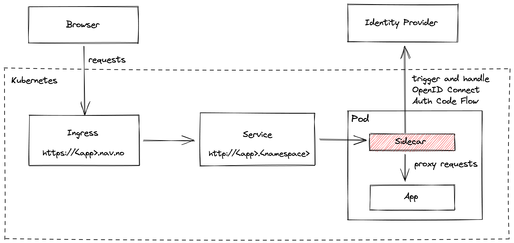
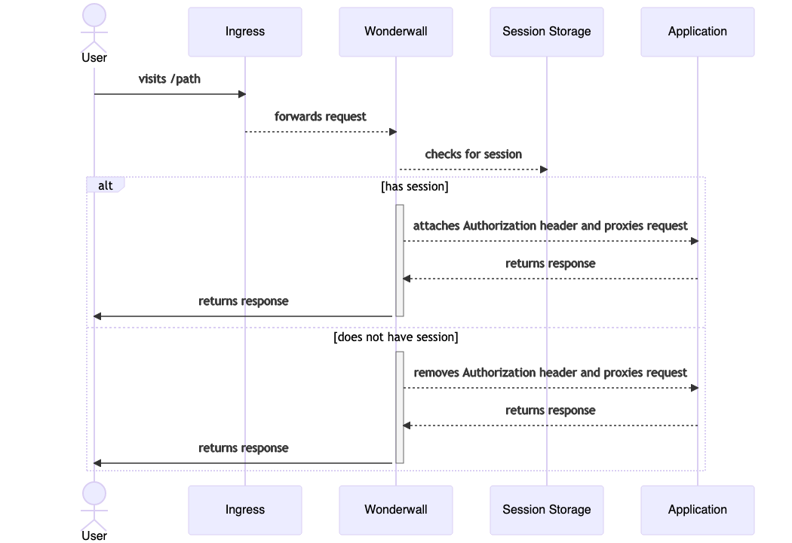

# Wonderwall (sidecar for authentication)

[Wonderwall](https://github.com/nais/wonderwall) is an application that implements an OpenID Connect (OIDC)
[Relying Party (client)](../security/auth/concepts/actors.md#client) in a way that makes it easy to plug into Kubernetes
as a _sidecar_.

!!! abstract

    Wonderwall functions as a reverse proxy that intercepts and proxies requests to your application. It provides endpoints
    to perform logins and logouts for end users, along with session management - so that your application does not have to.

    All HTTP requests to the application will be intercepted by Wonderwall, which is attached to your application's pod as a
    sidecar.

    If the user does _not_ have a valid local session with the sidecar, the request will be proxied as-is without
    modifications to the application container.

    In order to obtain a local session, the user must be redirected to the `/oauth2/login` endpoint, which performs the
    [OpenID Connect Authorization Code Flow](../security/auth/concepts/protocols.md#openid-connect).

    If the user successfully completed the login flow, the sidecar creates and stores a session. A corresponding session 
    cookie is created and set before finally redirecting user agent to the application. All requests that 
    are forwarded to the application container will now contain an `Authorization` header with the user's `access_token`:

    ```
    Authorization: Bearer <JWT_ACCESS_TOKEN>
    ```

    **Your application is [responsible](#3-token-validation) for validating the `access_token`.**

## Providers

The platform allows for integration with the following providers:

- [Azure AD](../security/auth/azure-ad/sidecar.md)
- [ID-porten](../security/auth/idporten/sidecar.md)

## Features

Wonderwall aims to be compliant with OAuth 2.1, and supports the following:

- [OpenID Connect Authorization Code Flow](../security/auth/concepts/protocols.md#openid-connect) with mandatory use of
  PKCE, state and nonce
- [Client authentication](../security/auth/concepts/actors.md#client-authentication)
  using [client assertions](../security/auth/concepts/actors.md#client-assertion) (`private_key_jwt`)
- [RP-initiated logout](https://openid.net/specs/openid-connect-rpinitiated-1_0.html)
- [Front-channel logout](https://openid.net/specs/openid-connect-frontchannel-1_0.html)

## Overview

The image below shows the overall architecture of an application when using Wonderwall as a sidecar:

???+ "Architecture"
    

The sequence diagram below shows the default behavior of the sidecar:

???+ "Sequence Diagram"
    

Generally speaking, the recommended approach when using the Wonderwall sidecar is to put it in front of 
your backend-for-frontend server that serves your frontend. Otherwise, you might run into issues with the cookie 
configuration and allowed redirects - these are both effectively restricted to only match the domain and path for your 
application's ingress.

## Endpoints

The sidecar provides these endpoints under your application's [ingress](../nais-application/application.md#ingresses):

| Path                          | Description                                                                                |
|-------------------------------|--------------------------------------------------------------------------------------------|
| `/oauth2/login`               | Initiates the OpenID Connect Authorization Code flow                                       |
| `/oauth2/callback`            | Handles the callback from the [identity provider]                                          |
| `/oauth2/logout`              | Initiates local and global/single-logout                                                   |
| `/oauth2/logout/frontchannel` | Handles global logout request (initiated by identity provider on behalf of another client) |

## Usage

### Overview

The contract for usage of the sidecar is fairly simple. 

For any endpoint that requires authentication:

1. Validate the `Authorization` header as specified in the [application guidelines](#3-token-validation).
2. If the `Authorization` header is missing, redirect the user to the [login endpoint](#1-initiate-login).
3. If the JWT `access_token` in the `Authorization` header is invalid or expired, redirect the user to
  the [login endpoint](#1-initiate-login).
4. If you need to log out a user, redirect the user to the [logout endpoint](#2-initiate-logout).

---

### 1. Initiate Login

When you must authenticate a user, redirect to the user to:

```
https://<ingress>/oauth2/login
```

The user will be sent to the [identity provider] for authentication and then back to the sidecar's callback endpoint.

#### 1.1. Redirect after Login

After the callback is handled and the user is successfully authenticated, the user will be redirected according to these
rules in ascending priority:

1. `/` (default).
2. The URL set in the `Referer` header.
3. The URL or relative path set in the query parameter `redirect`, e.g:

```
https://<ingress>/oauth2/login?redirect=/some/path
```

The host and scheme (if provided) are stripped from the redirect URL, which effectively only allows redirects to paths
within your own ingress.

#### 1.2. Autologin

If you want _all_ routes to your application to require an authenticated session, you can enable auto-login by setting
the `autoLogin` field to `true`:

```yaml
spec:
  <idporten|azure>:
    sidecar:
      autoLogin: true
```

This will configure the sidecar to automatically redirect any user to login when attempting to browse to **any** path
for your application. You should still validate and check the`Authorization` header and the token within as specified
in [the application guidelines](#3-token-validation).

---

### 2. Initiate Logout

When you must log a user out, redirect to the user to:

```
https://<ingress>/oauth2/logout
```

The user's session with the sidecar will be cleared, and the user will be redirected to the identity provider for global
logout.

---

### 3. Token Validation

!!! danger
    **Your application should secure its own endpoints.** That is, deny access to sensitive endpoints if the appropriate
    authentication is not supplied.

Your application should also [validate the claims and signature](../security/auth/concepts/tokens.md#token-validation)
for the JWT `access_token` attached by the sidecar.

Each provider may have some differences in claims and values; see their specific page for details:

- [Azure AD](../security/auth/azure-ad/sidecar.md#token-validation)
- [ID-porten](../security/auth/idporten/sidecar.md#token-validation)

---

### 4. Error Handling

Authentication should generally not fail. However, in the event that it does happen; the sidecar automatically presents
the end-users with a simple error page that allows the user to retry the authentication flow.

If you wish to customize or handle these errors yourselves, set the `errorPath` property to the relative path within
your ingress that should handle such requests. For example:

```yaml
spec:
  <idporten|azure>:
    sidecar:
      errorPath: /login/error
```

The sidecar will now redirect any errors to this path (i.e. `https://<ingress>/<errorPath>`), along with the following
query parameters:

- `correlation_id` - UUID that uniquely identifies the request, for tracing and log correlation.
- `status_code` - HTTP status code which indicates the type of error that occurred.

## Responsibilities & Guarantees

**The sidecar:**

* Adds the `Authorization` header with the user's JWT access token to the original request if the user has a valid
  session.
* Removes the `Authorization` header from the original request if the user _does not_ have a valid session.
* Owns the `/oauth2` endpoints [defined above](#endpoints) and intercepts all HTTP requests to these. They will never be
  forwarded to your application.
* Is safe to enable and use with multiple replicas of your application.
* Stores session data to a highly available Redis service on Aiven, and falls back to using cookies if the former is
  unavailable.
* Validates the `id_token` acquired from this flow in accordance with the
  [OpenID Connect specifications](https://openid.net/specs/openid-connect-core-1_0.html#IDTokenValidation).

**The sidecar does _not_:**

* Automatically refresh the user's tokens.
* Secure your application's endpoints in any way.
* Validate the user's `access_token` set in the `Authorization` header. The token may be invalid or expired by the time
  your application receives it.

[identity provider]: ../security/auth/concepts/actors.md#identity-provider
