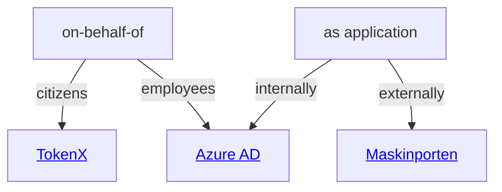

# Authentication and Authorization Overview

NAIS helps your applications [log in users](#logging-in-users), [validate inbound requests](#validating-inbound-requests) and [make authenticated outbound requests](#making-outbound-requests) using the following identity providers:

- [**Azure AD**][Azure AD] (aka Entra ID)

    For employees and internal services.

- [**ID-porten**][ID-porten]

    For Norwegian citizens.

- [**TokenX**][TokenX]

    For internal applications acting on-behalf-of ID-porten citizens.

- [**Maskinporten**][Maskinporten]

    For machine-to-machine communication between organizations or businesses.

Your application may have multiple use cases that can require a combination of services.

See the different scenarios below to identify which service(s) you need for your application, and follow the links to the respective service for more details.

## Logging in users

Depending on who your users are, you can use the following services to log them in:

:person_standing: Log in employees :octicons-arrow-right-24: [Azure AD](../security/auth/azure-ad/sidecar.md)

:person_standing: Log in citizens :octicons-arrow-right-24: [ID-porten]

## Validating inbound requests

...from applications acting 

The graph above can also be described as:

:material-server::person_standing: Validate requests from application on behalf of employee :octicons-arrow-right-24: [Azure AD]

:material-server::person_standing: Validate requests from application on behalf of citizen :octicons-arrow-right-24: [TokenX]

:material-server: Validate requests from internal application :octicons-arrow-right-24: [Azure AD]

:material-server: Validate requests from external application :octicons-arrow-right-24: [Maskinporten]

## Making outbound requests

The graph above can also be described as:

:material-server::person_standing: Make requests on behalf of employee :octicons-arrow-right-24: [Azure AD]

:material-server::person_standing: Make requests on behalf of citizen :octicons-arrow-right-24: [TokenX]

:material-server: Make requests to internal API :octicons-arrow-right-24: [Azure AD]

:material-server: Make requests to external API :octicons-arrow-right-24: [Maskinporten]

[Azure AD]: ../security/auth/azure-ad/README.md
[ID-porten]: ../security/auth/idporten.md
[TokenX]: tokenx/README.md
[Maskinporten]: maskinporten/README.md
