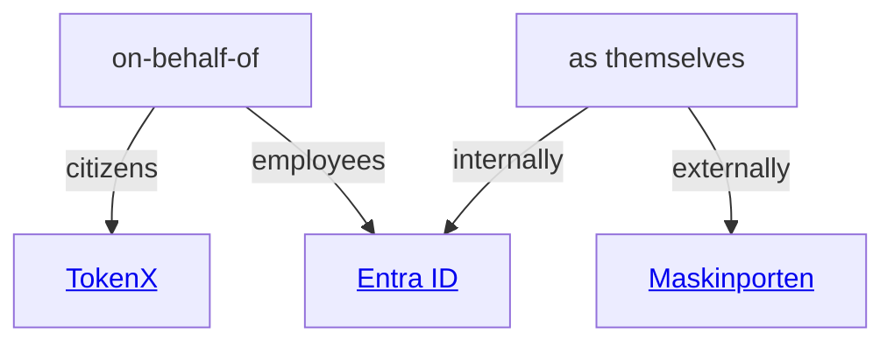
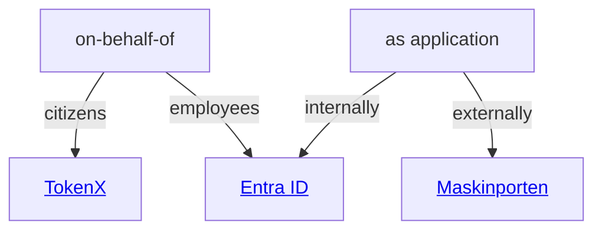

# Authentication and authorization



NAIS helps your applications [log in users](#logging-in-users), [validate inbound requests](#validating-inbound-requests) and [make authenticated outbound requests](#making-outbound-requests) using the following identity providers:

- [**Entra ID**][Entra ID] (aka Azure AD)

    For employees and internal services.

- [**ID-porten**][ID-porten]

    For Norwegian citizens.

- [**TokenX**][TokenX]

    For internal applications acting on-behalf-of ID-porten citizens.

- [**Maskinporten**][Maskinporten]

    For machine-to-machine communication between organizations or businesses.

Your application may have multiple use cases that can require a combination of services.

See the different scenarios below to identify which service(s) you need for your application, and follow the links to the respective service for more details.

## Logging in users

Depending on who your users are, you can use the following services to log them in:

:person_standing: Log in _employees_ :octicons-arrow-right-24: [Entra ID]

:person_standing: Log in _citizens_ :octicons-arrow-right-24: [ID-porten]

## Validating inbound requests

...from applications acting 

The graph above can also be described as:

:material-server::person_standing: Validate requests from _internal_ application acting on behalf of _employee_ :octicons-arrow-right-24: [Entra ID]

:material-server::person_standing: Validate requests from _internal_ application acting on behalf of _citizen_:octicons-arrow-right-24: [TokenX]

:material-server: Validate requests from _internal_ application :octicons-arrow-right-24: [Entra ID]

:material-server: Validate requests from _external_ application :octicons-arrow-right-24: [Maskinporten]

## Making outbound requests

The graph above can also be described as:

:material-server::person_standing: Make requests to _internal_ API on behalf of _employee_ :octicons-arrow-right-24: [Entra ID]

:material-server::person_standing: Make requests to _internal_ API on behalf of _citizen_ :octicons-arrow-right-24: [TokenX]

:material-server: Make requests to _internal_ API :octicons-arrow-right-24: [Entra ID]

:material-server: Make requests to _external_ API :octicons-arrow-right-24: [Maskinporten]

[Entra ID]: entra-id/README.md
[ID-porten]: idporten/README.md
[TokenX]: tokenx/README.md
[Maskinporten]: maskinporten/README.md



NAIS provides the following services and addons to support authentication and authorization in your applications:

:   [**Login proxy**](explanations/README.md#login-proxy)

     A reverse proxy for authenticating end-users in your application.


