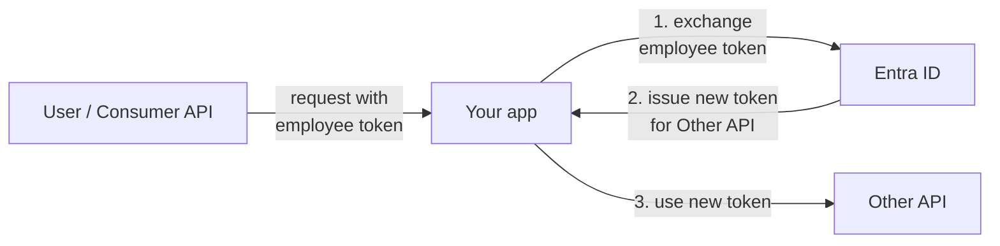
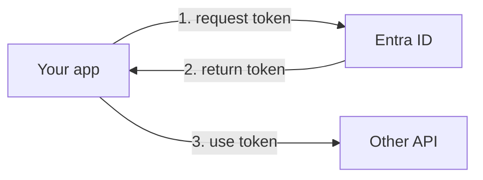

# Entra ID

[Entra ID](https://learn.microsoft.com/en-us/entra/identity-platform/) (formerly known as Azure Active Directory, Azure AD or AAD) is a cloud-based identity and access management service provided by Microsoft.

We use Entra ID as our internal identity provider for authenticating and authorizing both employees and applications.

NAIS provides support for declarative registration and configuration of Entra ID resources.
These cover these distinct use cases:

## Log in employees

If you have an employee-facing application that requires authentication, you will need to integrate with Entra ID.
NAIS simplifies this by providing a [login proxy](../explanations/README.md#login-proxy) with endpoints to easily handle login, logout, and user sessions.

Your application is left with the responsibility to verify that inbound requests have valid [tokens](../explanations/README.md#tokens).

:dart: [**Learn how to log in employees**](how-to/login.md)

## Secure your API

To secure your API with Entra ID, you'll need to grant consumers access to your application.
Once configured, your consumers can acquire a token from Entra ID to [consume your API](#consume-an-api).

Your application code must verify inbound requests by validating the included tokens.

:dart: [**Learn how to secure your API with Entra ID**](how-to/secure.md)

## Consume an API

If your application needs to consume another API secured with Entra ID, you need to acquire a token.
There are two types of flows for requesting tokens, depending on the use case:

### Consume on behalf of employee

This flow is for machine-to-machine requests _on behalf of_ an employee end-user.

To consume an API secured with Entra ID on behalf of an employee, you'll need to exchange their token for a new token:

The new token preserves the employee's identity context and is only valid for the specific API you want to access.

:dart: [**Learn how to consume an API on behalf of an employee**](how-to/consume-obo.md)
 
### Consume as application

This flow is for machine-to-machine requests _without_ any end-user involvement.

To consume an API secured with Entra ID as the application itself, you'll need to acquire a token:

:dart: [**Learn how to consume an API as an application**](how-to/consume-m2m.md)
