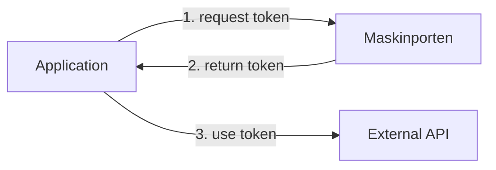
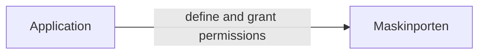

# Maskinporten Overview

[Maskinporten](https://docs.digdir.no/maskinporten_overordnet.html) is a service provided by DigDir used to authorize access to APIs between organizations or businesses.

NAIS provides support for declarative registration and configuration of Maskinporten resources.
These cover two distinct use cases:

## Consume an API

To consume an external API secured with Maskinporten, you'll need to acquire a [token](../explanations/README.md#tokens):

:dart: Learn how to [consume an external API using Maskinporten](how-to/consume.md)

## Secure your API

To secure your API with Maskinporten, you'll need to define and grant permissions to your consumers.

Once configured, your consumers can [acquire a token from Maskinporten](#consume-an-api) with these permissions.
Your application must then validate inbound requests from the consumer.

:dart: Learn how to [secure your API using Maskinporten](how-to/secure.md)
