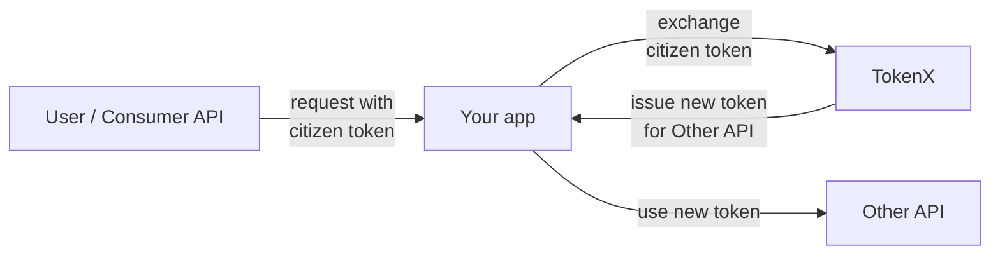

# TokenX

TokenX is NAIS' own implementation of OAuth 2.0 Token Exchange.

This allows internal applications to act on behalf of a citizen that originally authenticated with [ID-porten](../idporten/README.md),
while maintaining the [zero trust](../../workloads/explanations/zero-trust.md) security model between applications throughout a request chain.

NAIS provides support for declarative registration and configuration of TokenX resources.
These cover two distinct use cases:

## Consume an API

To consume an API secured with TokenX on behalf of a citizen, you'll need to exchange their [token](../explanations/README.md#tokens) for a new token.

The new token preserves the citizen's identity context and is only valid for the specific API you want to access.

:dart: [**Learn how to consume an internal API on behalf of a citizen**](how-to/consume.md)

## Secure your API

To secure your API with TokenX, you'll need to grant consumers access to your application.

Once configured, your consumers can exchange a token with TokenX to [consume your API](#consume-an-api).

Your application code must verify inbound requests by validating the included tokens.

:dart: [**Learn how to secure your API with TokenX**](how-to/secure.md)

## Generate a token for development

In some cases, you want to locally develop and test against a secured API in the development environments.
You will need a token to access said API.

:dart: [**Learn how to generate a token for development**](how-to/generate.md)
