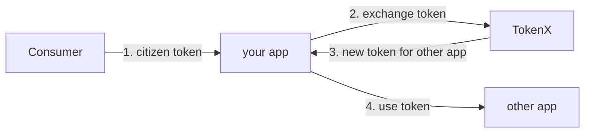
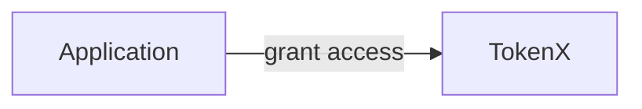

# TokenX overview

TokenX is NAIS' own implementation of OAuth 2.0 Token Exchange.

This allows applications to act on behalf of a citizen that originally authenticated with ID-porten, while maintaining the [zero-trust](../../workloads/explanations/zero-trust.md) security model between applications throughout the request chain.

NAIS provides support for declarative registration and configuration of TokenX resources.
These cover two distinct use cases:

## Consume an API

To consume an API secured with TokenX on behalf of a citizen, you'll need to exchange the inbound [token](../explanations/README.md#tokens) for a new token.
The new token is only valid for the API you want to access and contains the citizens identity context.

:dart: Learn how to [consume a API using TokenX](how-to/consume.md)

## Secure your API

To secure your API with TokenX, you'll first need to grant access to your consumers.

Once configured, your consumers can [exchange a token from TokenX](#consume-an-api) that targets your application.
Your application must then validate inbound requests from the consumer.

:dart: Learn how to [secure your API using TokenX](how-to/secure.md)
