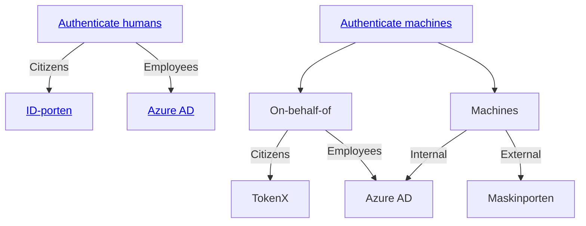

# Authentication Overview

NAIS helps your applications authenticate _humans_ or _machines_.

We support the following identity providers:

- [**Azure AD**](../security/auth/azure-ad/README.md) (aka Entra ID)

    ---
    Identity provider for employees and internal services.

- [**ID-porten**](../security/auth/idporten.md)

    ---
    Identity provider for Norwegian citizens.

- [**TokenX**](../security/auth/tokenx.md)

    ---
    Internal identity provider for applications acting on-behalf-of ID-porten citizens.

- [**Maskinporten**](../security/auth/maskinporten/README.md)

    ---
    Identity provider for machine-to-machine communication between organizations or businesses.

Your application may have multiple authentication use cases that require a combination of services.

Follow the decision tree below to identify which services to use:

C --> |On-behalf-of human| C1[<a href='#consume-an-api'>asdf</a>]
C1 --> |Citizen| TokenX
C1 --> |Employee| AAD
C --> |As a machine| C2[<a href='#consume-an-api'>Consume an API</a>]
C2 --> |External| Maskinporten
C2 --> |Internal| AAD
A --> D[<a href='#provide-an-api'>Provide an API</a>]
D --> |External| Maskinporten
D --> |Internal| AAD
D --> |Internal| TokenX

## Authenticate humans

This is a usually handled by a server-side component (backend-for-frontend) that performs the authentication flow and manages the users' sessions.

**Citizen-facing applications**

Use the [OpenID Connect Authorization Code Flow in ID-porten](idporten.md).

**Employee-facing applications**

Use the [OpenID Connect Authorization Code Flow in Azure AD](azure-ad/usage.md#openid-connect-authorization-code-flow).

---

## Consume an API

The application receives requests from other [clients](concepts.md#client), authenticated with [Bearer tokens](concepts.md#bearer-token).
An end user initiates these request chains.

The application performs requests to other downstream APIs on behalf of this end user.
We must acquire new tokens for each unique downstream API that we need to access.

The new tokens should:

1. Propagate the original end user's identity
2. Be scoped to the correct downstream API with the correct [`aud` / audience claim](concepts.md#claims-validation)

**Citizen-facing applications**

Use the [OAuth 2.0 Token Exchange Grant (TokenX)](tokenx.md).

**Employee-facing applications**

Use the [OAuth 2.0 On-Behalf-Of Grant in Azure AD](azure-ad/usage.md#oauth-20-on-behalf-of-grant).

---

## How do I perform machine-to-machine requests?

The application only performs pure machine-to-machine API requests.
It is _not_ a part of any request chain involving any end users.

Typical examples:

- an application that consumes a Kafka topic and performs API requests based on the Kafka record
- a daemon that performs a task periodically

**Internal**

Use the [OAuth 2.0 Client Credentials Grant in Azure AD](azure-ad/usage.md#oauth-20-client-credentials-grant).

**External**

Use the [OAuth 2.0 JWT Authorization Grant in Maskinporten](maskinporten/client.md).

---

## Provide an API

The application receives requests from other clients, authenticated with [Bearer tokens](concepts.md#bearer-token).

The tokens contain information about the application that performed the request. The tokens will also contain
information about the original end user, if any.

[Validate the tokens](concepts.md#token-validation) before granting access to the API resource.
