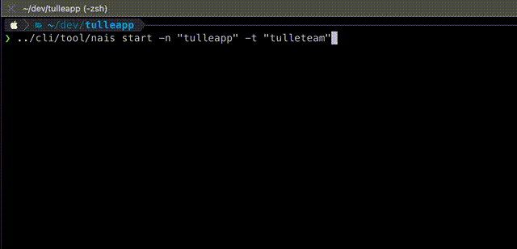

# start command

The `start` command can be used to bootstrap the YAML necessary for building and deploying your app using a [GitHub Workflow](https://docs.github.com/en/actions/using-workflows). The command will attempt to determine the type of project in the current directory by looking for files that are specific for each platform (pom.xml, go.sum et al.). Currently supported platforms are:

- JVM with Maven
- JVM with Gradle
- Nodejs with NPM
- Nodejs with Yarn
- Golang with Make
- Python with Pip
- Python with Poetry

YAML files are then retrieved using [start.nais.io](https://start.nais.io) and written to the current directory in the sub-folders `.github` and `.nais`.

!!! tip "Generated files"
    This command doesn't know anything about your app, and the generated YAML files are only meant to get you started. You should go through the generated files and customize them for your needs. Please see the [doc](https://doc.nais.io/nais-application/application/) for an overview of what can be done.

