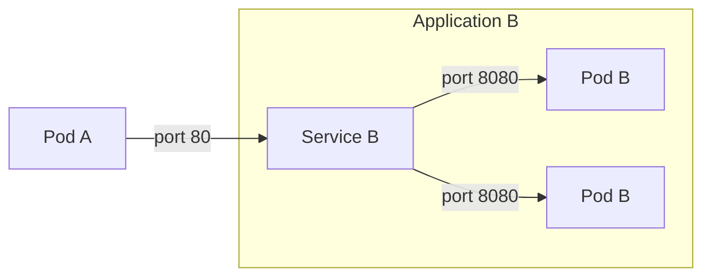

# Service Discovery in Kubernetes

Applications deployed to Kubernetes are exposed through what is known as a [`Service`][k8s-service-discovery]. This is an address that allows for direct communication within a Kubernetes cluster without having to go through an external ingress, load balancer, or proxy.

This is the recommended way to communicate between applications in the same Kubernetes cluster. This avoids having to expose your application to the outside world, and allows for direct communication between applications.

A `Service` in Kubernetes has some interesting properties:

1. It provides a single, stable address for a set of pods. This mens that if a pod dies, moves or is upgraded, the `Service` will continue to point to the remaining pods.
2. It can load balance traffic across multiple pods. This is useful for scaling out your application without having to change the address of the `Service` or update clients consuming your application.
3. Translates between ports. This is useful if you want to expose a service on a different port than the one your application is listening on. For example, you can expose port `80` on the `Service` and have it forward to port `8080` on the pod.

Services available can be viewed with `kubectl get service` in a particular namespace. The service name for a [NAIS Application](../nais-application/application.md) is the same as the Application name (`metdata.name`) and is the same across any cluster where the Application is deployed. This allows for simpler configuration.

[k8s-service-discovery]: https://kubernetes.io/docs/concepts/services-networking/service/



## Google Cloud Platform

!!! warning
    Ensure that you've set up proper [access policies](../nais-application/access-policy.md) for your applications.

The full hostname of a service on GCP follows this format:

```text
http://<service-name>.<namespace>.svc.cluster.local
```

## On-prem

The full hostname of a service on-prem follows this format:

```text
http://<service-name>.<namespace>.svc.nais.local
```

## Short names

You often won't need to use the full hostname to contact another service.

If you’re addressing a service in the same namespace, you can use just the service name to contact it:

```text
http://<another-service>
```

If the service exists in a different namespace, you must add the appropriate namespace:

```text
http://<another-service>.<another-namespace>
```

!!! info "Note for on-prem"
    If your application has [webproxy](../nais-application/application.md#webproxy) enabled, you should use the full hostname for all service discovery calls.

    This is to ensure that your application does not attempt to perform these in-cluster calls through the proxy, as the environment variable `NO_PROXY` includes `*.local`.
