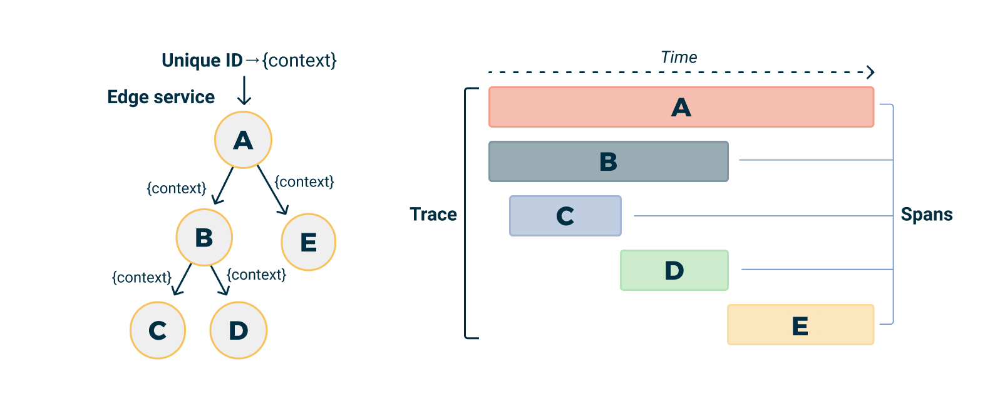
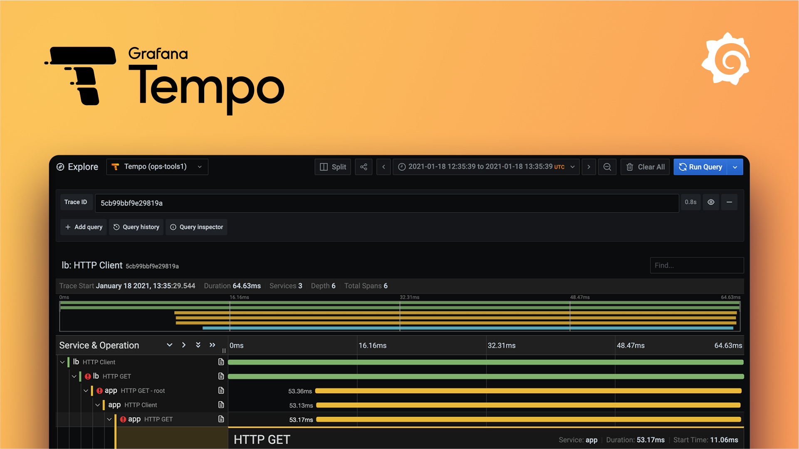

# Distributed Tracing

Tracing is a way to track a request as it passes through the various services needed to handle it. This is especially useful in a microservices architecture, where a single user action often results in a series of calls to different services.

Tracing allows developers to understand the entire journey of a request, making it easier to identify bottlenecks, latency issues, or failures that can impact user experience.

## How tracing works

When a request is made to your application, a trace is started. This creates a Trace which serves as a container for all the work done for that request.

<small>Trace visualization by Logshero licensed under Apache License 2.0</small>

The work done by individual services (or components of a single service) is captured in Spans. A span represents a single unit of work in a trace, like a SQL query or a call to an external service.

Spans can be nested and form a trace tree. The Trace is the root of the tree, and each Span is a node that represents a specific operation in your application. The tree of spans captures the causal relationships between the operations in your application (i.e., which operations caused others to occur).

Each Span carries a Context that includes metadata about the trace (like a unique trace identifier and span identifier) and any other data you choose to include. This context is propagated across process boundaries, allowing all the work that's part of a single trace to be linked together, even if it spans multiple services.

By analyzing the data captured in traces and spans, you can gain a deep understanding of how requests flow through your system, where time is being spent, and where problems might be occurring. This can be invaluable for debugging, performance optimization, and understanding the overall health of your system.

## OpenTelemetry

OpenTelemetry, a project under the Cloud Native Computing Foundation (CNCF), has become the standard for tracing and application telemetry due to its unified APIs for tracing and metrics, which simplify instrumentation and data collection from applications.

It supports a wide range of programming languages, including Java, JavaScript, Python, Go, and more, allowing for consistent tooling across different parts of a tech stack.

OpenTelemetry also provides automatic instrumentation for popular frameworks and libraries, enabling the collection of traces and metrics without the need for modifying application code.

It's vendor-neutral, allowing telemetry data export to any backend, providing the flexibility to switch between different analysis tools as needs change. Backed by leading companies in the cloud and software industry, and with a vibrant community, OpenTelemetry ensures project longevity and continuous improvement.

[:octicons-link-external-24: Learn more about OpenTelemetry][open-telemetry]

## Tracing in NAIS

NAIS does not collect application trace data automatically, but it provides the infrastructure to do so using OpenTelemetry, Grafana Tempo for storage and querying, and easy-to-use configuration options.

### The easy way: Auto-instrumentation

The preferred way to get started with tracing is to enable auto-instrumentation for your application. This will automatically collect traces and send them to the correct place using the OpenTelemetry Agent.

This is the easiest way to get started with tracing, as it requires little to no effort on the part of the team developing the application and provides instrumentation for popular libraries, frameworks and external services such as PostgreSQL, Redis, Kafka and HTTP clients.

[:bulb: Get started with auto-instrumentation](../../how-to-guides/observability/auto-instrumentation.md)

### The hard way: Manual instrumentation

If you want more control over how your application is instrumented, you can manually instrument your application using the OpenTelemetry SDK for your programming language.

To get the correct configuration for you can still use the auto-instrumentation configuration, but set the `runtime` to `sdk` as this will only set up the OpenTelemetry configuration, without injecting the OpenTelemetry Agent.

[:bulb: Get started with manual-instrumentation](../../how-to-guides/observability/auto-instrumentation.md#enable-auto-instrumentation-for-other-applications)

### OpenTelemetry SDKs

OpenTelemetry provides SDKs for a wide range of programming languages:

* [:fontawesome-brands-java: OpenTelemetry Java][otel-java]
* [:fontawesome-brands-js: OpenTelemetry JavaScript][otel-node]
* [:fontawesome-brands-python: OpenTelemetry Python][otel-python]
* [:fontawesome-brands-golang: OpenTelemetry Go][otel-go]

## Visualizing traces in Grafana Tempo

Visualizing and querying traces is done in Grafana using the Grafana Tempo. Tempo is an open-source, easy-to-use, high-scale, and cost-effective distributed tracing backend that stores and queries traces.

The easiest way to get started with Tempo is to use the [Explore view in Grafana][grafana-explore], which provides a user-friendly interface for querying and visualizing traces.

[:octicons-link-external-24: Open Grafana Explore][grafana-explore]

[:bulb: Get started with Grafana Tempo](../../how-to-guides/observability/tracing/tempo.md)

[open-telemetry]: https://opentelemetry.io/
[otel-java]: https://opentelemetry.io/docs/languages/java/
[otel-node]: https://opentelemetry.io/docs/languages/js/
[otel-python]: https://opentelemetry.io/docs/languages/python/
[otel-go]: https://opentelemetry.io/docs/languages/go/
[grafana]: <<tenant_url("grafana")>>
[grafana-explore]: <<tenant_url("grafana", "explore")>>
