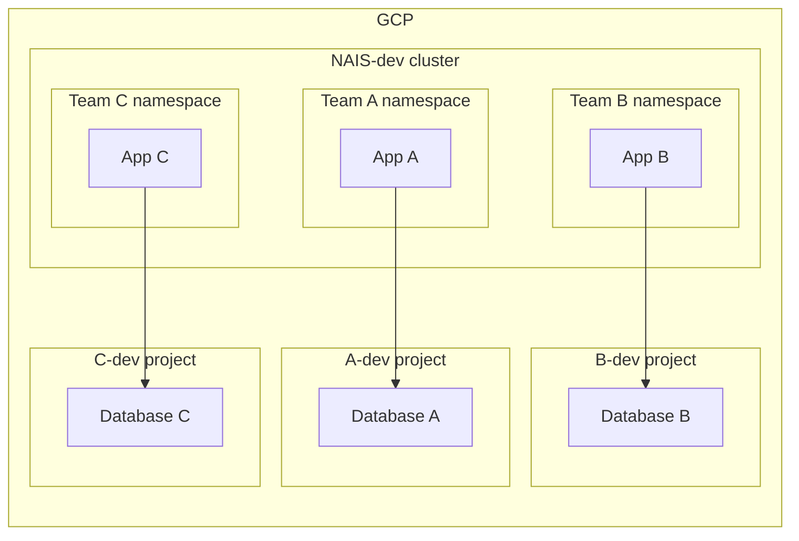

# Under the hood
In this explanation, we will go through some of the underlying technologies we use to provide NAIS.

## Environment

### Runtime implementation
Each environment is its own [Kubernetes](https://kubernetes.io) cluster using [GKE](https://cloud.google.com/kubernetes-engine?hl=en).
Inside each environment, every team has their own [namespace](https://kubernetes.io/docs/concepts/overview/working-with-objects/namespaces/), which is only accessible by the members of the team.

### Workload isolation
All workloads are deployed in a team namespace and every workload is isolated from _all_ other workloads by utilizing [Kubernetes network policies](https://kubernetes.io/docs/concepts/services-networking/network-policies/) unless [explicitly allowed](./zero-trust.md).

## GCP resources (CloudSQL, Cloud Storage, BigQuery, etc.)
When resources, such as a database, is requested, it is provisioned in a separate GCP project that is dedicated to _this_ team for _this_ environment.
As with the team's namespace, the team's project is only accessible by the members of the team.

Example NAIS environment:

In the example above, we have three teams, `A`, `B` and `C`.
Each team has their own namespace in the `dev` cluster, and when they request a database, it is provisioned in their own `team-dev` project.