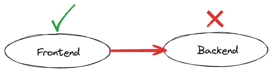

# Zero trust

NAIS embraces the [zero trust](https://en.wikipedia.org/wiki/Zero_trust_security_model) security model, where the core principle is to "never trust, always verify".

In NAIS every [workload](./workloads/README.md) is isolated by default - which means that it is not able to make _any_ outbound requests or receive _any_ incoming traffic unless explicitly defined. This includes traffic inside your namespace, in the same environment as well as to and from the Internet.
In order to control traffic to and from your workload, you need to define [access policies](../how-to-guides/access-policies.md).

For the native NAIS services - the platform takes care of this for you. For example, when you have a [database](../how-to-guides/persistence/postgres/README.md), the access policies required to reach the database will be created automatically.

## Example

Consider a simple application which consists of a frontend and a backend, where naturally the frontend needs to communicate with the backend.

This communication is denied by default as indicated by the red arrow.


In order to fix this, the frontend needs to allow outbound traffic to the backend by adding the following access policy.

```yaml
spec:
  accessPolicy:
    outbound:
      - application: backend
```



However - the frontend is still not allowed to make any requests to the backend.
The missing piece of the puzzle is adding an inbound policy to the backend like so:

```yaml
spec:
  accessPolicy:
    inbound:
      - application: frontend
```


Now that both applications has explicitly declared their policies, the communication is allowed.

See more about [how to define access policies](../how-to-guides/access-policies.md)
