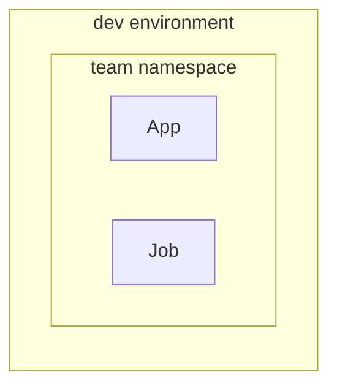
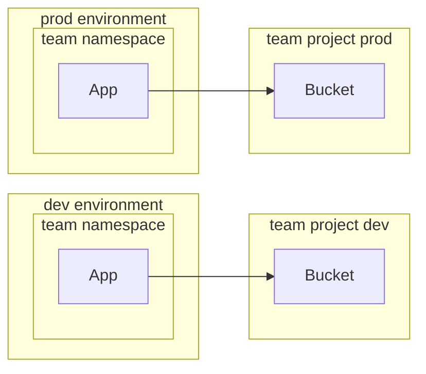

# Under the hood

In this explanation, we will go through some of the underlying technologies we use to provide Nais.

## Environment

### Runtime implementation

Each _environment_ is its own [Kubernetes :octicons-link-external-16:](https://kubernetes.io) cluster using [Google Kubernetes Engine (GKE) :octicons-link-external-16:](https://cloud.google.com/kubernetes-engine?hl=en).

Inside each environment, every team has their own [namespace :octicons-link-external-16:](https://kubernetes.io/docs/concepts/overview/working-with-objects/namespaces/).

A namespace can contain one or more [workloads](../workloads/README.md).
Only members of the team have access to the namespace and its resources.

In the example above, the team has an application and a job running in the `dev` environment.

### Workload isolation

All workloads are deployed in a team namespace.

Every workload is isolated from _all_ other workloads with [Kubernetes network policies :octicons-link-external-16:](https://kubernetes.io/docs/concepts/services-networking/network-policies/).

Access is denied by default, unless [explicitly allowed](../workloads/explanations/zero-trust.md).

## Google Cloud Platform (GCP) resources

Each team has a dedicated [GCP project :octicons-link-external-16:](https://cloud.google.com/resource-manager/docs/creating-managing-projects) for _each_ environment.

When your workload requests resources e.g. a bucket, it will be provisioned in the team's project for the matching environment.

In the example above, the team has an application running in the `dev` environment.
When the application requests a bucket, it is provisioned in the team's `dev` project.

Equivalently for the `prod` environment, the bucket is provisioned in the team's `prod` project.
