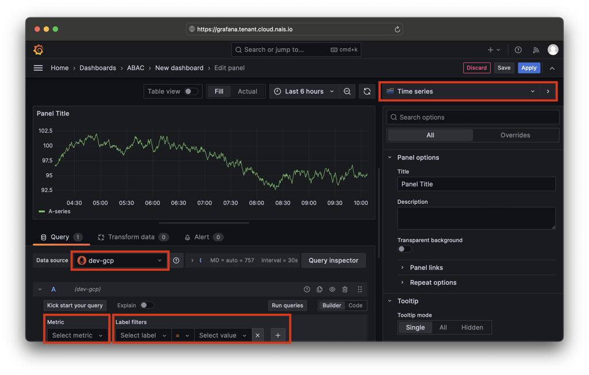
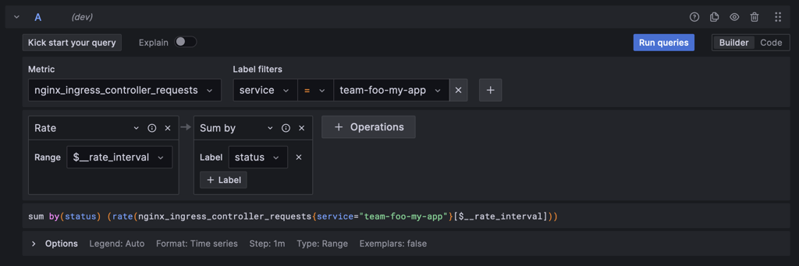

# Create a dashboard in Grafana

This guide shows you how to create a dashboard in Grafana for your application. Grafana is a popular open-source visualization and analytics platform that allows you to query, visualize, alert on, and understand your metrics no matter where they are stored.

## 0. Prerequisites

- You have an application running in the NAIS platform.
- Your application is [exporting metrics to Prometheus](./expose.md)

## 1. Create a new dashboard

1. Open [Grafana](<<tenant_url("grafana")>>) and click on "Dashboards" in the left-hand side menu.
2. Find your team folder in the list and click on it.
3. Click on the "New" button in the top right corner and select "New dashboard".

## 2. Add a new panel

You are now ready to add a new panel to your dashboard. A panel is a single visualization or a single query result. You can add multiple panels to a dashboard to create a complete view of your application.

1. Click on the "+ Add visualization" button at the center of the page.
2. Select one of the Prometheus data sources from the list. There is one data source for each available environment.
3. By default you will see a graph panel, if you want to change the visualization type, click on teh "Time series" dropdown in the top right corner of the panel and select the visualization type you want to use.

## 3. Select a metric

You are now ready to write a query to visualize your metrics. A query is a request for data from a data source. In this case, you are querying the Prometheus data source for metrics from your application.

We suggest you start by using the query builder mode when writing your first queries. The query builder mode is a graphical interface that helps you build PromQL queries by selecting labels and fields from your metrics.

Click on the Metric "Select metric" input field below the graph and click on the "Metrics explorer" link to find and select available metrics.

Search for the metric you want to visualize. For example, if you want to visualize the number of requests to your application, you can search for "nginx requests" and select the metric named `nginx_ingress_controller_requests` by click "Select".

## 4. Filter the metric

You can filter the metric by adding labels to the query. Labels are key-value pairs that are attached to each time series in Prometheus. You can use labels to filter the time series that are included in the query.

Click on the "Select label" input field below the graph and click on the "Labels" input field and add the label you want to filter by. For example, if you want to filter the metric by the `app` label, you can add the label `app` with the value of your application name.

For the `nginx_ingress_controller_requests` metric, you can filter by application using the `service` label which is the name of your team and application separated by a dash `-`. For example, if your team is named `team-foo` and your application is named `my-app`, you can filter by the label `service` with the value `team-foo-my-app`.

To update the graph with the new query, click on the "Run queries" button just above the query builder.

## 5. Add operations

You can add operations to the query to transform the data before it is visualized. For example, you can add an operation to calculate the rate of the metric, or you can add an operation to calculate the 95th percentile of the metric.

For our `nginx_ingress_controller_requests` metric, we would like to calculate the rate of requests per second. To do this, we can add the `rate()` operation to the query by clicking on the "+ Operation" button below the query builder and selecting "Range functions" and "rate".

In the case of rate, you need to specify the time range over which to calculate the rate. You can do this by expanding the options section below the query builder and setting the "Min step" to `1m` (1 minute).

Lastly, we would like to sum the rate of requests across all pods in the application. To do this, we can add the `sum()` operation to the query by clicking on the "+ Operation" button below the query builder and selecting "Aggregations" and "sum".

Click the "Run queries" button to update the graph with the new query.

## 6. Save the dashboard

When you are happy with your new panel, you can save it by clicking on the "Applyt" button in the top right corner of the page. Your new dashboard is not yet saved, so you need to click on the "Floppy disk" save icon in the top right corner of the page and give your dashboard a name.
