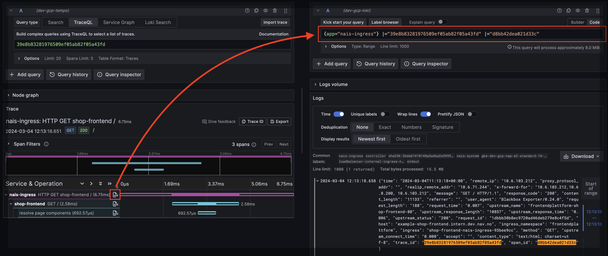

# Correlate traces and logs

This guide will explain how to correlate traces with logs in Grafana Tempo. This is only necessary if you are not using auto-instrumentation with OpenTelemetry Agent. If you are using auto-instrumentation, logs are automatically correlated with traces.

## Step 1: Configure Tracing

First you need to configure OpenTelemetry tracing in your application. The easiest way to get started with tracing is to enable auto-instrumentation for your application. This will automatically collect traces and send them to the correct place using the OpenTelemetry Agent or you can use the OpenTelemetry SDK to manually instrument your application.

[:bulb: Get started with auto-instrumentation](../auto-instrumentation.md)

## Step 2: Enable logging to Grafana Loki

In order to use the Grafana Tempo log correlation feature, you need to send your logs to Grafana Loki.

[:bulb: Enable logging to Grafana Loki](../logs/loki.md#enable-logging-to-grafana-loki)

## Step 3: Include trace information in your logs

The final step is to include trace information in your logs. This will allow Grafana Tempo to look up logs that are associated with a trace.

=== "log4j"

    Add the [opentelemetry-javaagent-log4j-context-data-2.17](https://mvnrepository.com/artifact/io.opentelemetry.javaagent.instrumentation/opentelemetry-javaagent-log4j-context-data-2.17) package to your `pom.xml` or `build.gradle` to include trace information in your logs:

    ```
    io.opentelemetry.instrumentation:opentelemetry-log4j-context-data-2.17-autoconfigure:2.1.0-alpha
    ```

    Add the following pattern to your log4j configuration to include trace information in your logs:

    ```xml
    <?xml version="1.0" encoding="UTF-8"?>
    <Configuration status="WARN">
        <Appenders>
            <Console name="Console" target="SYSTEM_OUT">
                <PatternLayout pattern="%d{HH:mm:ss.SSS} [%t] %-5level %logger{36} traceId: %X{trace_id} spanId: %X{span_id} - %msg%n" />
            </Console>
        </Appenders>
        <Loggers>
            <Root level="All" >
                <AppenderRef ref="Console"/>
            </Root>
        </Loggers>
    </Configuration>
    ```

=== "logback"

    Add the [opentelemetry-logback-mdc-1.0](https://mvnrepository.com/artifact/io.opentelemetry.instrumentation/opentelemetry-logback-mdc-1.0) package to your `pom.xml` or `build.gradle` to include trace information in your logs:

    ```
    io.opentelemetry.instrumentation:opentelemetry-logback-mdc-1.0:2.1.0-alpha
    ```

    Add the following pattern to your logback configuration to include trace information in your logs:

    ```xml
    <?xml version="1.0" encoding="UTF-8" ?>
    <configuration>
        <appender name="STDOUT" class="ch.qos.logback.core.ConsoleAppender">
            <encoder>
                <pattern><![CDATA[%date{HH:mm:ss.SSS} [%thread] %-5level %logger{15}#%line %X{req.requestURI} traceId: %X{trace_id} spanId: %X{span_id} %msg\n]]></pattern>
            </encoder>
        </appender>

        <appender name="OTEL" class="io.opentelemetry.instrumentation.logback.v1_0.OpenTelemetryAppender">
            <appender-ref ref="STDOUT" />
        </appender>

        <root>
            <level value="DEBUG" />
            <appender-ref ref="STDOUT" />
        </root>

    </configuration>
    ```

## 4. Profit

Now that you have tracing and logging set up, you can use Grafana Tempo to correlate traces and logs. When you view a trace in Grafana Tempo, you can see the logs that are associated with that trace. This makes it easy to understand what happened in your application and troubleshoot issues.



[:arrow_backward: Back to the list of guides](../index.md)