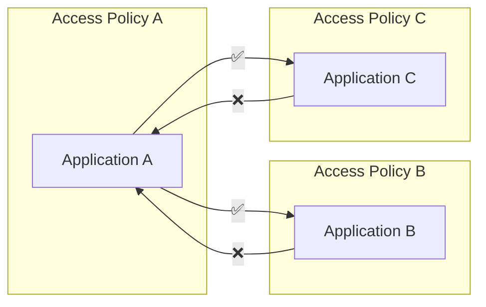

# Access Policy

Access policies express which applications and services you are able to communicate with, both inbound and outbound. The default policy is to **deny all incoming and outgoing traffic** for your application, meaning you must be conscious of which services/application you consume, and who your consumers are.

In NAIS, we use [Network Policies][k8s-netpol] to express access policies. Network policies are applied to the pod, and are enforced by the network itself on layer 3 and 4 (TCP/IP). This means that the network will drop any traffic that is not allowed by the policy.

  [k8s-netpol]: https://kubernetes.io/docs/concepts/services-networking/network-policies/



## Limitations

The access policy currently have the following limits:

1. **No support for UDP**. This is a limitation of Kubernetes, and will be fixed in the future.
2. **Only for pod-to-pod communication**. The Access policies only apply when communicating internally within the cluster using [service discovery](../clusters/service-discovery.md), and not through [ingress traffic](ingress.md).
3. **Only available in GCP**. Network policies are only applied in GCP clusters.  However, inbound rules for authorization in the context of [_TokenX_](../security/auth/tokenx.md) or [_Azure AD_](../security/auth/azure-ad/README.md) apply to all clusters.

## Access Policy vs. Ingress

Access policies are only applied to pod-to-pod communication, and not to ingress traffic. This means that you can still use ingress to expose your application to the internet, and use access policies to control which applications can communicate with your application.

Outbound requests to ingresses are regarded as external hosts, even if these ingresses exist in the same cluster.

## Inbound rules

Inbound rules specifies what other applications _in the same cluster_ your application receives traffic from.

### Receive requests from other app in the same namespace

For app `app-a` to be able to receive incoming requests from `app-b` in the same cluster and the same namespace, this specification is needed for `app-a`:

=== "nais.yaml"

    ```yaml
    apiVersion: "nais.io/v1alpha1"
    kind: "Application"
    metadata:
      name: app-a
    ...
    spec:
      ...
      accessPolicy:
        inbound:
          rules:
            - application: app-b
    ```

=== "visualization"

    ```mermaid
    graph LR
      accTitle: Receive requests from other app in the same namespace
      accDescr: The diagram shows two applications in the same namespace, A and B. Application A is allowed to receive requests from B.

      app-b--"✅"-->app-a

      subgraph mynamespace
        app-a
        app-b
      end
    ```

### Receive requests from other app in the another namespace

For app `app-a` to be able to receive incoming requests from `app-b` in the same cluster but another namespace \(`othernamespace`\), this specification is needed for `app-a`:

=== "nais.yaml"

    ```yaml
    apiVersion: "nais.io/v1alpha1"
    kind: "Application"
    metadata:
      name: app-a
    ...
    spec:
      ...
      accessPolicy:
        inbound:
          rules:
            - application: app-b
              namespace: othernamespace
    ```

=== "visualization"

    ```mermaid
    graph LR
      accTitle: Receive requests from other app in the another namespace
      accDescr: The diagram shows two applications in different namespaces, A and B. Application A is allowed to receive requests from B.

      app-b--"✅"-->app-a

      subgraph mynamespace
        app-a
      end

      subgraph othernamespace
        app-b
      end
    ```

## Outbound rules

`spec.accessPolicy.outbound.rules` specifies which applications _in the same cluster_ you allow your application to send requests to. To open for external applications, use the field `spec.accessPolicy.outbound.external`.

### Send requests to other app in the same namespace

For app `app-a` to be able to send requests to `app-b` in the same cluster and the same namespace, this specification is needed for `app-a`:

=== "nais.yaml"

    ```yaml
    apiVersion: "nais.io/v1alpha1"
    kind: "Application"
    metadata:
      name: app-a
    ...
    spec:
      ...
      accessPolicy:
        outbound:
          rules:
            - application: app-b
    ```

=== "visualization"

    ```mermaid
    graph LR
      accTitle: Send requests to other app in the same namespace
      accDescr: The diagram shows two applications in the same namespace, A and B. Application A is allowed to send requests to B.

      app-a--"✅"-->app-b

      subgraph mynamespace
        app-a
        app-b
      end
    ```

### Send requests to other app in the another namespace

For app `app-a` to be able to send requests requests to `app-b` in the same cluster but in another namespace \(`othernamespace`\), this specification is needed for `app-a`:

=== "nais.yaml"

    ```yaml
    apiVersion: "nais.io/v1alpha1"
    kind: "Application"
    metadata:
      name: app-a
    ...
    spec:
      ...
      accessPolicy:
        outbound:
          rules:
            - application: app-b
              namespace: othernamespace
    ```

=== "visualization"

    ```mermaid
    graph LR
      accTitle: Send requests to other app in the another namespace
      accDescr: The diagram shows two applications in different namespaces, A and B. Application A is allowed to send requests to B.

      app-a--"✅"-->app-b

      subgraph mynamespace
        app-a
      end

      subgraph othernamespace
        app-b
      end
    ```

### External services

External services are services that are not running in the same cluster, but are reachable from the cluster. This could be services running in other clusters, or services running in the same cluster but outside the cluster network.

Since this is not a native feature of Kubernetes Network Policies, we are leveraging Linkerd's [Service Profiles](https://linkerd.io/2/features/service-profiles/) to achieve this.

In order to send requests to services outside of the cluster, `external.host` configuration is needed:

=== "nais.yaml"

    ```yaml
    apiVersion: "nais.io/v1alpha1"
    kind: "Application"
    metadata:
      name: app-a
    ...
    spec:
      ...
      accessPolicy:
        outbound:
          external:
            - host: www.external-application.com
    ```

=== "visualization"

    ```mermaid
    graph LR
      accTitle: External services
      accDescr: The diagram shows an application, A, that is allowed to send requests to an external service.

      app-a--"✅"-->www.external-application.com

      subgraph cluster
        subgraph mynamespace
          app-a
        end
      end
    ```

Default hosts that are added and accessible for every application:

| Host / service              | Port | Protocol  |
|-----------------------------|------|-----------|
| `kube-dns`                  | 53   | UDP / TCP |
| `metadata.google.internal`  | 80   | TCP       |
| `private.googleapis.com`    | 443  | TCP       |
| `login.microsoftonline.com` | 443  | TCP       |
| `graph.microsoft.com`       | 443  | TCP       |
| `oidc.difi.no`              | 443  | TCP       |
| `ver2.maskinporten.no`      | 443  | TCP       |
| `test.maskinporten.no`      | 443  | TCP       |
| `maskinporten.no`           | 443  | TCP       |
| `oidc-ver2.difi.no`         | 443  | TCP       |
| `aivencloud.com`            | 443  | TCP       |
| `unleash.nais.io`           | 443  | TCP       |

#### Global Service Entries

There are some services that are automatically added to the mesh in [dev-gcp](https://github.com/navikt/nais-yaml/blob/master/vars/dev-gcp.yaml) and [prod-gcp](https://github.com/navikt/nais-yaml/blob/master/vars/prod-gcp.yaml) (search for `global_serviceentries`).

## Advanced: Resources created by Naiserator

The previous application manifest examples will create Kubernetes Network Policies.

### Kubernetes Network Policy

#### Default policy

Every app created will have this default network policy that allows traffic to Linkerd and kube-dns.
It also allows incoming traffic from the Linkerd control plane and from tap and prometheus in the linkerd-viz namespace. This is what enables monitoring via the linkerd dashboard.
These policies will be created for every app, also those who don't have any access policies specified.

```yaml
apiVersion: extensions/v1beta1
kind: NetworkPolicy
metadata:
  labels:
    app: appname
    team: teamname
  name: appname
  namespace: teamname
spec:
  egress:
    - to:
        - namespaceSelector:
            matchLabels:
              linkerd.io/is-control-plane: "true"
        - namespaceSelector: {}
          podSelector:
            matchLabels:
              k8s-app: kube-dns
        - ipBlock:
            cidr: 0.0.0.0/0
            except:
              - 10.6.0.0/15
              - 172.16.0.0/12
              - 192.168.0.0/16
  ingress:
    - from:
        - namespaceSelector:
            matchLabels:
              linkerd.io/is-control-plane: "true"
    - from:
        - namespaceSelector:
            matchLabels:
              linkerd.io/extension: viz
          podSelector:
            matchLabels:
              component: tap
    - from:
        - namespaceSelector:
            matchLabels:
              linkerd.io/extension: viz
          podSelector:
            matchLabels:
              component: prometheus
  podSelector:
    matchLabels:
      app: appname
  policyTypes:
    - Ingress
    - Egress

```

#### Kubernetes network policies

The applications specified in `spec.accessPolicy.inbound.rules` and `spec.accessPolicy.outbound.rules` will append these fields to the default Network Policy:

```yaml
apiVersion: extensions/v1beta1
kind: NetworkPolicy
...
spec:
  egress:
  - to:
    ...
    - namespaceSelector:
        matchLabels:
          kubernetes.io/metadata.name: othernamespace
      podSelector:
        matchLabels:
          app: app-b
    - podSelector:
        matchLabels:
          app: app-b
  - from:
    - namespaceSelector:
        matchLabels:
          kubernetes.io/metadata.name: othernamespace
      podSelector:
        matchLabels:
          app: app-b
    - podSelector:
        matchLabels:
          app: app-b
  podSelector:
    matchLabels:
      app: appname
  policyTypes:
  - Egress
  - Ingress
```

If you are working directly with Kubernetes Network Policies, we are recommending the Cilium Policy Editor which can be found at [editor.cilium.io](https://editor.cilium.io/).
