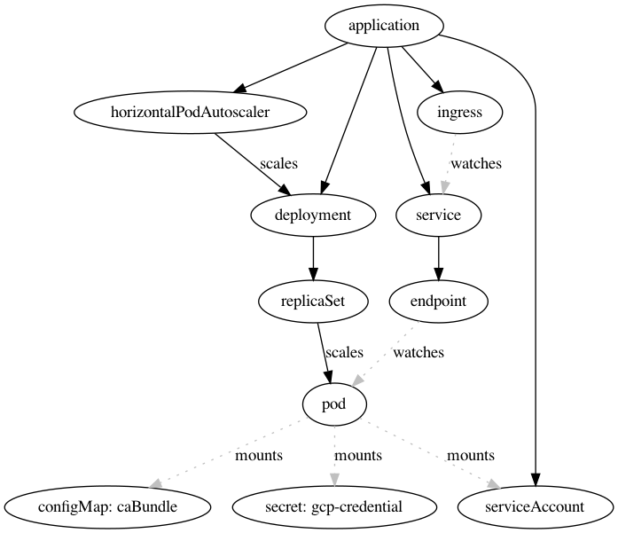

# K8s overview

A simplified overview of resources created, mounted, and used by a nais-app.



## Generate new image

Using [the DOT language](https://graphviz.org/doc/info/lang.html), one can create an overview of an application.

Run the following command in this directory:
```bash
dot -Tsvg nais.dot -o nais.svg
```
