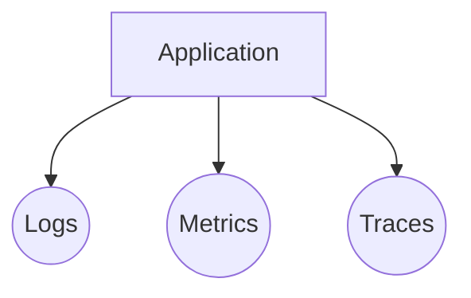
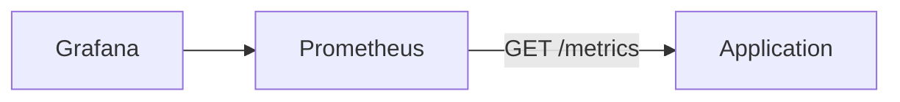
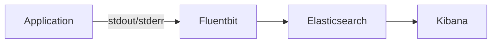
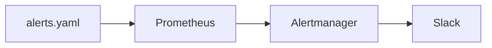

# Observability

Building and deploying applications is only half the battle. The other half is to be able to observe what's going on in your application. This is where observability comes in.

## What is observability?

Observability is a term used to describe the ability to understand the state of a system by looking at the logs, metrics and traces it produces. This is in contrast to the traditional approach of debugging a system by looking at the code.

We often use the analogy of a car to explain the difference between the two approaches. If you have a problem with your car, you can either look at the code (the engine) or you can look at the car itself (the dashboard). The dashboard gives you a lot of information about the state of the car, and you can use this information to understand what is going on.

The tree pillars of observability are:

1. **Logs** - Logs are a record of what has happened in your application. They are useful for debugging, but due to their unstructured format they generally do not scale very well.
2. **Metrics** - Metrics are a numerical measurement of something in your application. They are useful for understanding the performance of your application and is generally more scalable than logs both in terms of storage and querying since they are structured data.
3. **Traces** - Traces are a record of the path a request takes through your application. They are useful for understanding how a request is processed in your application.



## Metrics

Metrics are a way to measure the state of your application. Metrics are usually numerical values that can be aggregated and visualized. Metrics are often used to create alerts and dashboards.

We use the [OpenMetrics][openmetrics] format for metrics. This is a text-based format that is easy to parse and understand. It is also the format used by Prometheus, which is the most popular metrics system.

[openmetrics]: https://openmetrics.io/

[:octicons-arrow-right-24: Get started with metrics](./metrics.md)

### Prometheus

[Prometheus][prometheus] is a time-series database that is used to store metrics. It is a very powerful tool that can be used to create alerts and dashboards. Prometheus is used by many open source projects and is the de facto standard for metrics in the cloud native world.

Prometheus is a pull-based system. This means that Prometheus will scrape (pull) metrics from your application. This is in contrast to a push-based system, where your application would push metrics to a central system.

[prometheus]: https://prometheus.io/



[:octicons-arrow-right-24: Access Prometheus here](./metrics.md#prometheus-environments)

### Grafana

[Grafana][grafana] is a tool for visualizing metrics. It is used to create dashboards that can be used to monitor your application. Grafana is used by many open source projects and is the de facto standard for metrics in the cloud native world.

[:octicons-arrow-right-24: Access Grafana here][nais-grafana]

[grafana]: https://grafana.com/
[nais-grafana]: https://grafana.nais.io/

## Logs

Logs are a way to understand what is happening in your application. They are usually text-based and are often used for debugging. Since the format of logs is usually not standardized, it can be difficult to query and aggregate logs and thus we recommend using metrics for dashboards and alerting.

Logs are collected automatically by [fluentd][fluentd], stored in [Elasticsearch][elasticsearch] and made accessible via [Kibana][kibana].

[fluentd]: https://www.fluentd.org/
[elasticsearch]: https://www.elastic.co/elasticsearch/
[kibana]: https://www.elastic.co/kibana/



[:octicons-arrow-right-24: Configure your logs](./logs/README.md)

## Traces

With tracing, we can get application performance monitoring (APM).
Tracing gives deep insight into the execution of your application.
For instance, you can use tracing to see if parallel function are actually run in paralell,
or what amount of time your application spends in a given function.

Traces from NAIS applications are collected using the [OpenTelemetry](https://opentelemetry.io/) standard.
Performance metrics are stored and queried from the [Tempo](https://grafana.com/oss/tempo/) component.

Visualization of traces can be done in [Grafana](https://grafana.nav.cloud.nais.io),
using the _prod-gcp-tempo_ and _dev-gcp-tempo_ data sources.

```mermaid
graph LR
  Application --gRPC-- --> Tempo
  Tempo --> Grafana
```

[:octicons-arrow-right-24: Read more about tracing](./tracing.md)

## Alerts

Alerts are a way to notify you when something is wrong with your application, and are usually triggered when a metric or log entry matches a certain condition.

Alerts in NAIS are based on application metrics and use [Prometheus Alertmanager][alertmanager] to send notifications to Slack.

[alertmanager]: https://prometheus.io/docs/alerting/latest/alertmanager/



[:octicons-arrow-right-24: Read more about alerts](./alerts.md)

## Learning more

Observability is a very broad topic and there is a lot more to learn. Here are some resources that you can use to learn more about observability:

- [:octicons-video-24: Monitoring, the Prometheus Way][youtube-prometheus]
- [:octicons-book-24: SRE Workbook - Monitoring][sre-workbook-monitoring]
- [:octicons-book-24: SRE Workbook - Alerting][sre-workbook-alerting]

[sre-book-monitoring]: https://sre.google/sre-book/monitoring-distributed-systems/
[sre-workbook-monitoring]: https://sre.google/workbook/monitoring/
[sre-workbook-alerting]: https://sre.google/workbook/alerting-on-slos/
[youtube-prometheus]: https://www.youtube.com/watch?v=PDxcEzu62jk
