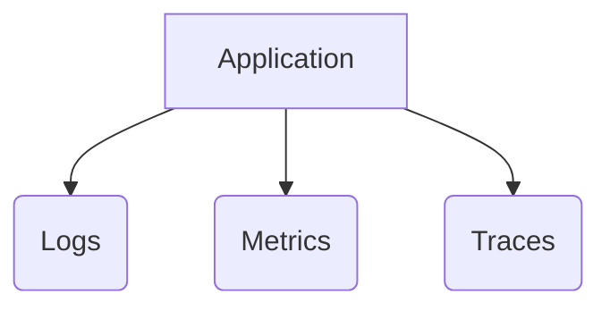
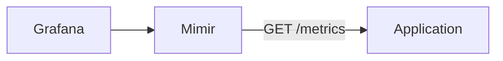
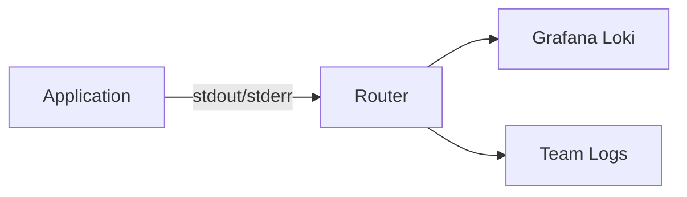
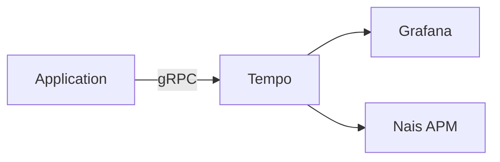
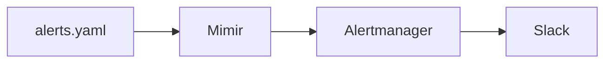

# Observability

Once your application is deployed, you need to know what it's doing. Observability gives you that visibility.

## What is observability?

Observability is the ability to understand the state of a system by looking at the logs, metrics, and traces it produces — rather than stepping through the code.

The three pillars of observability are:

1. **Logs** - Logs are a record of what has happened in your application. They are useful for debugging, but due to their unstructured format they generally do not scale very well.
2. **Metrics** - Metrics are a numerical measurement of something in your application. They are useful for understanding the performance of your application and is generally more scalable than logs both in terms of storage and querying since they are structured data.
3. **Traces** - Traces are a record of the path a request takes through your application. They are useful for understanding how a request is processed in your application.

```mermaid
graph
  A[Application] --> B(Logs)
  A --> C(Metrics)
  A --> D(Traces)

  click B "#logs"
  click C "#metrics"
  click D "#traces"
```

## Automatic observability

Nais can inject OpenTelemetry agents into your application at startup. With a few lines of YAML configuration, you get traces, metrics, and runtime data flowing to the [Nais APM](<<tenant_url("grafana", "a/nais-apm-app")>>) dashboards — no code changes required.

[:dart: Get started with auto-instrumentation](../observability/how-to/auto-instrumentation.md)

## Metrics

Metrics are a way to measure the state of your application. Metrics are usually numerical values that can be aggregated and visualized. Metrics are often used to create alerts and dashboards.

We use the [OpenMetrics][openmetrics] format for metrics. This is a text-based format that is easy to parse and understand. It is also the format used by Prometheus, which is the most popular metrics system.

[openmetrics]: https://openmetrics.io/

[:bulb: Learn more about metrics](metrics/README.md)

### Mimir

[Mimir][mimir] is a time-series database that stores metrics. It is compatible with [Prometheus][prometheus] and supports PromQL queries.

Metrics are collected by scraping (pulling) the `/metrics` endpoint from your application.

[mimir]: https://grafana.com/oss/mimir/
[prometheus]: https://prometheus.io/

```mermaid
graph LR
  Grafana --> Mimir
  Mimir --GET /metrics--> Application
```

[:simple-grafana: Query metrics in Grafana Explore](<<tenant_url("grafana", "explore")>>)

### Grafana

[Grafana][grafana] is a tool for visualizing metrics. It is used to create dashboards that can be used to monitor your application. Grafana is used by many open source projects and is the de facto standard for metrics in the cloud native world.

[:simple-grafana: Access Grafana here][nais-grafana]

[grafana]: https://grafana.com/
[nais-grafana]: <<tenant_url("grafana")>>

## Logs

Logs are a way to understand what is happening in your application. They are usually text-based and are often used for debugging. Since the format of logs is usually not standardized, it can be difficult to query and aggregate logs and thus we recommend using metrics for dashboards and alerting.

Logs that are sent to console (`stdout`) are collected automatically and can be configured for persistent storage and querying in several ways.

```mermaid
graph LR
  Application --stdout/stderr--> Router
  Router --> A[Grafana Loki]
  Router --> B[Team Logs]
```

[:bulb: Learn more about logs](logging/README.md)

## Traces

With tracing, you get application performance monitoring (APM). Tracing gives deep insight into request execution: you can see parallel calls, time spent in each function, and dependencies between services.

Traces from Nais applications are collected using the [OpenTelemetry](https://opentelemetry.io/) standard and stored in [Tempo](https://grafana.com/oss/tempo/). The [Nais APM](<<tenant_url("grafana", "a/nais-apm-app")>>) app provides service inventory, RED dashboards, dependency maps, and cross-signal navigation — no manual queries needed.

```mermaid
graph LR
  Application --gRPC--> Tempo
  Tempo --> Grafana
  Tempo --> APM[Nais APM]
```

[:bulb: Learn more about tracing](tracing/README.md)

## Alerts

Alerts are a way to notify you when something is wrong with your application, and are usually triggered when a metric or log entry matches a certain condition.

Alerts in Nais are based on application metrics and use [Prometheus Alertmanager][alertmanager] to send notifications to Slack.

[alertmanager]: https://prometheus.io/docs/alerting/latest/alertmanager/

```mermaid
graph LR
  alerts.yaml --> Mimir
  Mimir --> Alertmanager
  Alertmanager --> Slack
```

[:bulb: Learn more about alerts](alerting/README.md)

## Learning more

Observability is a very broad topic and there is a lot more to learn. Here are some resources that you can use to learn more about observability:

[:octicons-video-24: Monitoring, the Prometheus Way][youtube-prometheus]

[:octicons-book-24: SRE Book - Monitoring distributed systems][sre-book-monitoring]

[:octicons-book-24: SRE Workbook - Monitoring][sre-workbook-monitoring]

[:octicons-book-24: SRE Workbook - Alerting][sre-workbook-alerting]

[sre-book-monitoring]: https://sre.google/sre-book/monitoring-distributed-systems/
[sre-workbook-monitoring]: https://sre.google/workbook/monitoring/
[sre-workbook-alerting]: https://sre.google/workbook/alerting-on-slos/
[youtube-prometheus]: https://www.youtube.com/watch?v=PDxcEzu62jk
