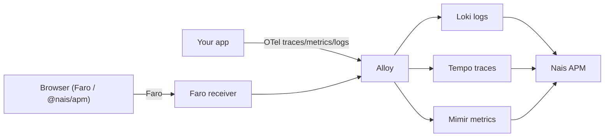

# How Nais APM works

Nais APM is a **read layer** over telemetry your apps already send to the
platform. It stores almost nothing of its own. Understanding that shapes what to
expect from it — and what it deliberately leaves to the platform.

## The LGTM pipeline

Everything in Nais APM comes from the standard Nais observability stack, often
called **LGTM** — Loki, Grafana, Tempo, Mimir:

- **Backend** apps emit OpenTelemetry traces, metrics, and logs, collected via
  **Alloy**.
- **Browser** apps emit telemetry through [Grafana Faro](../../frontend/README.md)
  (or [`@nais/apm`](../reference/apm-client-api.md), a Faro wrapper) to a Faro
  receiver, which feeds the same Alloy pipeline.
- Data lands in **Loki** (logs, including browser errors and replays),
  **Tempo** (traces), and **Mimir** (metrics, including RED and span-metrics).

Nais APM reads from these three stores and composes them into service views:
RED health from Mimir, issues and log patterns from Loki, traces and breakdowns
from Tempo. It doesn't have its own database of your telemetry — it queries the
same stores you can reach from [Grafana Explore](<<tenant_url("grafana", "explore")>>).

## Why grouping is computed at query time

The one thing Nais APM *derives* — grouping errors into
[issues](../reference/issues-model.md) — is computed **at query time and
statelessly**. When you open the Issues tab, the fingerprints are recomputed
from the raw error events in Loki. Nothing is precomputed or written back.

This is a deliberate design choice for **high availability**. Grafana runs with
multiple replicas, and a stateless query-time computation means every replica
produces the same answer with no shared cache to keep consistent and no
migration to run when the grouping algorithm improves (hence the versioned
`v1:` fingerprint prefix). The trade-off — recomputing on each read — is cheap
enough at the volumes involved.

## The one thing it does store: triage state

The exception is triage — resolve, ignore, assign. That state can't be derived
from telemetry, so it's persisted. Nais APM stores it as an **append-only event
log in Grafana's own organization annotations**, not in a database of its own.
Because Grafana already persists annotations in a database shared across all
replicas, triage state is replica-safe with **zero new infrastructure**, and the
log doubles as a full audit history.

This has one operational requirement: Grafana's annotation retention must stay
unbounded, or triage history would be deleted. The plugin checks this on its
first triage write and warns if retention is capped.

## What Nais APM does not do

Nais APM is intentionally scoped. It does **not**:

- **Store your telemetry outside your Grafana stack.** There is no third-party
  SaaS and no separate datastore — your data stays in your team's Loki, Tempo,
  and Mimir.
- **Deliver notifications or page anyone.** It *creates* alert rules
  ([from templates](../how-to/create-alerts.md)), but delivery is Grafana and
  [Nais alerting](../../alerting/README.md).
- **Schedule synthetic checks, build general dashboards, or do ML anomaly
  detection.** The "delta vs previous period" on the health overview is a
  pragmatic substitute for anomaly detection, not a model.

The result: Nais APM is a curated, opinionated view — the Sentry-style
error-tracking and APM experience — built entirely on the vanilla telemetry the
platform already collects, with no data leaving your own stack.

## Related

- [Get started with Nais APM](../tutorials/get-started.md)
- [Issues and fingerprinting](../reference/issues-model.md)
- [Frontend observability](../../frontend/README.md)
