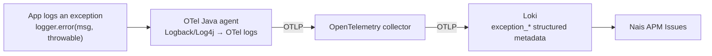

# Get backend exceptions into Issues

The Nais APM **Issues** tab groups your service's backend exceptions from Loki.
How good that grouping is depends entirely on *how the exception reaches Loki*.
This guide shows how to get JVM exceptions (Spring Boot and Ktor) into the
**richest** shape: OpenTelemetry semantic-convention exception metadata, so each
exception becomes a first-class issue with its type, message, full stack trace,
and pod impact.

## Why the log shape matters

Nais APM reads three shapes of backend exception from Loki, best to worst:

| Shape | What Loki has | Result in Issues |
|-------|---------------|------------------|
| **A — semconv metadata** | `exception_type`, `exception_message`, `exception_stacktrace` as [structured metadata](../../logging/reference/loki-labels.md) | **First-class.** Grouped by type + message, every occurrence counted, full stack trace, pod impact. |
| **B — JSON body** | A JSON log line with `message`/`msg` and an error-class `level` | Grouped by message only (no type), counted per occurrence. |
| **C — plain text** | A multi-line stack trace printed to stdout | **Weak.** Sampled, not fully counted, grouped on the lead line — lossy. |

Most JVM apps log a `Throwable` as a **plain multi-line stack trace to stdout**.
The platform's log collector (fluentbit) ships stdout to Loki verbatim — it does
**not** parse a Java stack trace back into exception fields — so those apps land
in **shape C** and get weak, sampled issues.

To reach **shape A** you have to hand the platform the exception as *structured
data*, not as printed text. The only path that does that today is sending your
logs over **OpenTelemetry (OTLP)**.

## How the OTLP path produces shape A



The [auto-instrumentation](../../how-to/auto-instrumentation.md) Java agent
includes a Logback/Log4j appender bridge. When log export is enabled, every log
event goes to the OpenTelemetry collector as a structured log record — and when
the event carries a `Throwable`, the appender attaches the semantic-convention
exception attributes automatically:

- `exception.type`
- `exception.message`
- `exception.stacktrace`

The collector forwards log records to Loki's OTLP endpoint, which stores log
attributes as **structured metadata**, normalizing dots to underscores. So
`exception.type` becomes the `exception_type` label the Issues tab groups on.
Nothing in the app needs to know the semconv field names — logging with the
throwable is enough.

!!! note "This is the same lever for any JVM logging framework"
    The bridge instruments **Logback** and **Log4j2** (and anything on SLF4J
    that routes to them). Spring Boot and Ktor both use SLF4J + Logback by
    default, so the exact same two steps below work for both: enable OTLP log
    export, and log exceptions *with the throwable*.

## Spring Boot (Kotlin / Java)

### 1. Enable auto-instrumentation and OTLP log export

You need the Java agent (for the appender bridge) and the opt-in log exporter.
In `nais.yaml`:

```yaml title="nais.yaml"
spec:
  observability:
    autoInstrumentation:
      enabled: true
      runtime: java
  env:
    - name: OTEL_LOGS_EXPORTER
      value: otlp
```

`OTEL_LOGS_EXPORTER` defaults to `none`; setting it to `otlp` is what turns on
the log bridge. See the
[auto-instrumentation reference](../../reference/auto-config.md#logs-auto-instrumentation).

!!! warning "Not compatible with Team Logs"
    Enabling OTLP log export sends **all** your logs through the collector. Do
    not combine it with [Team Logs](../../logging/how-to/team-logs.md), and read
    [Known limitations](#known-limitations-and-cost) below on log duplication
    before rolling it out widely.

### 2. Log exceptions with the throwable

Shape A only happens when the log event actually carries the exception object.
Pass the `Throwable` as the last argument — never string-interpolate it:

```kotlin
private val log = LoggerFactory.getLogger(OrderService::class.java)

try {
    processOrder(order)
} catch (e: OrderException) {
    // GOOD — the throwable is captured → exception.type/message/stacktrace
    log.error("Failed to process order {}", order.id, e)

    // BAD — the stack trace ends up as plain text in the message, shape C
    // log.error("Failed to process order ${order.id}: ${e.stackTraceToString()}")
}
```

For exceptions that escape your controllers, add a
`@RestControllerAdvice` handler so they are logged once, with the throwable, at
`ERROR`:

```kotlin
@RestControllerAdvice
class GlobalExceptionHandler {
    private val log = LoggerFactory.getLogger(javaClass)

    @ExceptionHandler(Exception::class)
    fun handle(e: Exception): ResponseEntity<String> {
        log.error("Unhandled exception", e)
        return ResponseEntity.internalServerError().body("Internal error")
    }
}
```

That's it — no `logback.xml` changes and no extra dependency are required for the
exception fields. The agent's appender adds them.

## Ktor

Ktor has no logging framework of its own: it logs through **SLF4J**, and the
standard Ktor project ships **logback-classic** as the binding. That means the
same Java-agent appender bridge applies — the two steps are identical.

### 1. Enable auto-instrumentation and OTLP log export

Same `nais.yaml` as Spring Boot above (`runtime: java`, `OTEL_LOGS_EXPORTER=otlp`).

### 2. Log exceptions with the throwable

Use the **StatusPages** plugin as the single place that turns an unhandled
exception into a logged `Throwable`:

```kotlin
install(StatusPages) {
    exception<Throwable> { call, cause ->
        call.application.log.error("Unhandled exception", cause)
        call.respondText("Internal error", status = HttpStatusCode.InternalServerError)
    }
}
```

Anywhere else you catch, log the same way — the throwable as the last argument:

```kotlin
val log = LoggerFactory.getLogger("PaymentRoute")

try {
    charge(request)
} catch (e: PaymentException) {
    log.error("Charge failed for {}", request.id, e)
    call.respond(HttpStatusCode.BadGateway)
}
```

!!! note "If your Ktor app doesn't use Logback"
    Confirm `ch.qos.logback:logback-classic` (or Log4j2) is on the classpath. If
    you use a different SLF4J binding, the agent has no appender to bridge and
    you'll stay in shape C. Logback is the Ktor default, so most apps already
    have it.

## Field mapping

What the app produces, and how it lands in the Issues tab:

| OTel log attribute (semconv) | Loki structured metadata | Used by Issues for |
|------------------------------|--------------------------|--------------------|
| `exception.type` | `exception_type` | Grouping key + issue title; also gates a line into shape A |
| `exception.message` | `exception_message` | Grouping key + issue title |
| `exception.stacktrace` | `exception_stacktrace` | Stack trace shown in the issue |
| `k8s.pod.name` (resource attr) | `k8s_pod_name` | Pod impact count |

The Issues tab selects shape A with, in effect:

```logql
sum by (exception_type, exception_message) (
  count_over_time({service_name="<app>", service_namespace="<team>"} | exception_type != "" [$__range])
)
```

## Verify it works

1. Trigger the exception in your app (dev is fine).
2. In [Grafana Explore](<<tenant_url("grafana", "explore")>>), pick your
   environment's Loki data source and run:

    ```logql
    {service_name="<your-app>", service_namespace="<your-team>"} | exception_type != ""
    ```

    Expand a result line: you should see `exception_type`, `exception_message`,
    and `exception_stacktrace` under **structured metadata** (not inside the log
    body). If they're there, you're in shape A.

3. Open your service's **Issues** tab in
   [Nais APM](<<tenant_url("grafana", "a/nais-apm-app")>>). Within a few minutes
   the exception should appear as a backend issue with its type, message, stack
   trace, and a pod-impact count.

If you see the log lines but no `exception_*` metadata, the event was logged
*without* the throwable (or via a non-Logback/Log4j binding) — revisit step 2 of
the relevant section.

## Known limitations and cost

- **Log duplication.** Enabling `OTEL_LOGS_EXPORTER=otlp` does **not** stop your
  container from writing to stdout, and fluentbit keeps shipping stdout to Loki.
  So each log line can land in Loki twice: once from stdout, once over OTLP. This
  increases log volume (and cost). Keep your console logging lean when you turn
  this on.
- **A possible duplicate issue.** If your stdout logging is JSON (for example
  logstash-logback-encoder) *and* you enable OTLP export, the same exception can
  surface as **two** issues: the rich shape-A issue (from the OTLP copy) and a
  weaker message-only shape-B issue (from the stdout JSON copy). This is a known
  rough edge — see the platform follow-up below.

## Related

- [How issues are grouped](../reference/issues-model.md) — the fingerprint model
  behind the type + message grouping.
- [Auto-instrumentation reference](../../reference/auto-config.md) — the
  `OTEL_LOGS_EXPORTER` opt-in and other agent settings.
- [Loki labels reference](../../logging/reference/loki-labels.md) — what
  structured metadata is.
- [Triage an issue](triage-an-issue.md) — acting on the issue once it's grouped.
