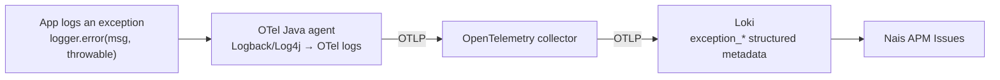

# Get backend exceptions into Issues

The Nais APM **Issues** tab groups your service's backend exceptions from Loki.
How good that grouping is depends entirely on *how the exception reaches Loki*.
This guide shows how to get backend exceptions — from JVM (Spring Boot and
Ktor), Node.js, and Go services — into the **richest** shape: OpenTelemetry
semantic-convention exception metadata, so each exception becomes a first-class
issue with its type, message, stack trace, and pod impact.

## Why the log shape matters

Nais APM reads three shapes of backend exception from Loki, best to worst:

| Shape | What Loki has | Result in Issues |
|-------|---------------|------------------|
| **A — semconv metadata** | `exception_type`, `exception_message`, `exception_stacktrace` as [structured metadata](../../logging/reference/loki-labels.md) | **First-class.** Grouped by type + message, every occurrence counted, full stack trace, pod impact. |
| **B — JSON body** | A JSON log line with `message`/`msg` and an error-class `level` | Grouped by message only (no type), counted per occurrence. |
| **C — plain text** | A multi-line stack trace printed to stdout | **Weak.** Sampled, not fully counted, grouped on the lead line — lossy. |

Most JVM apps log a `Throwable` as a **plain multi-line stack trace to stdout**.
The platform's log collector (fluentbit) ships stdout to Loki verbatim — it does
**not** parse a Java stack trace back into exception fields — so those apps land
in **shape C** and get weak, sampled issues.

To reach **shape A** you have to hand the platform the exception as *structured
data*, not as printed text. The only path that does that today is sending your
logs over **OpenTelemetry (OTLP)**.

## How the OTLP path produces shape A



The [auto-instrumentation](../../how-to/auto-instrumentation.md) Java agent
includes a Logback/Log4j appender bridge. When log export is enabled, every log
event goes to the OpenTelemetry collector as a structured log record — and when
the event carries a `Throwable`, the appender attaches the semantic-convention
exception attributes automatically:

- `exception.type`
- `exception.message`
- `exception.stacktrace`

The collector forwards log records to Loki's OTLP endpoint, which stores log
attributes as **structured metadata**, normalizing dots to underscores. So
`exception.type` becomes the `exception_type` label the Issues tab groups on.
Nothing in the app needs to know the semconv field names — logging with the
throwable is enough.

!!! note "This is the same lever for any JVM logging framework"
    The bridge instruments **Logback** and **Log4j2** (and anything on SLF4J
    that routes to them). Spring Boot and Ktor both use SLF4J + Logback by
    default, so the exact same two steps below work for both: enable OTLP log
    export, and log exceptions *with the throwable*.

!!! note "Node.js is automatic too; Go is manual"
    Node.js reaches shape A the same way — the auto-instrumentation's Winston or
    Pino appender attaches `exception.*` when you log an `Error` object (see
    [Node.js and Express](#nodejs-and-express)). Go has **no** platform agent and
    no automatic error mapping, so you set the `exception.*` attributes yourself
    (see [Go (net/http)](#go-nethttp)).

## Spring Boot (Kotlin / Java)

### 1. Enable auto-instrumentation and OTLP log export

You need the Java agent (for the appender bridge) and the opt-in log exporter.
In `nais.yaml`:

```yaml title="nais.yaml"
spec:
  observability:
    autoInstrumentation:
      enabled: true
      runtime: java
  env:
    - name: OTEL_LOGS_EXPORTER
      value: otlp
```

`OTEL_LOGS_EXPORTER` defaults to `none`; setting it to `otlp` is what turns on
the log bridge. See the
[auto-instrumentation reference](../../reference/auto-config.md#logs-auto-instrumentation).

!!! warning "Not compatible with Team Logs"
    Enabling OTLP log export sends **all** your logs through the collector. Do
    not combine it with [Team Logs](../../logging/how-to/team-logs.md), and read
    [Known limitations](#known-limitations-and-cost) below on log duplication
    before rolling it out widely.

### 2. Log exceptions with the throwable

Shape A only happens when the log event actually carries the exception object.
Pass the `Throwable` as the last argument — never string-interpolate it:

```kotlin
private val log = LoggerFactory.getLogger(OrderService::class.java)

try {
    processOrder(order)
} catch (e: OrderException) {
    // GOOD — the throwable is captured → exception.type/message/stacktrace
    log.error("Failed to process order {}", order.id, e)

    // BAD — the stack trace ends up as plain text in the message, shape C
    // log.error("Failed to process order ${order.id}: ${e.stackTraceToString()}")
}
```

For exceptions that escape your controllers, add a
`@RestControllerAdvice` handler so they are logged once, with the throwable, at
`ERROR`:

```kotlin
@RestControllerAdvice
class GlobalExceptionHandler {
    private val log = LoggerFactory.getLogger(javaClass)

    @ExceptionHandler(Exception::class)
    fun handle(e: Exception): ResponseEntity<String> {
        log.error("Unhandled exception", e)
        return ResponseEntity.internalServerError().body("Internal error")
    }
}
```

That's it — no `logback.xml` changes and no extra dependency are required for the
exception fields. The agent's appender adds them.

## Ktor

Ktor has no logging framework of its own: it logs through **SLF4J**, and the
standard Ktor project ships **logback-classic** as the binding. That means the
same Java-agent appender bridge applies — the two steps are identical.

### 1. Enable auto-instrumentation and OTLP log export

Same `nais.yaml` as Spring Boot above (`runtime: java`, `OTEL_LOGS_EXPORTER=otlp`).

### 2. Log exceptions with the throwable

Use the **StatusPages** plugin as the single place that turns an unhandled
exception into a logged `Throwable`:

```kotlin
install(StatusPages) {
    exception<Throwable> { call, cause ->
        call.application.log.error("Unhandled exception", cause)
        call.respondText("Internal error", status = HttpStatusCode.InternalServerError)
    }
}
```

Anywhere else you catch, log the same way — the throwable as the last argument:

```kotlin
val log = LoggerFactory.getLogger("PaymentRoute")

try {
    charge(request)
} catch (e: PaymentException) {
    log.error("Charge failed for {}", request.id, e)
    call.respond(HttpStatusCode.BadGateway)
}
```

!!! note "If your Ktor app doesn't use Logback"
    Confirm `ch.qos.logback:logback-classic` (or Log4j2) is on the classpath. If
    you use a different SLF4J binding, the agent has no appender to bridge and
    you'll stay in shape C. Logback is the Ktor default, so most apps already
    have it.

## Node.js and Express

Node has no bytecode agent like the JVM, but the `runtime: nodejs`
[auto-instrumentation](../../how-to/auto-instrumentation.md) is the OpenTelemetry
Node SDK plus the auto-instrumentations bundle — and that bundle includes the
**Winston** and **Pino** instrumentations. Each of those has a log-sending
appender that forwards your log records into the OTel logs pipeline, and on
current versions it maps a logged `Error` onto the semantic-convention
`exception.*` attributes for you. So the recipe is the same two steps: enable
OTLP log export, and log the **`Error` object** — never a preformatted string.

### 1. Enable auto-instrumentation and OTLP log export

```yaml title="nais.yaml"
spec:
  observability:
    autoInstrumentation:
      enabled: true
      runtime: nodejs
  env:
    - name: OTEL_LOGS_EXPORTER
      value: otlp
```

Setting `OTEL_LOGS_EXPORTER=otlp` is what makes the Node SDK configure a logs
provider for the Winston/Pino appenders to emit into; log sending is on by
default once that provider exists.

### 2. Log the `Error` object

Pass the `Error` itself so the appender can read its name, message, and stack —
don't interpolate it into the message string.

With **Pino**, put the error under the `err` key (Pino's default error key):

```javascript
// GOOD — the Error under `err` → exception.type/message/stacktrace,
// and `orderId` rides along as a structured attribute
logger.error({ err, orderId: order.id }, "Failed to process order");

// BAD — a preformatted string: no type, no stack → shape B
// logger.error(`Failed to process order ${order.id}: ${err.message}`);
```

With **Winston**, pass the error alongside the message:

```javascript
// GOOD — the Error is picked up from the log arguments → exception.* attributes
logger.error("Failed to process order", { orderId: order.id, err });

// BAD — string interpolation, no exception metadata → shape B
// logger.error(`Failed to process order ${order.id}: ${err.message}`);
```

The natural place to catch what escapes your routes is the Express
**error-handling middleware** — the four-argument handler `(err, req, res, next)`,
registered after all your routes:

```javascript
app.use((err, req, res, next) => {
    logger.error({ err }, "Unhandled error"); // Winston: logger.error("Unhandled error", { err })
    res.status(500).send("Internal Server Error");
});
```

!!! note "Check your OpenTelemetry versions"
    The automatic `Error` → `exception.*` mapping is a recent addition
    (OpenTelemetry JS `api-logs`/`sdk-logs` ≥ 0.212.0, which the platform's
    `nodejs` agent bundles). On older self-managed pins the `Error` was copied as
    a generic attribute instead, leaving you in shape B. If you emit your own log
    records with `@opentelemetry/api-logs`, you can set it explicitly by passing
    the error as the record's `exception` field:
    `logger.emit({ severityNumber: SeverityNumber.ERROR, body: err.message, exception: err })`.

## Go (net/http)

Go is different in two ways, and it's worth being honest about both.

First, there is **no Go agent**. The `runtime: sdk`
[auto-instrumentation](../../how-to/auto-instrumentation.md) mode sets the
OpenTelemetry environment variables (including the OTLP endpoint) but injects
nothing into your process — your app wires the OpenTelemetry SDK itself, so you
configure the logs pipeline in code.

Second, **nothing maps a Go `error` to `exception.*` for you**, and a Go `error`
carries no stack trace the way a Java `Throwable` does. You can still reach shape
A on `exception.type` and `exception.message` — which is what the Issues tab
groups on — but you set those attributes yourself, and a real stack trace takes
extra work.

### 1. Wire the logs SDK and bridge `slog` to it

Build a `LoggerProvider` with the OTLP log exporter and route `slog` through the
[`otelslog`](https://pkg.go.dev/go.opentelemetry.io/contrib/bridges/otelslog)
bridge. The OpenTelemetry Go **logs** signal is still beta (`v0.x` modules), but
it is usable in production:

```go
import (
    "context"
    "log/slog"

    "go.opentelemetry.io/contrib/bridges/otelslog"
    "go.opentelemetry.io/otel/exporters/otlp/otlplog/otlploggrpc"
    sdklog "go.opentelemetry.io/otel/sdk/log"
    "go.opentelemetry.io/otel/sdk/resource"
)

func setupLogging(ctx context.Context, res *resource.Resource) (*sdklog.LoggerProvider, error) {
    // otlploggrpc reads the OTEL_EXPORTER_OTLP_* env vars that `runtime: sdk` injects.
    exporter, err := otlploggrpc.New(ctx)
    if err != nil {
        return nil, err
    }
    provider := sdklog.NewLoggerProvider(
        sdklog.WithResource(res), // the same resource you build for traces (service.name / namespace)
        sdklog.WithProcessor(sdklog.NewBatchProcessor(exporter)),
    )
    // Route the standard-library slog through the bridge.
    slog.SetDefault(otelslog.NewLogger("my-app", otelslog.WithLoggerProvider(provider)))
    return provider, nil // remember to defer provider.Shutdown(ctx)
}
```

### 2. Log the error with `exception.*` attributes

The bridge copies `slog` attribute keys through verbatim and does **not**
special-case errors — so name the attributes with the exact semantic-convention
keys and they land as the `exception_type` / `exception_message` structured
metadata the Issues tab needs:

```go
func handleOrder(w http.ResponseWriter, r *http.Request) {
    if err := processOrder(r.Context(), order); err != nil {
        // GOOD — exception.type + exception.message → shape A grouping,
        // order.id rides along as its own structured attribute
        slog.ErrorContext(r.Context(), "failed to process order",
            slog.String("order.id", order.ID),
            slog.String("exception.type", fmt.Sprintf("%T", err)),
            slog.String("exception.message", err.Error()),
        )

        // BAD — the error folded into the message: no type, fragmented grouping → shape B
        // slog.Error("failed to process order " + order.ID + ": " + err.Error())

        http.Error(w, "internal error", http.StatusInternalServerError)
        return
    }
}
```

!!! warning "Stack traces are weaker in Go — be realistic"
    A Go `error` has no stack, so `exception.stacktrace` is **not** populated for
    you. If you need it you must capture it yourself with `runtime.Stack`, but
    that gives the *current* goroutine's stack at the log call — not where the
    error originated — so it's far less useful than a JVM stack trace. An error
    library that records a stack at creation (for example `pkg/errors` or
    `cockroachdb/errors`) is a better source; format its stack into
    `slog.String("exception.stacktrace", …)`. Separately,
    `span.RecordError(err, trace.WithStackTrace(true))` records the exception on
    the current **span** (visible in the trace), independent of the log record
    above. Type + message alone is still enough to land in shape A.

## Log the exception, not a bare message

This is the single biggest reason backend Issues come out thin, and it applies to
every runtime above. Everything hinges on one habit: **hand the logging framework
the throwable/error object, not a string you built from it.** The moment you
pre-format the error into the message, its type and stack are gone and Loki only
ever sees text — you drop from shape A to shape B (or, on stdout, shape C).

### Log the object, never a pre-formatted string

Bad first, good second, per runtime:

**JVM (Kotlin)**

```kotlin
// BAD  — type and stack lost inside a string
log.warn("Failed to fetch $url: ${e.message}")
// GOOD — throwable as the last argument, url as a parameter
log.warn("Failed to fetch {}", url, e)
```

**Node.js (Pino)**

```javascript
// BAD
logger.warn(`Failed to fetch ${url}: ${err.message}`);
// GOOD
logger.warn({ err, url }, "Failed to fetch");
```

**Go**

```go
// BAD
slog.Warn("failed to fetch " + url + ": " + err.Error())
// GOOD
slog.Warn("failed to fetch",
    slog.String("url", url),
    slog.String("exception.type", fmt.Sprintf("%T", err)),
    slog.String("exception.message", err.Error()),
)
```

### Don't log self-healing retries at error or warn

A message that logs on every retry and then recovers is still counted as an
Issue — often a *top* Issue — even though nothing was ever actually broken. Log
retries at `info`/`debug`, and only escalate to `error` when the **final**
attempt fails:

```javascript
async function fetchWithRetry(url, attempts = 3) {
    for (let i = 1; i <= attempts; i++) {
        try {
            return await fetch(url);
        } catch (err) {
            if (i === attempts) {
                // only the terminal failure becomes an Issue
                logger.error({ err, url, attempts }, "Fetch failed after retries");
                throw err;
            }
            // transient, self-healing — not an Issue
            logger.debug({ url, attempt: i }, "Fetch failed, retrying");
        }
    }
}
```

### Put context in attributes, not in the message

Add identifiers and status as **structured fields** (`url`, `status`, `orderId`)
rather than concatenating them into the message string. Two payoffs: they become
queryable structured metadata in Loki, and — because the Issues tab groups on
message + type — keeping variable data out of the message stops one error from
fragmenting into dozens of near-duplicate issues.

## Field mapping

What the app produces, and how it lands in the Issues tab:

| OTel log attribute (semconv) | Loki structured metadata | Used by Issues for |
|------------------------------|--------------------------|--------------------|
| `exception.type` | `exception_type` | Grouping key + issue title; also gates a line into shape A |
| `exception.message` | `exception_message` | Grouping key + issue title |
| `exception.stacktrace` | `exception_stacktrace` | Stack trace shown in the issue |
| `k8s.pod.name` (resource attr) | `k8s_pod_name` | Pod impact count |

The Issues tab selects shape A with, in effect:

```logql
sum by (exception_type, exception_message) (
  count_over_time({service_name="<app>", service_namespace="<team>"} | exception_type != "" [$__range])
)
```

## Verify it works

1. Trigger the exception in your app (dev is fine).
2. In [Grafana Explore](<<tenant_url("grafana", "explore")>>), pick your
   environment's Loki data source and run:

    ```logql
    {service_name="<your-app>", service_namespace="<your-team>"} | exception_type != ""
    ```

    Expand a result line: you should see `exception_type`, `exception_message`,
    and `exception_stacktrace` under **structured metadata** (not inside the log
    body). If they're there, you're in shape A.

3. Open your service's **Issues** tab in
   [Nais APM](<<tenant_url("grafana", "a/nais-apm-app")>>). Within a few minutes
   the exception should appear as a backend issue with its type, message, stack
   trace, and a pod-impact count.

If you see the log lines but no `exception_*` metadata, the event was logged
without the error object — on the JVM, without the throwable or via a
non-Logback/Log4j binding; on Node.js, as a preformatted string instead of the
`Error`; on Go, without the `exception.*` attributes — so revisit step 2 of the
relevant section.

## Known limitations and cost

- **Log duplication.** Enabling `OTEL_LOGS_EXPORTER=otlp` does **not** stop your
  container from writing to stdout, and fluentbit keeps shipping stdout to Loki.
  So each log line can land in Loki twice: once from stdout, once over OTLP. This
  increases log volume (and cost). Keep your console logging lean when you turn
  this on.
- **A possible duplicate issue.** If your stdout logging is JSON (for example
  logstash-logback-encoder on the JVM, or Pino/Winston JSON on Node.js) *and* you
  enable OTLP export, the same exception can
  surface as **two** issues: the rich shape-A issue (from the OTLP copy) and a
  weaker message-only shape-B issue (from the stdout JSON copy). This is a known
  rough edge — see the platform follow-up below.

## Related

- [How issues are grouped](../reference/issues-model.md) — the fingerprint model
  behind the type + message grouping.
- [Auto-instrumentation reference](../../reference/auto-config.md) — the
  `OTEL_LOGS_EXPORTER` opt-in and other agent settings.
- [Loki labels reference](../../logging/reference/loki-labels.md) — what
  structured metadata is.
- [Triage an issue](triage-an-issue.md) — acting on the issue once it's grouped.
