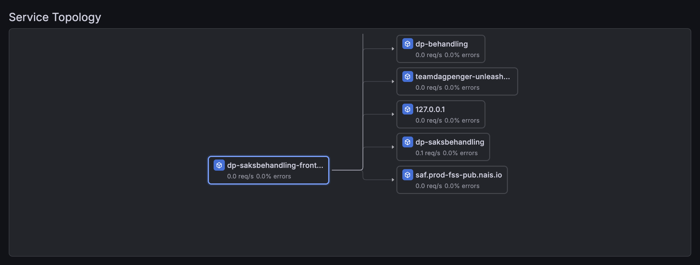
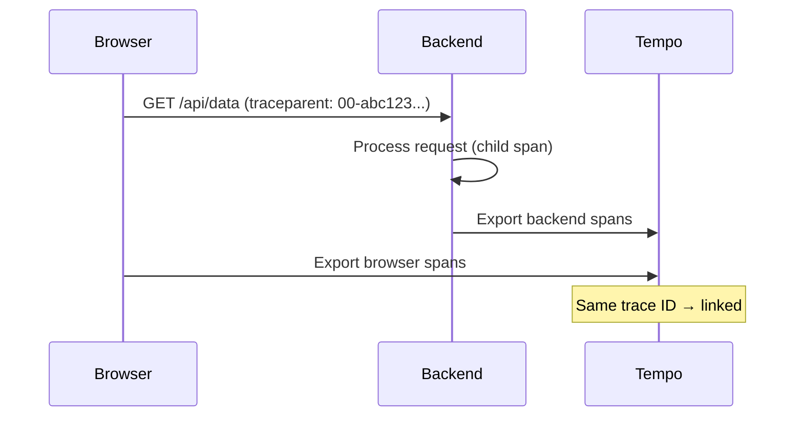

# Frontend-to-backend trace propagation

By default, Faro collects browser-side traces but they're not connected to your backend spans in Tempo. With trace propagation, you get end-to-end visibility: a single trace that follows a user action from the browser through your backend services.



A few applications on Nais use this today (dp-saksbehandling-frontend, dp-brukerdialog-frontend, dp-mine-dagpenger-frontend). It's quick to set up and makes debugging cross-service issues far easier.

## How it works

1. The browser sends a `traceparent` HTTP header with each API request to your backend
2. Your backend picks up the trace context and creates child spans under the same trace
3. Both browser and backend spans appear together in Grafana Tempo



## What you need

1. `@grafana/faro-web-tracing` installed in your frontend
2. `propagateTraceHeaderCorsUrls` configured in `TracingInstrumentation` (shown below)
3. Backend CORS allowing the `traceparent` header
4. Backend instrumented with OpenTelemetry (or [auto-instrumentation](../../how-to/auto-instrumentation.md)) and exporting traces to Tempo

## Configure trace propagation in Faro

Add `propagateTraceHeaderCorsUrls` to your `TracingInstrumentation` config. This tells Faro which URLs should receive the `traceparent` header:

```typescript
import { getWebInstrumentations, initializeFaro } from '@grafana/faro-web-sdk';
import { TracingInstrumentation } from '@grafana/faro-web-tracing';

initializeFaro({
  url: '...', // collector endpoint
  app: { name: 'my-app' },
  instrumentations: [
    ...getWebInstrumentations(),
    new TracingInstrumentation({
      instrumentationOptions: {
        propagateTraceHeaderCorsUrls: [
          /https:\/\/my-backend\.nav\.no\/.*/,
        ],
      },
    }),
  ],
});
```

Use a regex or string that matches your backend API URLs. You can list multiple patterns:


```typescript
propagateTraceHeaderCorsUrls: [
  /https:\/\/api\.nav\.no\/.*/,
  /https:\/\/my-backend\.intern\.dev\.nav\.no\/.*/,
],
```

Or use a single wildcard to propagate traces to all `*.nav.no` backends:

```typescript
propagateTraceHeaderCorsUrls: [/https:\/\/[^/]+\.nav\.no\/.*/],
```

```typescript
propagateTraceHeaderCorsUrls: [
  /https:\/\/my-backend\.<<tenant()>>\.cloud\.nais\.io\/.*/,
],
```


If you build URLs from environment variables, escape them to prevent [ReDoS](https://owasp.org/www-community/attacks/Regular_expression_Denial_of_Service_-_ReDoS):

```typescript
function escapeRegExp(str: string): string {
  return str.replace(/[.*+?^${}()|[\]\\]/g, '\\$&');
}

propagateTraceHeaderCorsUrls: [
  new RegExp(`${escapeRegExp(apiUrl)}/.*`),
],
```

## Configure CORS on your backend

Your backend must allow the `traceparent` header in CORS responses. Without this, the browser blocks the header and trace propagation silently fails.

Add `traceparent` to `Access-Control-Allow-Headers`:

```
Access-Control-Allow-Headers: Content-Type, traceparent
```

If you also use `tracestate` (for vendor-specific trace context), allow that too:

```
Access-Control-Allow-Headers: Content-Type, traceparent, tracestate
```

## Optional: Backend `server-timing` header

To correlate backend responses back to the frontend trace, your backend can send a `server-timing` header containing the trace context. This lets Grafana link the response back to the backend span.

In a Next.js middleware:

```typescript
// middleware.ts
import { NextRequest, NextResponse } from 'next/server';
import { trace } from '@opentelemetry/api';

export function middleware(request: NextRequest) {
  const response = NextResponse.next();
  const span = trace.getActiveSpan();

  if (span) {
    const { traceId, spanId } = span.spanContext();
    response.headers.set(
      'server-timing',
      `traceparent;desc="00-${traceId}-${spanId}-01"`,
    );
  }

  return response;
}
```

## Verify it works

1. Open your app in a browser
2. Open DevTools → **Network** tab
3. Make a request to your backend API
4. Check the **Request Headers** — you should see `traceparent: 00-<traceId>-<spanId>-01`
5. If you set up the `server-timing` header, check the **Response Headers** for it
6. In [Grafana Tempo](https://grafana.<<tenant()>>.cloud.nais.io/explore), search for the trace ID — you should see both browser and backend spans

## Related

- [Backend context propagation](../../tracing/how-to/context-propagation.md) — how to propagate traces between backend services
- [Correlate traces and logs](../../tracing/how-to/correlate-traces-logs.md) — connect traces with structured logs
- [Troubleshooting](../reference/troubleshooting.md) — common CORS and CSP issues
