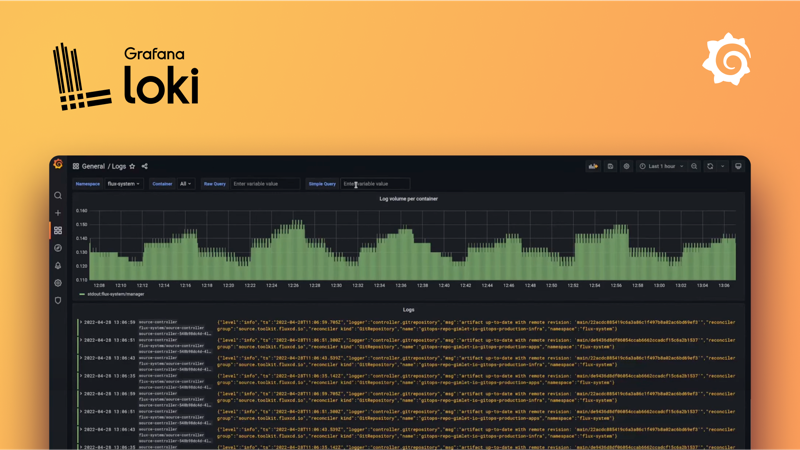
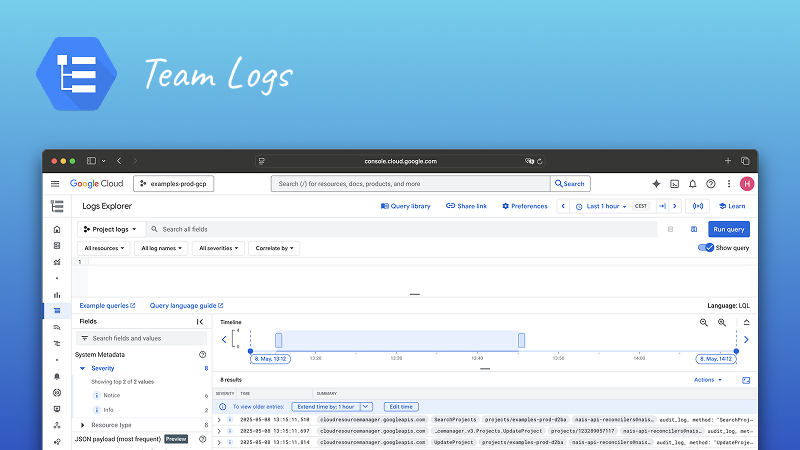

# Logging

## Purpose of logs

Logs are a way to understand what is happening in your application. They are usually text-based and are often used for debugging. Since the format of logs is usually not standardized, it can be difficult to query and aggregate logs and thus we recommend using metrics for dashboards and alerting.

There are many types of logs, and they can be used for different purposes. Some logs are used for debugging, some are used for auditing, and some are used for security. Our primary use case for logs is to understand the flow of a request through a system.

Application logs in nais is first and foremost a tool for developers to debug their applications. It is not intended to be used for auditing or security purposes. We do not condone writing sensitive information to application logs.

## Good practice

- [x] **Establish a clear logging strategy** for your application. What do you want to log? What do you not want to log? What is the purpose of your logs?
- [x] **Use log levels** to differentiate between different types of logs. We recommend using the following log levels: `INFO`, `WARN`, `ERROR`, and `FATAL`.
- [x] **Use structured logging**. This means that your logs must be written in a JSON format. This makes it easier to query and aggregate logs.
- [x] **Write meaningful log messages** and attach relevant metadata to your logs. This makes it easier to understand what is happening in your application.
- [ ] **Do not log sensitive information**. This includes personal information, passwords, and secrets.
    If you need to log sensitive information, use [secure logs](how-to/enable-secure-logs.md) or [audit logs](how-to/audit-logs.md).
- [ ] **Do not underestimate the cost and performance** of logging. Logging is a trade-off between observability, performance, and cost. Logging can be computational and financial expensive, so make sure you log only what you actually need.
- [ ] **Do not use rely on logs for monitoring**. Use metrics for monitoring, visualization, and alerting as your first line of defense and use logs for debugging when something goes wrong.

## Log destinations

Logs can be sent to different destinations for persistent storage and querying. Logs can even be sent to multiple destinations at the same time depending on your use case.

### Grafana Loki

Grafana Loki is the default log storage system in Nais. It is inspired by Prometheus and integrates seamlessly with Grafana. It is designed to be cost effective and easy to operate, as it does not index the contents of the logs, but rather a set of predefined labels for each log stream.

Loki is designed to be used in conjunction with metrics and tracing to provide a complete picture of an application's performance. Without the other two, it can be perceived as more cumbersome to use than a traditional logging system.

[:dart: Get started with Grafana Loki](how-to/loki.md)

### Team Logs

Team Logs is a private log storage system for your team. Where logs in Loki is available across all teams, Team Logs private log storage system is only available for your team. Team Logs is designed to be used in conjunction with Grafana Loki and has to be configured as a destination for your application logs.

[:dart: Get started with Team Logs](how-to/team-logs.md)
