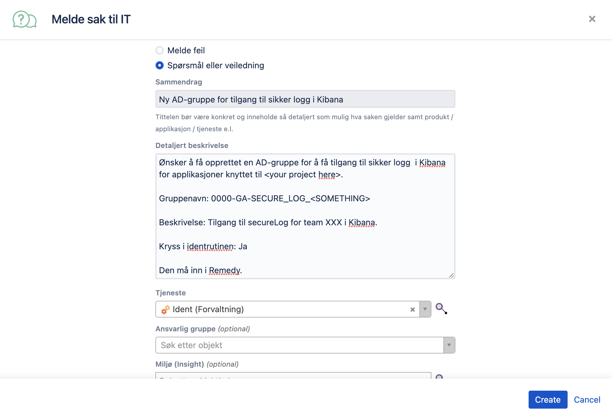

# Access secure logs

Once secure logs for your team are [enabled](./enable-secure-logs.md), they will be sent to the team's own `tjenestekall-*` index in Kibana. Those indices are accessed through `Securelogs` dataview. The members of the corresponding NAIS team should get access to those logs automatically when they log on to Kibana with Single Sign On. Send a message in #kibana channel if that is not the case. 

## Access to secure logs for external participants

It is also possible to give access to these logs to people outside of the team. The external participants currently could not use Single Sign On to read the others' secure logs. They should use Elasticsearch login on the Kibana login page. 

To open access to your secure logs for people not in the team do the following:

### Create an AD-group

To make sure you give external access to the proper logs, you need an AD-group connected to the nais-team. So the first thing you do is create this group.

Go to [Porten (service desk)](https://jira.adeo.no/plugins/servlet/desk/portal/542) and click `Melde sak til IT`. Then follow the template below.
For IT to be able to correctly add the group to Remedy you need to specify the four digit department code for those who can be able to ask for permission to the group. E.g 2990 is the four digit code for the department IT-AVDELINGEN. If you are creating secure logs for your team and are unsure about which department your colleagues belong to then you can use [Delve](https://eur.delve.office.com/) to search for their profile. In their profile their department code will also be visible.

You can paste the template below into Jira:

```text
Ønsker å få opprettet en AD-gruppe for å dele sikker logg i Kibana fra <your project here> med eksterne deltagere ved behov.

Gruppenavn: 0000-GA-SECURE_LOG_<SOMETHING>

Beskrivelse: Tilgang for eksterne deltagere til secureLog fra Team <team name> i Kibana.

Kryss i identrutinen: Ja

Den må inn i Remedy.
Enheter i Nav som skal ha tilgang: <four digit department code>. E.g (2990 - IT-AVDELINGEN)
```



### Connect the AD group to your team in Kibana

The logs your apps produces are linked with your [NAIS team](../../../explanations/team.md).
Administrators of Kibana will give the read rights to those logs to people from the created group.
Ask for this in the [#kibana](https://nav-it.slack.com/archives/C7T8QHXD3) Slack channel; provide the name of the AD-group and the name of your team in the message.

### Put people into the AD-group

This must be done by "identansvarlig". For NAV-IT employees, this is `nav.it.identhandtering@nav.no`. Send them an email and ask for access with a CC to whoever is your superior.

For everyone else, the team lead or who ever is their superior should know.

### What can go wrong?

Basically, the one thing that can go wrong here is that the AD-group is not registered in "identrutinen". If this happens, the group cannot be found by "identansvarlig". If this happens, make a new JIRA-ticket to the same people and tell them to transfer the group. Sadly this can take a few days.
