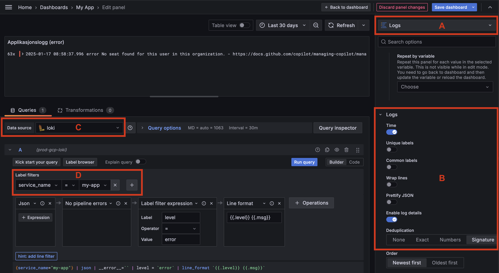

# Adding logs to your Grafana dashboard

In this guide, you will learn how to add logs to your Grafana dashboards. Logs are a valuable source of information for debugging and monitoring your applications. By adding logs to your Grafana dashboards, you can correlate logs with metrics and traces to get a complete picture of your application's health.

## Prerequisites

- [Enabled Loki logging for your application](./loki.md#enable-logging-to-grafana-loki)
- A Grafana dashboard

## Add logs to your dashboard

To add logs to your Grafana dashboard, you need to open the dashboard in edit mode and add a new Visualization to the dashboard. This will open the Visualization editor where you can configure the log query and display options.

1. Open your Grafana dashboard in edit mode.
1. Click the `Add` button in the top menu and select `Visualization`.
1. Select `Logs` as the panel visualization type (`A`)
1. Optionally, you can configure log display and de-duplication (`B`).
1. Select the Loki data source (`C`).
1. Enter your LogQL query in the query editor (`D`). Here you can filter logs by indexed labels such as `service_name`, and `service_namespace`.
1. Add additional query operations such as Json parsing, filtering, and aggregation (`E`).

In the above example, we are querying logs from the `service_name` label with the value `my-app`. We then parse the JSON log message (ignoring any parsing errors) and filter logs with the `level` field set to `error`. Lastly we format the log line as level and message (`{{ .level }} {{ .msg }}`).
