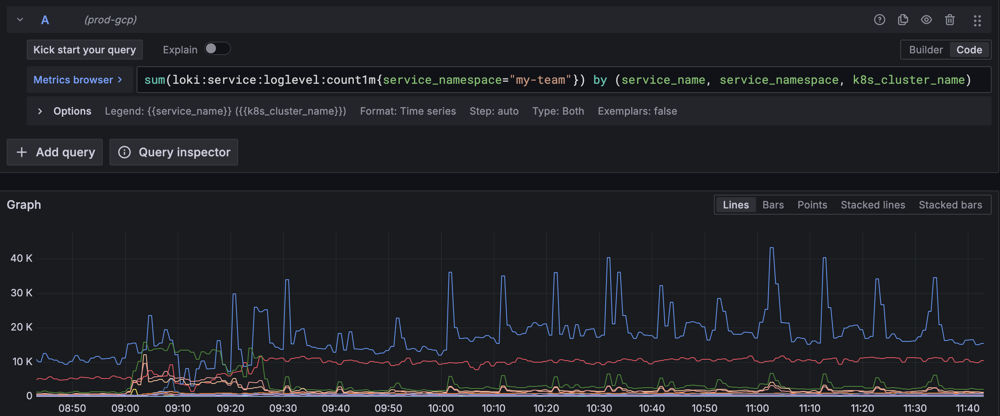

# Metrics and alerts for logs

This guide shows how to use Loki metrics for monitoring log patterns and creating alerts.

## Monitoring error rates using log metrics

To monitor error rates using the `loki:service:loglevel:count1m` metric:

1. **Access Grafana** and create a new panel

2. **Use this PromQL query** to calculate error percentage:

   ```promql
   100 *
     sum(loki:service:loglevel:count1m{service_namespace="my-team", service_name="my-app", detected_level="error"}) by (service_name, service_namespace, k8s_cluster_name)
   /
     sum(loki:service:loglevel:count1m{service_namespace="my-team", service_name="my-app"}) by (service_name, service_namespace, k8s_cluster_name)
   ```

   > **Important**: The `loki:service:loglevel:count1m` metric is already pre-aggregated for 1-minute intervals. Do not use `rate()` or `increase()` functions with it.

3. **Configure visualization** as a graph or gauge



## Common log monitoring queries

Monitor high error volume:

```promql
sum(loki:service:loglevel:count1m{service_name="my-app", detected_level="error"}) > 50
```

Show trends over time:

```promql
sum(loki:service:loglevel:count1m{service_name="my-app", detected_level="error"}[60m:1m]) by (service_name)
```

Compare error rates across clusters:

```promql
sum(loki:service:loglevel:count1m{service_name="my-app", detected_level="error"}) by (k8s_cluster_name)
```

## Creating Prometheus alerts for logs

To create an alert for high error rates in your logs, add a `PrometheusRule` to your application:

```yaml
apiVersion: monitoring.coreos.com/v1
kind: PrometheusRule
metadata:
  labels:
    team: my-team
  name: log-error-alerts
  namespace: my-team
spec:
  groups:
  - name: log-error-alerts
    rules:
      - alert: HighErrorLogRate
        expr: |
          (
            sum(loki:service:loglevel:count1m{service_name="my-app", detected_level="error"})
            /
            sum(loki:service:loglevel:count1m{service_name="my-app"})
          ) > 0.05
        for: 10m
        annotations:
          summary: "High log error rate detected"
          consequence: "Users may be experiencing errors when using the application."
          action: "Check logs for error messages and investigate affected services."
          message: "Service {{ $labels.service_name }} has {{ $value | humanizePercentage }} error logs over the last 10 minutes."
          runbook_url: "https://github.com/navikt/my-app-runbook/blob/main/HighErrorLogRate.md"
        labels:
          severity: warning
          namespace: my-team
```

### Related Documentation

- [How to create alerts with Prometheus metrics](../../alerting/how-to/prometheus-basic.md)
- [Loki Metrics Reference](../reference/loki-metrics.md)
