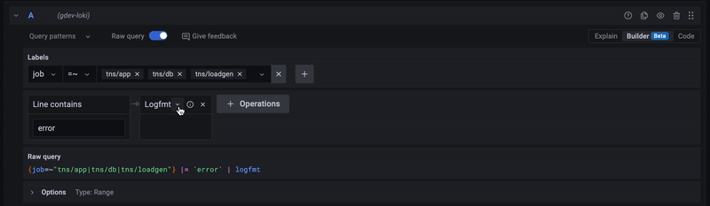

# Get started with Grafana Loki

This guide will help you get started with Grafana Loki, a log aggregation system that is integrated with Grafana and inspired by Prometheus.

## Enable logging to Grafana Loki

Grafana Loki can be enabled by setting the list of logging destinations in your nais application manifest.

???+ note ".nais/application.yaml"
    ```yaml hl_lines="6"
    …
    spec:
      observability:
        logging:
          destinations:
            - id: loki
    ```

!!! warning
    Setting logging destinations will override the default logging configuration. If you want to keep the default logging configuration and add Loki as an additional destination, you need to include the default destination in the list.

## Working with logs in Grafana Loki

Grafana Loki is integrated directly with Grafana, and you can access your logs either by adding a Logs Panel to your dashboard or by clicking on the "[Explore](<<tenant_url("grafana", "explore")>>)" link on the left-hand side of the Grafana UI and selecting one of the Loki data sources (one for each environment).

Grafana Loki has a query language called [LogQL](../reference/logql.md) that you can use to search for logs. LogQL is a simplified version of PromQL, and you can use LogQL to search for logs by message, by field, or by a combination of both.

To get you started we suggest using the query builder mode when writing your first LogQL queries. The query builder mode is a graphical interface that helps you build LogQL queries by selecting labels and fields from your logs.



## Further reading

- [LogQL reference](../reference/logql.md)
