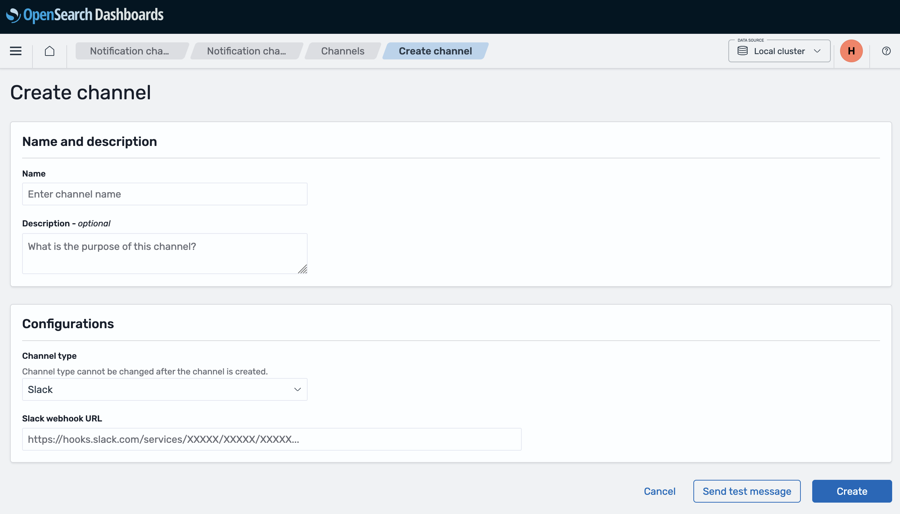
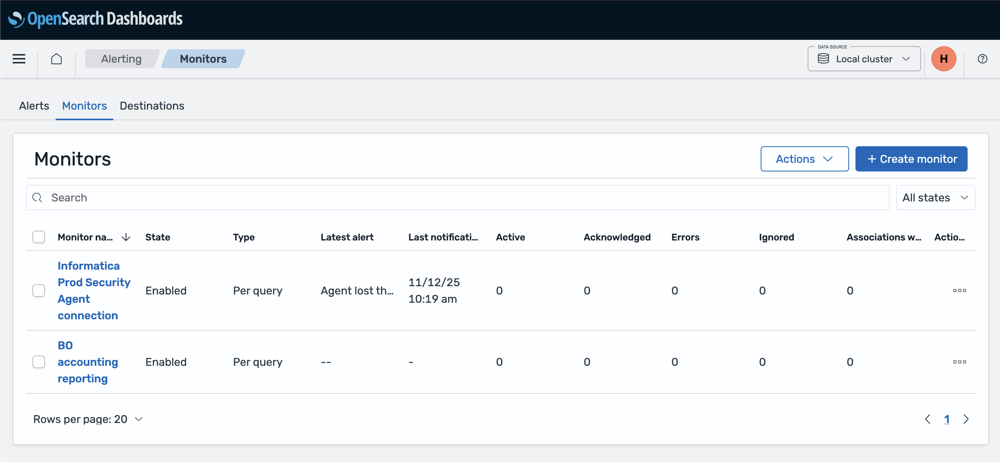
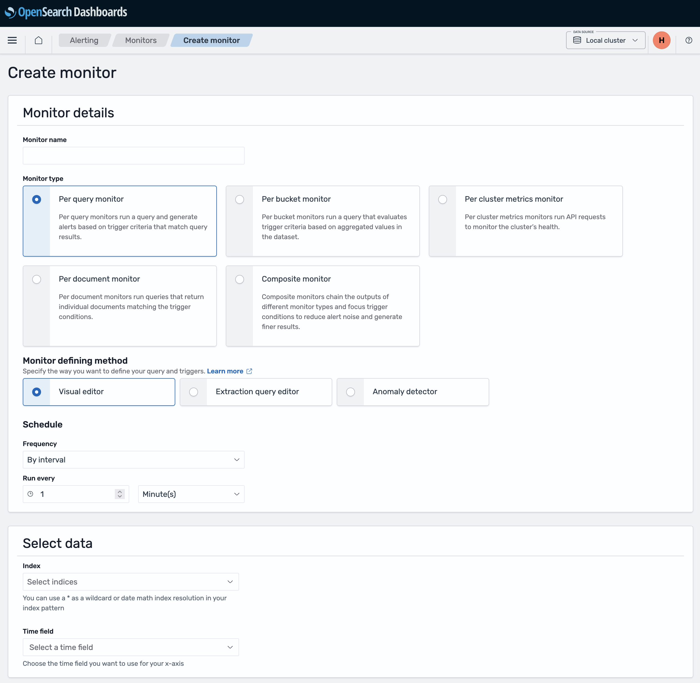
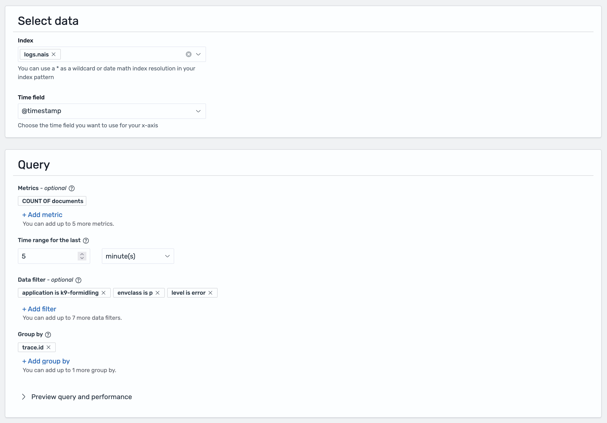
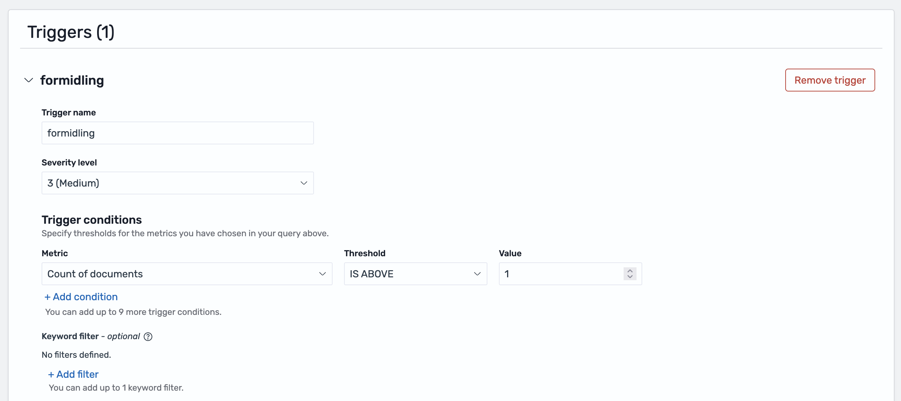
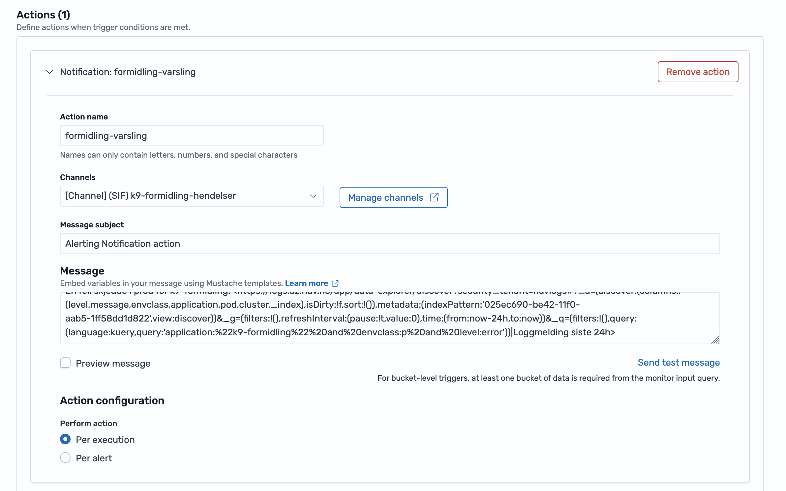

# Create alerts in nav-logs (OpenSearch Dashboards)

!!! warning "Not supported by Nais"

    This logging solution is not supported by Nais. See [Loki](./loki.md) for the new default logging solution.

This guide will help you create alerts based on your application logs in nav-logs (OpenSearch Dashboards).

Alerting in OpenSearch consists of two main components: **notification channels** (where alerts are sent) and **monitors** (what triggers the alerts). You must create a notification channel before you can create a monitor.

## Prerequisites

- You have [enabled logging to nav-logs](./nav-logs-dashboards.md#enable-logging-to-nav-logs) for your application
- You have [access to nav-logs](./nav-logs-dashboards.md#get-access-to-nav-logs)
- You have a Slack webhook URL ready (see Step 1 below)

## Step 1: Create a notification channel

Before you can receive alerts, you need to create a notification channel. This defines where your alerts will be sent.

!!! warning "Sensitive information"
    The Slack webhook URL is sensitive and should be kept secure. Only paste it into the OpenSearch notification channel configuration.

### Access notification channels

1. Navigate to [logs.az.nav.no](https://logs.az.nav.no)
2. Open the menu and navigate to **Notifications** → **Channels**
3. Or go directly to the [Channels page](https://logs.az.nav.no/app/notifications-dashboards#/channels)

### Create a new channel

1. Click **Create channel**
2. **Name**: Give your channel a descriptive name (e.g., "my-team-slack-alerts")
3. **Channel type**: Select **Slack**
4. **Slack webhook URL**: Paste your Slack incoming webhook URL
    - To create a webhook: Go to your Slack workspace → Apps → Incoming Webhooks
    - Configure which channel receives notifications and copy the webhook URL
5. Click **Create**

!!! tip "Test your channel"
    Use the "Send test message" button to verify the channel works before creating monitors.

## Step 2: Create a monitor

Monitors run queries on your logs at scheduled intervals and trigger alerts when conditions are met.

### Access monitors

1. Go directly to the [Create monitor page](https://logs.az.nav.no/app/alerting#/create-monitor)
2. Or navigate from the menu: **Alerting** → **Monitors** → **Create monitor**

### Configure monitor basics

1. **Monitor name**: Give your monitor a descriptive name (e.g., "BO accounting reporting")
2. **Monitor type**: Select **Per query monitor** (this is what you're familiar with from logs.adeo.no)
3. **Schedule**: Set how often to check (e.g., every 5 minutes)

### Define what to monitor

1. **Index**: Enter the data stream name or pattern:
    - `logs.nais` - Nais application logs
    - `logs.aura` - Aura database logs
    - `logs.datapower` - DataPower logs
    - `logs*` - All log types (supports current and future data streams)
2. **Time field**: Select `@timestamp`

### Define your query

You can define your query using one of two methods:

#### Method 1: Visual editor

Use the visual editor to build your query with filters:

**Query examples:**

    application: "my-app" AND level: "ERROR"
    application: "my-app" AND message: "Database connection failed"
    namespace: "myteam" AND level: "ERROR"

#### Method 2: Extraction query editor

For more complex queries, you can write the query yourself:

1. First, test your search in the **Discover** tab to find what you're looking for
2. Click **Inspect** in the top-right corner of the screen
3. Select the **Request** tab
4. Scroll down to find the query being used to show your results
5. Copy this query and paste it into the **Extraction query editor** when creating your monitor

!!! tip
    Test your query in Discover first to ensure it returns the expected results before creating a monitor.

## Step 3: Create a trigger

Triggers define the threshold for when an alert should be sent and specify which notification channel to use.

### Add a trigger

1. Click **Add trigger**
2. **Trigger name**: Describe the condition (e.g., "High error rate")
3. **Severity level**: Select 1-5 (1 is highest priority)
4. **Trigger condition**: Define the threshold for when to alert

**Common conditions:**

    ctx.results[0].hits.total.value > 10    # More than 10 errors
    ctx.results[0].hits.total.value > 0     # Any errors found
    ctx.results[0].hits.total.value == 0    # No logs found (missing expected events)

### Configure action

Under the **Action** section of the trigger, select where the alert should be sent.

!!! info
    You must have already created a notification channel (Step 1) before you can select it here.

1. Click **Add action**
2. **Action name**: e.g., "Notify team Slack"
3. **Destination**: Select your notification channel (created in Step 1)
4. **Message**: Customize the alert content

**Example message:**

    ⚠️ Alert: {{ctx.monitor.name}}

    Found {{ctx.results.0.hits.total.value}} errors
    Time: {{ctx.periodStart}} to {{ctx.periodEnd}}

    View logs: https://logs.az.nav.no

**Useful variables:**

- `{{ctx.monitor.name}}` - Monitor name
- `{{ctx.trigger.name}}` - Trigger name
- `{{ctx.results.0.hits.total.value}}` - Number of matches
- `{{ctx.periodStart}}` / `{{ctx.periodEnd}}` - Time period

### Enable throttling (optional)

To prevent alert spam:

- **Throttling**: Enable and set time window (e.g., 10 minutes)
- This limits how often notifications are sent

### Save

Click **Create** to save your monitor. It will start running on the schedule you defined.

## Complete example

Here's a quick example monitoring for missing accounting reports:

**Notification channel:**

- Name: `bo-team-slack`
- Type: Slack

**Monitor:**

- Name: `BO accounting reporting`
- Type: Per query monitor
- Schedule: Every 5 minutes
- Index: `logs.nais`
- Time field: `@timestamp`
- Query: `application: "bo-accounting" AND message: "accounting report sent"`

**Trigger:**

- Name: `BO does not send accounting`
- Condition: `ctx.results[0].hits.total.value == 0` (alerts when no logs found)
- Action: Send to `bo-team-slack`

## Troubleshooting

**Monitor not triggering:**

- Test your query in Discover first
- Check the time range covers when logs appear
- Verify the trigger condition is correct

**No notifications received:**

- Test the notification channel with "Send test message"
- Check the channel is selected in the action
- Verify throttling isn't blocking notifications

**Too many alerts:**

- Increase the trigger threshold
- Enable throttling to limit notification frequency
- Make your query more specific

## Related documentation

- [Get started with nav-logs](./nav-logs-dashboards.md)
- [KQL Reference](../reference/kql.md)
- [Loki alerts](./logs-metrics-alerts.md) (recommended alternative)
- [OpenSearch Alerting documentation](https://docs.opensearch.org/latest/observing-your-data/alerting/monitors/)
