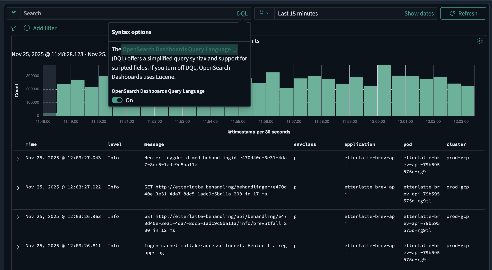

# Dashboards Query Language (DQL) Reference

The Dashboards Query Language (DQL) is a simple text-based query language for filtering data in nav-logs (OpenSearch Dashboards). DQL is the default query language in OpenSearch Dashboards and is simpler to use than Lucene query syntax.



## Basic syntax

### Search for terms

By default, DQL searches all fields for the specified terms. Terms are combined with `or` by default:

```
error exception
```

This searches for documents containing `error` or `exception` in any field.

### Exact phrase search

To search for an exact phrase, use quotation marks:

```
"database connection failed"
```

### Field-specific search

To search in a specific field, use the field name followed by a colon:

```
level: ERROR
```

```
message: "timeout"
```

## Common fields

The following fields are common to all logs in nav-logs and can be used in your DQL queries:

- `@timestamp` - The timestamp of the log event
- `application` - The application the log event originated from
- `cluster` - The cluster the log event originated from
- `container` - The container the log event originated from
- `host` - The host the log event originated from
- `level` - The log level of the log event
- `message` - The log message itself
- `namespace` - The namespace the log event originated from
- `pod` - The pod the log event originated from
- `team` - The team who owns the application

## Operators

### Boolean operators

DQL supports `and`, `or`, and `not` operators (case-insensitive):

```
level: ERROR and application: "my-app"
```

```
level: ERROR or level: WARN
```

```
level: ERROR and not message: "expected"
```

Precedence order: `not` > `and` > `or`. Use parentheses to control evaluation order:

```
(level: ERROR or level: WARN) and application: "my-app"
```

### Comparison operators

DQL supports numeric and date comparisons using `>`, `<`, `>=`, and `<=`:

```
response_time > 1000
```

```
date >= "2024-01-01" and date < "2024-02-01"
```

### Field existence

To check if a field exists, use the `*` wildcard:

```
error_code: *
```

### Negation

To search for documents where a field does not contain a specific value:

```
not level: DEBUG
```

Note: This returns documents where either the field doesn't contain the value OR the field doesn't exist. To filter only documents that have the field:

```
level: * and not level: DEBUG
```

## Wildcards

DQL supports the `*` wildcard for matching multiple characters. Wildcards work in both field names and search terms:

### In field names

```
title*: error
```

Matches fields like `title`, `title.keyword`, etc.

### In search terms

```
message: error*
```

Matches `error`, `errors`, `errored`, etc.

```
app*name: "my-app"
```

Matches fields like `app_name`, `application_name`, etc.

!!! note
    Wildcards are not supported within phrase searches (quoted strings).

## Grouping

Use parentheses to group multiple terms when searching in a field:

```
level: (ERROR or WARN)
```

This is equivalent to:

```
level: ERROR or level: WARN
```

## Nested fields

For nested object fields, use the dot notation:

```
kubernetes.pod.name: "my-pod"
```

For nested arrays, use curly braces:

```
tags: {name: production}
```

Multiple conditions in nested fields:

```
tags: {name: production and value: true}
```

## Reserved characters

The following characters are reserved in DQL: `\`, `(`, `)`, `:`, `<`, `>`, `"`, `*`

To search for these characters, escape them with a backslash:

```
format: 2\*3
```

```
path: "C\:\\Users\\file.txt"
```

## Example queries

| Query                                      | Description                                |
| :----------------------------------------- | :----------------------------------------- |
| `error`                                    | Documents containing "error" in any field  |
| `level: ERROR`                             | Documents where level is ERROR             |
| `"connection timeout"`                     | Documents containing the exact phrase      |
| `application: "my-app" and level: ERROR`   | ERROR logs from my-app                     |
| `level: ERROR or level: WARN`              | ERROR or WARN level logs                   |
| `level: (ERROR or WARN)`                   | Same as above                              |
| `not level: DEBUG`                         | All logs except DEBUG level                |
| `message: error*`                          | Messages starting with "error"             |
| `response_time > 1000`                     | Slow responses                             |
| `@timestamp >= "2024-01-01"`               | Logs from 2024 onwards                     |
| `level: ERROR and not message: "expected"` | Unexpected errors                          |
| `namespace: "my-team" and level: ERROR`    | Team's error logs                          |
| `error_code: *`                            | Documents with error_code field            |
| `level: * and not level: DEBUG`            | All logs with level field, excluding DEBUG |

## Further reading

For more detailed information about DQL, see the [official OpenSearch DQL documentation](https://docs.opensearch.org/latest/dashboards/dql/).
