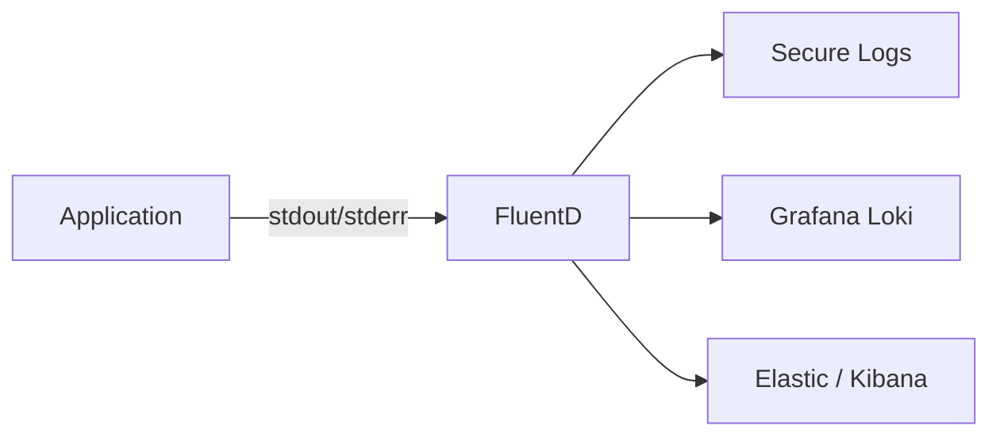
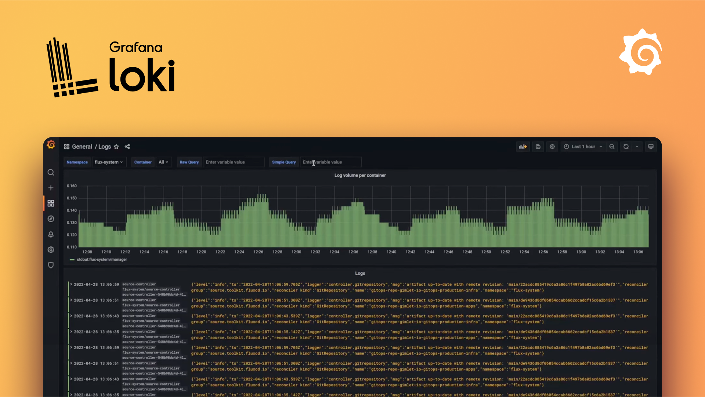

# Application Logs

## Purpose of logs

Logs are a way to understand what is happening in your application. They are usually text-based and are often used for debugging. Since the format of logs is usually not standardized, it can be difficult to query and aggregate logs and thus we recommend using metrics for dashboards and alerting.

There are many types of logs, and they can be used for different purposes. Some logs are used for debugging, some are used for auditing, and some are used for security. Our primary use case for logs is to understand the flow of a request through a system.

Application logs in nais is first and foremost a tool for developers to debug their applications. It is not intended to be used for auditing or security purposes. We do not condone writing sensitive information to application logs.

## Good practice

- [x] **Establish a clear logging strategy** for your application. What do you want to log? What do you not want to log? What is the purpose of your logs?
- [x] **Use log levels** to different- [x] **Use log levels** to differentiate between different types of logs. We recommend using the following log levels: `INFO`, `WARN`, `ERROR`, and `FATAL`.
- [x] **Use structured logging**. This means that your logs must be written in a JSON format. This makes it easier to query and aggregate logs.
- [x] **Write meaningful log messages** and attach relevant metadata to your logs. This makes it easier to understand what is happening in your application.
- [ ] **Do not log sensitive information**. This includes personal information, passwords, and secrets. If you need to log sensitive information, use [secure logs](#secure-logs) or [audit logs](#audit-logs).
- [ ] **Do not underestimate the cost and performance** of logging. Logging is a trade-off between observability, performance, and cost. Logging can be computational and financial expensive, so make sure you log only what you actually need.
- [ ] **Do not use rely on logs for monitoring**. Use metrics for monitoring, visualization, and alerting as your first line of defense and use logs for debugging when something goes wrong.

## Technical overview

Logs that are sent to console (also known as `stdout`) are collected automatically by an agent inside the cluster. This agent can be configured to send logs for persistent storage and querying based on team- and application specific configuration.

Logs must be written in JSON format *and* preferably following the [Elastic Common Schema](https://www.elastic.co/guide/en/ecs/current/ecs-reference.html) or [OpenTelemetry Semantic Conventions](https://opentelemetry.io/docs/specs/semconv/).



[FluentD]: https://www.fluentd.org/

## Log collection

Log collection is automatically configured for persistent storage, but can be changed in the following two ways:

1. By changing the default logging destination for all applications in your team namespace (not yet fully implemented)
2. By changing the logging destination for a single application using the `spec.observability.logging.destinations` field in the [nais manifest](../../nais-application/application.md).

The most recent log will always be available in nais console and using the `kubectl logs` command.

### Log destinations

| Destination                 | ID            | Description                        | Availability |
| :-------------------------- | :------------ | :--------------------------------- | :----------- |
| None                        | `none`        | Logs are not collected.            | All          |
| [Loki](#grafana-loki)       | `loki`        | Logs are available in Grafana.     | All          |
| [Elastic](#elastic-kibana)  | `elastic`     | Logs are available in Kibana.      | NAV-only     |
| [Secure Logs](#secure-logs) | `secure_logs` | Logs are stored in a secret place. | NAV-only     |

## Grafana Loki



Grafana Loki is a log aggregation system inspired by Prometheus and integrated with Grafana. It is designed to be cost effective and easy to operate, as it does not index the contents of the logs, but rather a set of predefined labels for each log stream.

Grafana Loki is designed to be used in conjunction with metrics and tracing to provide a complete picture of an application's performance. Without the other two, it can be perceived as more cumbersome to use than a traditional logging system.

### Enabling Loki

Loki can be enabled by setting the list of logging destinations in your nais application manifest.

```yaml
…
spec:
  observability:
    logging:
      destinations:
        - id: loki
```

### Working with Loki

Grafana Loki is integrated directly with Grafana, and you can access your logs either by adding a Logs Panel to your dashboard or by clicking on the "Explore" link on the left-hand side of the Grafana UI and selecting one of the Loki data sources (one for each environment).

Grafana Loki has a query language called [LogQL](https://grafana.com/docs/loki/latest/logql/) that you can use to search for logs. LogQL is a simplified version of PromQL, and you can use LogQL to search for logs by message, by field, or by a combination of both.

The main difference between LogQL and PromQL is the use of the pipe `|` operator. The pipe operator is used to chain together multiple LogQL expressions. This allows you to filter, aggregate, and transform logs in a single query.

## Elastic Kibana

Elasticsearch is a

### Configuring Kibana


### Working with Kibana

When you open Kibana you are prompted to select a workspace, select "Nav Logs" to start viewing your application logs.

Once the page loads you will see an empty page with a search bar. This is the query bar, and it is used to search for logs. You can use the query bar to search for logs by message, by field, or by a combination of both.

The query language is called [Kibana Query Language](https://www.elastic.co/guide/en/kibana/current/kuery-query.html) (`KQL`). KQL is a simplified version of Lucene query syntax. You can use KQL to search for logs by message, by field, or by a combination of both.

There is also a time picker in the upper right corner of the page. You can use the time picker to select a time range to search for logs. The default time range is the last 15 minutes. If no logs shows up, try to increase the time range.

### Common fields

The following fields are common to all logs and can be used in the query bar:

* `@timestamp` - The timestamp of the log event.
* `application` - The application the log event originated from.
* `cluster` - The cluster the log event originated from.
* `container` - The container the log event originated from.
* `host` - The host the log event originated from.
* `level` - The log level of the log event.
* `message` - The log message itself.
* `namespace` - The namespace the log event originated from.
* `pod` - The pod the log event originated from.
* `team` - The team who owns the application the log event originated from.

### Example queries

| Query                                                            | Description                                                                                  |
| :--------------------------------------------------------------- | :------------------------------------------------------------------------------------------- |
| `message: "my message"`                                          | Search for logs with the message "my message"                                                |
| `message: "my message" AND level: "ERROR"`                       | Search for logs with the message "my message" and the level "ERROR"                          |
| `message: "my message" OR level: "ERROR"`                        | Search for logs with the message "my message" or the level "ERROR"                           |
| `message: "my message" AND NOT level: "ERROR"`                   | Search for logs with the message "my message" and not the level "ERROR"                      |
| `message: "my message" AND level: "ERROR" AND NOT level: "WARN"` | Search for logs with the message "my message" and the level "ERROR" and not the level "WARN" |
| `message: "my message" AND level: "ERROR" OR level: "WARN"`      | Search for logs with the message "my message" and the level "ERROR" or the level "WARN"      |

### Gain access to Kibana

In order to get access to logs.adeo.no you need to have the correct access rights added to your AD account. This can be requested through your Personnal Manager.

These permissions will give you access:
```
0000-GA-Logganalyse
0000-GA-Logganalyse_FullVerdikjede_Prod
0000-GA-Logganalyse_FullVerdikjede_UTQ
```

If you're unsure if you already have these permission, or some of them, you can check what permission you currently have at igruppe.adeo.no

## Secure logs

Some applications have logs with information that should not be stored with the normal application logs. To support this a directory for these logs can be mounted in the application, and the content of logs written here will be transferred to separate indices in Elasticsearch.

### Enabling secure logs

Secure logs can be enabled by setting the `secureLogs.enabled` flag in the application resource. See [the nais manifest specification](../../nais-application/application.md).

### Log files

With secure logs enabled a directory `/secure-logs/` will be mounted in the application container. Every `*.log` file in this directory will be monitored and the content transferred to Elasticsearch. Make sure that these files are readable for the log shipper (`the process runs as uid/gid 1065`).

The `/secure-logs/` directory has a size limit of 128Mb, and it's the application responsibility to ensure that this limit is not exceeded. **If the limit is exceeded the application pod will be evicted and restarted.** Use log rotation on file size to avoid this.

### Log configuration

Log files should be in JSON format as the normal application logs. Here is an example configuration of JSON logging with a size based rolling file appender in Logback:

```markup
  <appender name="secureLog" class="ch.qos.logback.core.rolling.RollingFileAppender">
    <file>/secure-logs/secure.log</file>
    <rollingPolicy class="ch.qos.logback.core.rolling.FixedWindowRollingPolicy">
      <fileNamePattern>/secure-logs/secure.log.%i</fileNamePattern>
      <minIndex>1</minIndex>
      <maxIndex>1</maxIndex>
    </rollingPolicy>
    <triggeringPolicy class="ch.qos.logback.core.rolling.SizeBasedTriggeringPolicy">
      <maxFileSize>50MB</maxFileSize>
    </triggeringPolicy>
    <encoder class="net.logstash.logback.encoder.LogstashEncoder" />
  </appender>
```

See [logging examples](examples.md) for more information on log configuration.

### Non-JSON logs

If the logging framework used doesn't support JSON logging, it is also possible to use multiline logs in this format:

```text
<iso8601 timestamp> <log level> <message>
<message cont.>
<message cont.>
```

Files on this format must be named `*.mlog`.

### Sending logs with HTTP

If you do not want to have these logs as files in the pod, it is also possible to use HTTP to write logs. POST your log entry as JSON to `http://localhost:19880`

```bash
curl -X POST -d '{"log":"hello world","field1":"value1"}' -H 'Content-Type: application/json' http://localhost:19880/
```

### Gain access to Secure Logs

Once everything is configured, your secure logs will be sent to the `tjenestekall-*` index in kibana. To gain access to these logs, you need to do the following:

#### 1 Create an AD-group

To make sure you gain access to the proper logs, you need an AD-group connected to the nais-team. So the first thing you do is create this group.

Go to [Porten (service desk)](https://jira.adeo.no/plugins/servlet/desk/portal/542) and click `Melde sak til IT`. The follow the template below.
For IT to be able to correctly add the group to Remedy you need to specify the four digit department code for those who can be able to ask for permission to the group. E.g 2990 is the four digit code for the department IT-AVDELINGEN. If you are creating secure logs for your team and are unsure about which department your colleagues belong to then you can use [Delve](https://eur.delve.office.com/) to search for their profile. In their profile their department code will also be visible.

You can paste the template below into Jira:

```text
Ønsker å få opprettet en AD-gruppe for å få tilgang til sikker logg i Kibana for applikasjoner knyttet til <your project here>.

Gruppenavn: 0000-GA-SECURE_LOG_<SOMETHING>

Beskrivelse: Tilgang til secureLog for Team <team name> i Kibana.

Kryss i identrutinen: Ja

Den må inn i Remedy.
Enheter i Nav som skal ha tilgang: <four digit department code>. E.g (2990 - IT-AVDELINGEN)
```


#### 2 Connect the AD group to your team in Kibana

The logs your apps produces are linked with your [nais-team](../../basics/teams.md).
Administrators of Kibana will create a role for your team with read rights to those logs.
Whoever is in the AD-group (created in step 1) will get the Kibana role, and can thus read all logs produced by apps belonging to the nais-team.

Ask in the [#atom](https://nav-it.slack.com/archives/C7TQ25L9J) Slack channel to connect the AD-group (created in step 1) to your nais-team.

#### 3 Put people into the AD-group

This must be done by "identansvarlig". For NAV-IT employees, this is `nav.it.identhandtering@nav.no`. Send them an email and ask for access with a CC to whoever is your superior.

For everyone else, the team lead or who ever is their superior should know.

#### What can go wrong?

Basically, the one thing that can go wrong here is that the AD-group is not registered in "identrutinen". If this happens, the group cannot be found by "identansvarlig". If this happens, make a new JIRA-ticket to the same people and tell them to transfer the group. Sadly this can take a few days.

## Audit logs

Most applications where a user processes data related to another user need to log audit statements, detailing which user did what action on which subject.
These logs need to follow a specific format and be accessible by ArcSight.
See [naudit](https://github.com/navikt/naudit) for how to set up the logging, and details on the log format.
