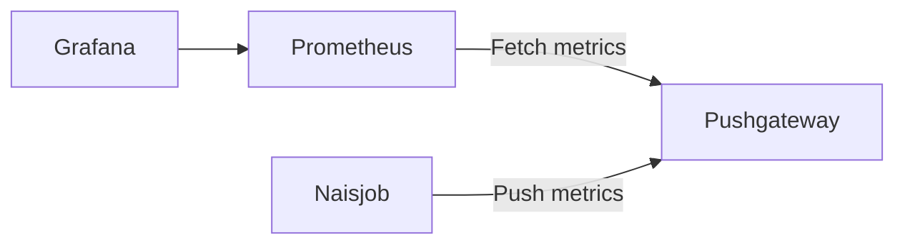

# Metrics

Prometheus is used to scrape metrics from the pod. You have to add Prometheus in your [NAIS manifest](../nais-application/application.md) to enable scrape.

Each app that have scraping enabled can use the default Grafana dashboard [nais-app-dashboard](https://grafana.nais.io/d/000000283/nais-app-dashbord), or create theire own.

## NAIS manifest config

```text
spec:
  prometheus:
    enabled: true  # default: false. Pod will now be scraped for metrics by Prometheus.
    path: /metrics # Path where prometheus metrics are served.
```

### JVM Application

If you are building an app on the JVM you can use Prometheus' own [Java client library](https://github.com/prometheus/client_java). Make sure to enable scraping in the NAIS manifest.

We also recommend to export the default metrics.

```text
DefaultExports.initialize();
```

## Retention

When using Prometheus the retention is 16 weeks for prod, and 4 weeks for dev.
If you need data stored longer then what Prometheus support, we recommend using your own [Aiven Influxdb](/persistence/influxdb).
Then you have full control of the database and retention.

## Push metrics

The Pushgateway is an intermediary service which allows you to push metrics from jobs which cannot be scraped. For details, see [Pushing metrics](https://prometheus.io/docs/instrumenting/pushing/).



!!! note

    ### Should I be using the Pushgateway?

    We only recommend using the Pushgateway in certain limited cases such as [Naisjob][naisjob]. There are several pitfalls when blindly using the Pushgateway instead of Prometheus's usual pull model for general metrics collection:

    * When monitoring multiple instances through a single Pushgateway, the Pushgateway becomes both a single point of failure and a potential bottleneck.
    * You lose Prometheus's automatic instance health monitoring via the up metric (generated on every scrape).
    * You lose Prometheus's automatic instance labelling like `pod_name`, `namespace` and `node`.
    * The Pushgateway never forgets series pushed to it and will expose them to Prometheus forever unless those series are manually deleted via the Pushgateway's API.

    The latter point is especially relevant when multiple instances of a job differentiate their metrics in the Pushgateway via an instance label or similar. Metrics for an instance will then remain in the Pushgateway even if the originating instance is renamed or removed. This is because the lifecycle of the Pushgateway as a metrics cache is fundamentally separate from the lifecycle of the processes that push metrics to it. Contrast this to Prometheus's usual pull-style monitoring: when an instance disappears (intentional or not), its metrics will automatically disappear along with it. When using the Pushgateway, this is not the case, and you would now have to delete any stale metrics manually or automate this lifecycle synchronization yourself.

    [naisjob]: /naisjob

### Example

=== "naisjob.yaml"
  ```yaml
  apiVersion: nais.io/v1
  kind: Naisjob
  metadata:
    labels:
      team: myteam
    name: myjob
    namespace: myteam
  spec:
    image: ghcr.io/navikt/myapp:mytag
    schedule: "*/1 * * * *"
    env:
      - name: PUSH_GATEWAY_ADDRESS
        value: nais-prometheus-pushgateway.nais:9091
  ```

=== "PushMetrics.java"
  ```java
  package io.prometheus.client.it.pushgateway;

  import io.prometheus.client.CollectorRegistry;
  import io.prometheus.client.Gauge;
  import io.prometheus.client.exporter.BasicAuthHttpConnectionFactory;
  import io.prometheus.client.exporter.PushGateway;

  public class ExampleBatchJob {
      public static void main(String[] args) throws Exception {
          String jobName = "my_batch_job";
          String pushGatewayAddress = System.getenv("PUSH_GATEWAY_ADDRESS");

          CollectorRegistry registry = new CollectorRegistry();
          Gauge duration = Gauge.build()
                  .name("my_batch_job_duration_seconds")
                  .help("Duration of my batch job in seconds.")
                  .register(registry);
          Gauge.Timer durationTimer = duration.startTimer();
          try {
              Gauge lastSuccess = Gauge.build()
                      .name("my_batch_job_last_success")
                      .help("Last time my batch job succeeded, in unixtime.")
                      .register(registry);
              lastSuccess.setToCurrentTime();
          } finally {
              durationTimer.setDuration();
              PushGateway pg = new PushGateway(pushGatewayAddress);
              pg.pushAdd(registry, jobName);
          }
      }
  }
  ```
