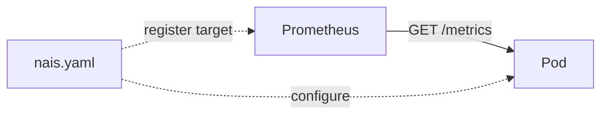
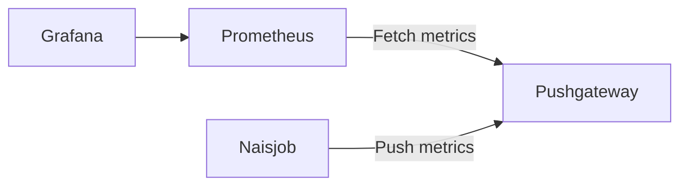

# Metrics

!!! info inline end "Prometheus Environments"

    **GCP**

     * [prometheus.dev-gcp.nav.cloud.nais.io](https://prometheus.dev-gcp.nav.cloud.nais.io)
     * [prometheus.prod-gcp.nav.cloud.nais.io](https://prometheus.prod-gcp.nav.cloud.nais.io)

    **On-prem**

     * [prometheus.dev-fss.nav.cloud.nais.io](https://prometheus.dev-fss.nav.cloud.nais.io)
     * [prometheus.prod-fss.nav.cloud.nais.io](https://prometheus.prod-fss.nav.cloud.nais.io) :octicons-shield-lock-16:

    :octicons-shield-lock-16: requires `onprem-k8s-prod` gateway in `naisdevice`.

Metrics are a way to measure the state of your application from within and something that is built into a microservice architecture from the very beginning. We suggest you start with the basics, that is defining what is fascinating to your team to track in terms of service health and level of service quality.

We have standardized on the [OpenMetrics][openmetrics] format for metrics. This is a text-based format that is easy to parse and understand. It is also the format used by Prometheus, which is the most popular metrics system.

We use Prometheus to fetch metric endpoints from your application (in Prometheus terminology we call this scraping), and Grafana for visualizing your application's metrics. You enable Prometheus metrics collection from your application in your [NAIS manifest][nais-manifest-prometheus].

??? info "Prometheus cluster configuration" 
    To see the current configuration for a prometheus instance in your cluster, e.g. `scrape_interval`, go to
    `https://prometheus.<cluster>.nav.cloud.nais.io/config`



[openmetrics]: https://openmetrics.io/
[nais-manifest-prometheus]: /nais-application/application/#prometheus

All applications that have Prometheus scraping enabled will show up in the [default Grafana dashboard](https://grafana.nais.io/d/000000283/nais-app-dashbord), or create their own.

## Get started

Bellow we have a few samples to get you started. For more in-depth examples and reference, check out the documentation for your specific client.

??? info "Client libraries"
    There are a number of client libraries available depending on what programming language you are using. You can use these to simplify the communication with Prometheus.

    * [Prometheus Java client][prometheus-client-java]
    * [Prometheus Python client][prometheus-client-python]
    * [Prometheus Go client][prometheus-client-go]
    * [Prometheus Node.js client][prometheus-client-node]

    You can find a comprehensive list of [client libraries here][prometheus-clients-all].

    [prometheus-client-java]: https://github.com/prometheus/client_java
    [prometheus-client-python]: https://github.com/prometheus/client_python
    [prometheus-client-go]: https://github.com/prometheus/client_golang
    [prometheus-client-node]: https://github.com/siimon/prom-client
    [prometheus-clients-all]: https://prometheus.io/docs/instrumenting/clientlibs/

=== "nais.yaml"

    ```yaml
    spec:
      prometheus:
        enabled: true  # default: false. Pod will now be scraped for metrics by Prometheus.
        path: /metrics # Path where prometheus metrics are served.
    ```

=== "Counter.java"

    Counters go up, and reset when the process restarts.

    ```java
    import io.prometheus.client.Counter;
    class YourClass {
      static final Counter requests = Counter.build()
        .name("requests_total").help("Total requests.").register();

      void processRequest() {
        requests.inc();
        // Your code here.
      }
    }
    ```

=== "Gauge.java"

    Gauges can go up and down.

    ```java
    import io.prometheus.client.Gauge;
    class YourClass {
      static final Gauge inprogressRequests = Gauge.build()
        .name("inprogress_requests").help("Inprogress requests.").register();

      void processRequest() {
        inprogressRequests.inc();
        // Your code here.
        inprogressRequests.dec();
      }
    }
    ```

    There are utilities for common use cases:

    ```java
    gauge.setToCurrentTime(); // Set to current unixtime.
    ```

=== "Summary.java"

    Summary metrics calculate quantiles (e.g. the 99th percentile request latency).  Note that summaries cannot be aggregated.

    ```java
    import io.prometheus.client.Summary;
    class YourClass {
      static final Summary requestLatency = Summary.build()
        .name("requests_latency_seconds").help("Request latency in seconds.").register();

      void processRequest() {
        Summary.Timer requestTimer = requestLatency.startTimer();
        // Your code here.
        requestTimer.observeDuration();
      }
    }
    ```

### Default metrics

Most of the client libraries (see list above), includes libraries for generating default metrics like garbage collection, memory pools, classloading, and thread counts. Using these metrics will ensure that your metrics are named in a certain convention, making it more easy to compare across applications.

=== "JAVA"

    ```java
    import io.prometheus.client.hotspot.DefaultExports;
    Class YourClass {
      public static void main(String[] args) {
          DefaultExports.initialize()
      }
    }
    ```

=== "Node.js"

    ```js
    const client = require('prom-client');
    const collectDefaultMetrics = client.collectDefaultMetrics;
    const Registry = client.Registry;
    const register = new Registry();
    collectDefaultMetrics({ register });
    ```

=== "Python"

    ```python
    from prometheus_client import start_http_server, Summary
    prometheus_client.start_http_server(8000)
    ```

=== "Go"

    ```go
    import (
      "log"
      "net/http"
      "github.com/prometheus/client_golang/prometheus"
      "github.com/prometheus/client_golang/prometheus/promhttp"
    )

    func main() {
      http.Handle("/metrics", promhttp.Handler())
      log.Fatal(http.ListenAndServe(":8080", nil))
    }
    ```

## Retention

When using Prometheus the retention is 4 weeks.
If you need data stored longer than what Prometheus support, we recommend using [BigQuery](/persistence/bigquery) or your own [Aiven Influxdb](/persistence/influxdb).
Then you have full control of the database and retention.

## Metric naming

For metric names we use the internet-standard [Prometheus naming conventions](https://prometheus.io/docs/practices/naming/):

* Metric names should have a (single-word) application prefix relevant to the domain the metric belongs to.
* Metric names should be nouns in **snake_case**; do not use verbs.
* Metric names should have units to make interpreting your metrics queries straightforward.
* Metric names should represent the same logical thing-being-measured across different labels (e.g. the number of HTTP requests, not the number of GET requests, the number of POST requests, etc.)

## Label naming

Use labels to differentiate the characteristics of the thing that is being measured:

* `api_http_requests_total` - differentiate request types by adding an `operation` label: `operation="create|update|delete"`
* `api_request_duration_seconds` - differentiate request stages by adding a `stage` label: `stage="extract|transform|load"`

Do not put the label names in the metric name, as this introduces redundancy and will cause confusion if the respective labels are aggregated away.

!!! warning
    CAUTION: Remember that every unique combination of key-value label pairs represents a new time series, which can dramatically increase the amount of data stored. Do not use labels to store dimensions with high cardinality (many different label values), such as user IDs, email addresses, or other unbounded sets of values.

## Metric types

You can introduce the metric types with the classic example of counting an ongoing process:

```text
# HELP how_many_hats Hats counter
# TYPE how_many_hats counter
how_many_hats 3
```

You should, as a developer, that build metrics into your application have solid grasp of the semantics of the different metric types, which include:

- **Counter:** Sum of things, forever growing. Example; number of requests to this service, etc.
- **Gauge:** Value is arbitrary and can go up and down. Example: Current number of active connections.
- **Summary:** Calculate arbitrary buckets of aggregated textual observations. Example: Response time of 99% of requests or larger buckets etc.
- **Histogram:** Like Summaries, Histograms can be used to monitor latencies (or other things like request sizes). Unlike Summaries, Histograms have more features, if you want to learn more you can read the [difference between histograms and summaries](https://prometheus.io/docs/practices/histograms/).

## Cluster metrics

NAIS clusters comes with a set of metrics that are available for all applications. Many of these relates to Kubernetes and includes metrics like CPU and memory usage, number of pods, etc. You can find a comprehensive list in the [kube-state-metrics documentation](https://github.com/kubernetes/kube-state-metrics/blob/master/docs/README.md).

Our ingress controller also exposes metrics about the number of requests, response times, etc. You can find a comprehensive list in our [ingress documentation](/nais-application/ingress/#ingress-metrics).

## Debugging metrics

If you are having trouble with your metrics, you can use the [Prometheus expression browser](https://prometheus.io/docs/visualization/browser/) to test your queries. You can find this at `/graph` in the respective Prometheus environment.

If your metrics are not showing up in the expression browser, you can check the target page at `/targets` to see if your application is registered as a target or if Prometheus has encountered any errors when scraping your application.

## Push metrics

The Pushgateway is an intermediary service which allows you to push metrics from jobs which cannot be scraped. For details, see [Pushing metrics](https://prometheus.io/docs/instrumenting/pushing/).



!!! question "Should I be using the Pushgateway?"

    We only recommend using the Pushgateway in certain limited cases such as [Naisjob][naisjob]. There are several pitfalls when blindly using the Pushgateway instead of Prometheus's usual pull model for general metrics collection:

    * When monitoring multiple instances through a single Pushgateway, the Pushgateway becomes both a single point of failure and a potential bottleneck.
    * You lose Prometheus's automatic instance health monitoring via the up metric (generated on every scrape).
    * You lose Prometheus's automatic instance labelling like `pod_name`, `namespace` and `node`.
    * The Pushgateway never forgets series pushed to it and will expose them to Prometheus forever unless those series are manually deleted via the Pushgateway's API.

    The latter point is especially relevant when multiple instances of a job differentiate their metrics in the Pushgateway via an instance label or similar. Metrics for an instance will then remain in the Pushgateway even if the originating instance is renamed or removed. This is because the lifecycle of the Pushgateway as a metrics cache is fundamentally separate from the lifecycle of the processes that push metrics to it. Contrast this to Prometheus's usual pull-style monitoring: when an instance disappears (intentional or not), its metrics will automatically disappear along with it. When using the Pushgateway, this is not the case, and you would now have to delete any stale metrics manually or automate this lifecycle synchronization yourself.

    [naisjob]: /naisjob

### Example

=== "naisjob.yaml"

    ```yaml
    apiVersion: nais.io/v1
    kind: Naisjob
    metadata:
      labels:
        team: myteam
      name: myjob
      namespace: myteam
    spec:
      image: europe-north1-docker.pkg.dev/[mgmt-id]/[team-name]/[image-name]:tag
      schedule: "*/1 * * * *"
      env:
        - name: PUSH_GATEWAY_ADDRESS
          value: prometheus-pushgateway.nais-system:9091
      accessPolicy:
        outbound:
          rules:
            - application: prometheus-pushgateway
              namespace: nais-system
    ```

=== "PushMetrics.java"

    ```java
    package io.prometheus.client.it.pushgateway;

    import io.prometheus.client.CollectorRegistry;
    import io.prometheus.client.Gauge;
    import io.prometheus.client.exporter.BasicAuthHttpConnectionFactory;
    import io.prometheus.client.exporter.PushGateway;

    public class ExampleBatchJob {
        public static void main(String[] args) throws Exception {
            String jobName = "my_batch_job";
            String pushGatewayAddress = System.getenv("PUSH_GATEWAY_ADDRESS");

            CollectorRegistry registry = new CollectorRegistry();
            Gauge duration = Gauge.build()
                    .name("my_batch_job_duration_seconds")
                    .help("Duration of my batch job in seconds.")
                    .register(registry);
            Gauge.Timer durationTimer = duration.startTimer();
            try {
                Gauge lastSuccess = Gauge.build()
                        .name("my_batch_job_last_success")
                        .help("Last time my batch job succeeded, in unixtime.")
                        .register(registry);
                lastSuccess.setToCurrentTime();
            } finally {
                durationTimer.setDuration();
                PushGateway pg = new PushGateway(pushGatewayAddress);
                pg.pushAdd(registry, jobName);
            }
        }
    }
    ```
