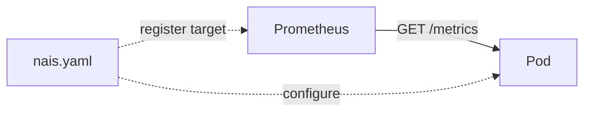

# Metrics

See [how to](how-to/expose.md) set up metrics.

Metrics are a way to measure the state of your application from within and something that is built into a microservice architecture from the very beginning. We suggest you start with the basics, that is defining what is fascinating to your team to track in terms of service health and level of service quality.

We have standardized on the [OpenMetrics][openmetrics] format for metrics. This is a text-based format that is easy to parse and understand. It is also the format used by Prometheus, which is the most popular metrics system.

We use Prometheus to fetch metric endpoints from your application (in Prometheus terminology we call this scraping), and Grafana for visualizing your application's metrics. You enable Prometheus metrics collection from your application in your [NAIS manifest][nais-manifest-prometheus].

??? info "Prometheus cluster configuration"
    To see the current configuration for a prometheus instance in your cluster, e.g. `scrape_interval`, go to
    `https://prometheus.<MY-ENV>.<<tenant()>>.cloud.nais.io/config`



[openmetrics]: https://openmetrics.io/
[nais-manifest-prometheus]:  ../../workloads/application/reference/application-spec.md#prometheus

All applications that have Prometheus scraping enabled will show up in the [default Grafana dashboard](https://grafana.<<tenant()>>.cloud.nais.io/d/000000283/nais-app-dashbord), or create their own.

## Metric naming

For metric names we use the Internet standard [Prometheus naming conventions](https://prometheus.io/docs/practices/naming/):

- Metric names should have a (single-word) application prefix relevant to the domain the metric belongs to.
- Metric names should be nouns in **snake_case**; do not use verbs.
- Metric names should have units to make interpreting your metrics queries straightforward.
- Metric names should represent the same logical thing-being-measured across different labels (e.g. the number of HTTP requests, not the number of GET requests, the number of POST requests, etc.)

## Label naming

Use labels to differentiate the characteristics of the thing that is being measured:

- `api_http_requests_total` - differentiate request types by adding an `operation` label: `operation="create|update|delete"`
- `api_request_duration_seconds` - differentiate request stages by adding a `stage` label: `stage="extract|transform|load"`

Do not put the label names in the metric name, as this introduces redundancy and will cause confusion if the respective labels are aggregated away.

!!! warning
    CAUTION: Remember that every unique combination of key-value label pairs represents a new time series, which can dramatically increase the amount of data stored. Do not use labels to store dimensions with high cardinality (many different label values), such as user IDs, email addresses, or other unbounded sets of values.

## Metric types

You can introduce the metric types with the classic example of counting an ongoing process:

```text
# HELP how_many_hats Hats counter
# TYPE how_many_hats counter
how_many_hats 3
```

You should, as a developer, that build metrics into your application have solid grasp of the semantics of the different metric types, which include:

- **Counter:** Sum of things, forever growing. Example; number of requests to this service, etc.
- **Gauge:** Value is arbitrary and can go up and down. Example: Current number of active connections.
- **Summary:** Calculate arbitrary buckets of aggregated textual observations. Example: Response time of 99% of requests or larger buckets etc.
- **Histogram:** Like Summaries, Histograms can be used to monitor latencies (or other things like request sizes). Unlike Summaries, Histograms have more features, if you want to learn more you can read the [difference between histograms and summaries](https://prometheus.io/docs/practices/histograms/).

## Cluster metrics

NAIS clusters comes with a set of metrics that are available for all applications. Many of these relates to Kubernetes and includes metrics like CPU and memory usage, number of pods, etc. You can find a comprehensive list in the [kube-state-metrics documentation](https://github.com/kubernetes/kube-state-metrics/blob/master/docs/README.md).

Our ingress controller also exposes metrics about the number of requests, response times, etc. You can find a comprehensive list in our [ingress documentation](../../workloads/application/reference/ingress.md#metrics).

## Debugging metrics

If you are having trouble with your metrics, you can use the [Prometheus expression browser](https://prometheus.io/docs/visualization/browser/) to test your queries. You can find this at `/graph` in the respective Prometheus environment.

If your metrics are not showing up in the expression browser, you can check the target page at `/targets` to see if your application is registered as a target or if Prometheus has encountered any errors when scraping your application.

## Environments

List of Prometheus environments:


* <<tenant_url("prometheus.dev-fss")>>
* <<tenant_url("prometheus.prod-fss")>>
* <<tenant_url("prometheus.dev-gcp")>>
* <<tenant_url("prometheus.prod-gcp")>>

* <<tenant_url("prometheus.dev")>>
* <<tenant_url("prometheus.prod")>>

