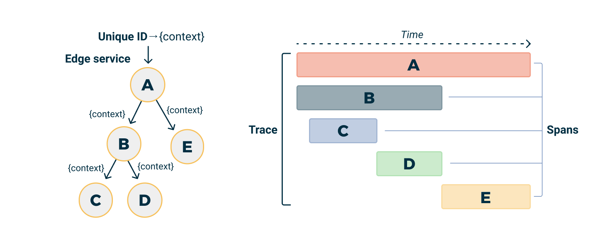

# Distributed Tracing

Tracing tracks a request as it passes through the services that handle it. In a microservices architecture, a single user action often triggers calls to several services. Tracing shows you the full path, making it easier to find bottlenecks, latency issues, or failures.

## How tracing works

When a request is made to your application, a trace is started. This creates a Trace which serves as a container for all the work done for that request.

<small>Trace visualization by Logshero licensed under Apache License 2.0</small>

The work done by individual services (or components of a single service) is captured in Spans. A span represents a single unit of work in a trace, like a SQL query or a call to an external service.

Spans can be nested and form a trace tree. The Trace is the root of the tree, and each Span is a node that represents a specific operation in your application. The tree of spans captures the causal relationships between the operations in your application (i.e., which operations caused others to occur).

Each Span carries a Context that includes metadata about the trace (like a unique trace identifier and span identifier) and any other data you choose to include. This context is propagated across process boundaries, allowing all the work that's part of a single trace to be linked together, even if it spans multiple services.

By analyzing traces and spans, you can see how requests flow through your system, where time is spent, and where problems occur.

## OpenTelemetry

OpenTelemetry is a CNCF project that provides a single set of APIs for tracing, metrics, and logs. It supports Java, JavaScript, Python, Go, and other languages, so you can use the same tooling across your stack.

OpenTelemetry provides automatic instrumentation for popular frameworks and libraries, collecting traces and metrics without code changes. It is vendor-neutral — you can export telemetry data to any backend.

[:octicons-link-external-24: Learn more about OpenTelemetry on opentelemetry.io][open-telemetry]

## Tracing in Nais

Nais provides auto-instrumentation that injects OpenTelemetry agents into your application at startup. Once enabled, traces are collected and stored in [Grafana Tempo](https://grafana.com/oss/tempo/), where you can query and visualize them.

### The easy way: Auto-instrumentation

The preferred way to get started is to enable auto-instrumentation for your application. This injects the OpenTelemetry Agent at startup, which hooks into popular libraries and frameworks to collect traces — without code changes.

[:dart: Get started with auto-instrumentation](../how-to/auto-instrumentation.md)

### The hard way: Manual instrumentation

If you want more control, you can instrument your application using the OpenTelemetry SDK directly. Set the runtime to `sdk` in your `nais.yaml` to get the OpenTelemetry environment variables without injecting an agent:

[:dart: Use SDK-only mode for manual instrumentation](../how-to/auto-instrumentation.md#enable-auto-instrumentation)

### OpenTelemetry SDKs

OpenTelemetry provides SDKs for a wide range of programming languages:

* [:fontawesome-brands-java: OpenTelemetry Java][otel-java]
* [:fontawesome-brands-js: OpenTelemetry JavaScript][otel-node]
* [:fontawesome-brands-python: OpenTelemetry Python][otel-python]
* [:fontawesome-brands-golang: OpenTelemetry Go][otel-go]

### Sensitive data

While tracing is only concerned about request/response metadata there are some edge-cases where user data can become available in the data collected such as HTTP URL path or Kafka resource key. Request and response body is never collected.

Below is a list of known fields you should check for your application.

| Trace type | Known fields                                        |
|------------|-----------------------------------------------------|
| HTTP       | `url.path`, `target.path`, `route.path`, `url.full` |
| Valkey     | `db.statement`                                      |
| Postgres   | `db.statement`                                      |
| Kafka      | `messaging.kafka.message.key`                       |

We have some rules to mask personal numbers `db.statement` and `messaging.kafka.message.key` but you should always check your application traces to make sure no sensitive data is collected when using auto-instrumentation.

For more information about what metadata is collected for different trace types please see the relevant OpenTelemetry Semantic Conventions specification:

* [:simple-opentelemetry: Database Client Calls](https://opentelemetry.io/docs/specs/semconv/database/database-spans/)
* [:simple-opentelemetry: HTTP Client Calls](https://opentelemetry.io/docs/specs/semconv/http/http-spans/#http-client)
* [:simple-opentelemetry: HTTP Server Requests](https://opentelemetry.io/docs/specs/semconv/http/http-spans/#http-server)
* [:simple-opentelemetry: Messaging Client Calls](https://opentelemetry.io/docs/specs/semconv/messaging/messaging-spans/)
* [:simple-opentelemetry: Object Store Client Calls](https://opentelemetry.io/docs/specs/semconv/object-stores/)

### Noisy traces

Tracing can be noisy, especially health checks and other internal requests (such as metrics collection). In an attempt to reduce noise, we have added a filter to the OpenTelemetry endpoint that will drop traces matching the following URL path glob pattern:

* `*/isAlive`
* `*/isReady`
* `*/prometheus`
* `*/metrics`
* `*/actuator/*`
* `*/internal/health*`
* `*/internal/status*`

!!! info

    We are currently looking into better ways for teams to specify paths, or patterns, they would like to exempt from tracing.

## Visualizing traces

### Nais APM

The [Nais APM](<<tenant_url("grafana", "a/nais-apm-app")>>) app is the easiest way to explore your application's traces. It provides a service inventory, RED dashboards (Rate/Errors/Duration), dependency maps, operations breakdown, and cross-signal navigation between metrics, traces, and logs — with no configuration.

[:simple-grafana: Open Nais APM][nais-apm]

### Grafana Explore

For ad-hoc trace queries, use the Explore view in Grafana with the Tempo data source. This gives you full access to TraceQL for filtering and aggregating trace data.

[:simple-grafana: Open Grafana Explore][grafana-explore]

[:dart: Get started with Grafana Tempo](how-to/tempo.md)

[open-telemetry]: https://opentelemetry.io/
[otel-java]: https://opentelemetry.io/docs/languages/java/
[otel-node]: https://opentelemetry.io/docs/languages/js/
[otel-python]: https://opentelemetry.io/docs/languages/python/
[otel-go]: https://opentelemetry.io/docs/languages/go/
[grafana]: <<tenant_url("grafana")>>
[grafana-explore]: <<tenant_url("grafana", "explore")>>
[nais-apm]: <<tenant_url("grafana", "a/nais-apm-app")>>
