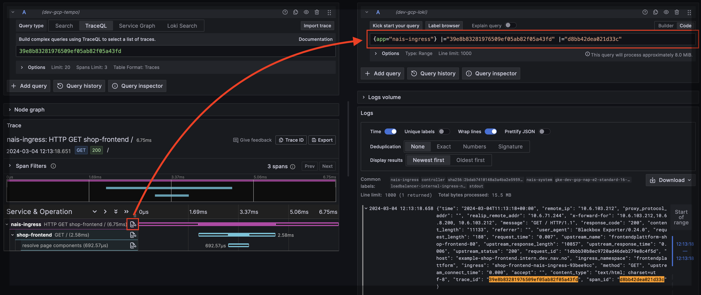

# Correlate traces and logs

This guide explains how to correlate traces with logs in Grafana Tempo. When set up correctly, clicking a trace shows the associated logs — and clicking a log line links back to its trace.

## Prerequisites

1. [Auto-instrumentation enabled](../../how-to/auto-instrumentation.md) (or manual OTel SDK setup)
2. [Logs sent to Grafana Loki](../../logging/how-to/loki.md#enable-logging-to-grafana-loki)

## How it works

The OTel Java agent automatically injects `trace_id` and `span_id` into your logging framework's MDC (Mapped Diagnostic Context). If your log output includes MDC fields, correlation works out of the box — no extra dependencies needed.

**Most Nav apps already have this working.** If you use `LogstashEncoder` (which outputs all MDC fields as JSON), trace context is already in your logs.

## Verify it works

1. Open [Nais APM](<<tenant_url("grafana", "a/nais-apm-app")>>) and find a trace for your service
2. Click "View logs" — if correlated logs appear, you're done

If logs don't appear, check the troubleshooting section below.

## Log format requirements

=== "logback (LogstashEncoder)"

    If you use `LogstashEncoder`, all MDC fields (including `trace_id` and `span_id`) are included automatically:

    ```xml
    <appender name="STDOUT" class="ch.qos.logback.core.ConsoleAppender">
        <encoder class="net.logstash.logback.encoder.LogstashEncoder" />
    </appender>
    ```

    No extra dependencies or appender wrapping needed when using auto-instrumentation.

=== "logback (PatternLayout)"

    If you use a plain `PatternLayout`, add `%X{trace_id}` and `%X{span_id}` to your pattern:

    ```xml
    <pattern>%d{HH:mm:ss.SSS} [%t] %-5level %logger{36} traceId=%X{trace_id} spanId=%X{span_id} - %msg%n</pattern>
    ```

=== "log4j2"

    Log4j2 context data injection is automatic with the OTel agent. Use `%X{trace_id}` in your pattern:

    ```xml
    <PatternLayout pattern="%d{HH:mm:ss.SSS} [%t] %-5level %logger{36} traceId: %X{trace_id} spanId: %X{span_id} - %msg%n" />
    ```

=== "@navikt/pino-logger"

    Correlation is automatic with Node.js auto-instrumentation. The trace and span IDs are included in logs without extra config.

    If you use Next.js, add the packages to `serverExternalPackages` to prevent tree-shaking:

    ```javascript
    // next.config.js
    module.exports = {
      serverExternalPackages: ['@navikt/pino-logger', 'pino'],
    };
    ```

=== "@navikt/next-logger"

    Correlation is automatic with Node.js auto-instrumentation.

    Add to `serverExternalPackages`:

    ```javascript
    // next.config.js
    module.exports = {
      serverExternalPackages: ['@navikt/next-logger', 'pino'],
    };
    ```

## Without auto-instrumentation

If your app does **not** use Nais auto-instrumentation, you need to inject trace context into MDC manually. Add the OpenTelemetry logback appender:

```
io.opentelemetry.instrumentation:opentelemetry-logback-mdc-1.0:2.16.0-alpha
```

```xml
<appender name="OTEL" class="io.opentelemetry.instrumentation.logback.mdc.v1_0.OpenTelemetryAppender">
    <appender-ref ref="STDOUT" />
</appender>

<root level="INFO">
    <appender-ref ref="OTEL" />
</root>
```

## Troubleshooting

If trace-log correlation isn't working:

1. **Check your logs contain `trace_id`** — query Loki for your app and look for the field
2. **Verify auto-instrumentation is enabled** — check your nais.yaml has `autoInstrumentation.enabled: true`
3. **Check LogstashEncoder** — if you use a custom pattern, make sure `%X{trace_id}` is included

## Result

When correlation works, Grafana Tempo shows associated logs inline with your trace:


