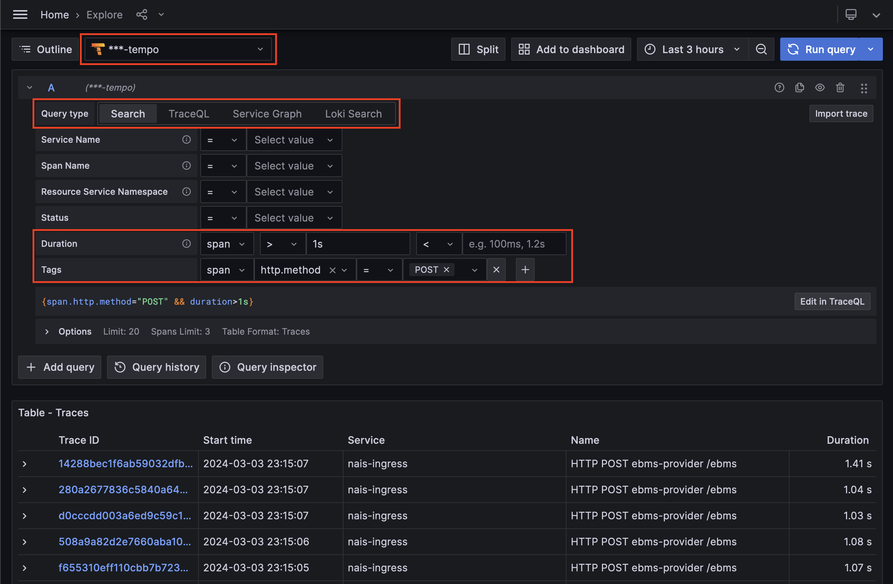
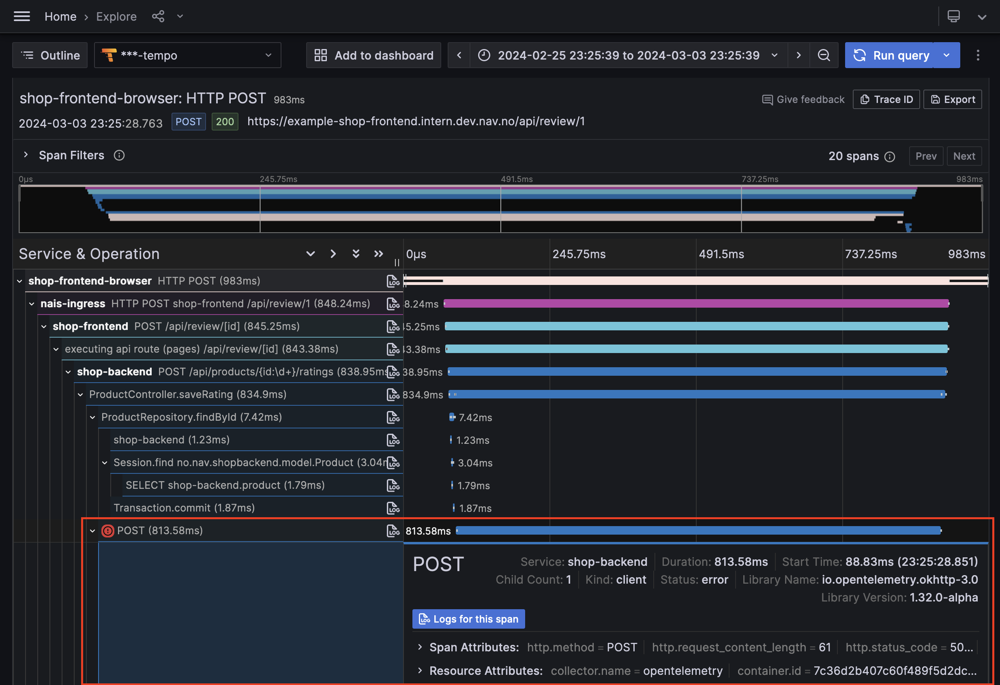

# Get started with Grafana Tempo

Grafana Tempo is an open-source, easy-to-use, high-scale, and cost-effective distributed tracing backend that stores and queries traces in a way that is easy to understand and use. It is fully integrated with Grafana, allowing you to visualize and query traces in the same interface as your metrics, and logs.

Since NAIS does not collect application trace data automatically, you need to enable tracing in your application. The preferred way to get started with tracing is to enable auto-instrumentation for your application. This will automatically collect traces and send them to the correct place using the OpenTelemetry Agent.

[:dart: Get started with auto-instrumentation](../../how-to/auto-instrumentation.md)

Once you have traces being collected, you can visualize and query them in Grafana using the Grafana Tempo data source. To get started with Tempo, you can use the Explore view in Grafana, which provides a user-friendly interface for querying and visualizing traces.

[:simple-grafana: Open Grafana Explore](<<tenant_url("grafana")>>)

## Querying traces in Grafana Tempo

The easiest way to get started with querying traces in Grafana Tempo is to use the query builder mode. The query builder mode is a graphical interface that helps you build LogQL queries by selecting labels and fields from your logs.

Start by selecting the tempo data source for the environment you want to query traces for (one ending with `-tempo`). Then select the Search query type to open the query builder mode.

Here you can select the service you want to query traces for, and then select the operation you want to query traces for. You can also add filters to your query to narrow down the results.

Bellow the query builder you will see the TraceQL query that is being built as you select tags and fields. You can also edit the TraceQL query directly if you want to write your own queries.

Click the `Run query` button to run the query and see the results. You can also add the query to a dashboard by clicking the `Add to dashboard` button.

[:octicons-link-external-24: Learn more about Grafana Tempo query editor on grafana.com](https://grafana.com/docs/grafana/latest/datasources/tempo/query-editor/)

### TraceQL query language

Grafana Tempo uses the TraceQL query language to query traces. TraceQL is a query language for querying trace data, and it is based on the LogQL query language used by Grafana Loki for querying logs and the PromQL query language used by Prometheus for querying metrics.

TraceQL provides a powerful and flexible way to query trace data, and it is designed to be easy to use and understand. You can use TraceQL to filter and aggregate trace data, and to create visualizations and alerts based on trace data.

<iframe title="vimeo-player" src="https://player.vimeo.com/video/796408188?h=b3e8e3257b" width="100%" height="360" frameborder="0" allowfullscreen></iframe>

[:books: Learn more about TraceQL query language](../reference/traceql.md)

## Understanding trace data

Clicking a trace in the query results will open the trace view, which provides a detailed view of the trace data. Here you can see the trace ID, the duration of the trace, and the services and operations involved in the trace.

Trace data is visualized as a tree, where each node represents a span in the trace. You can expand and collapse nodes to see more or less detail, and you can click a node to see more information about the span.

A red circle next to a span indicates that the span has an error. You can click the span to see more information about the error.

Traces in nais follows the OpenTelemetry Semantic Conventions, which provides a standard for naming and structuring trace data. This makes it easier to understand and use trace data, as you can rely on a consistent structure across all traces.

[:books: Learn more about OpenTelemetry Trace Semantic Conventions](../reference/trace-semconv.md)

