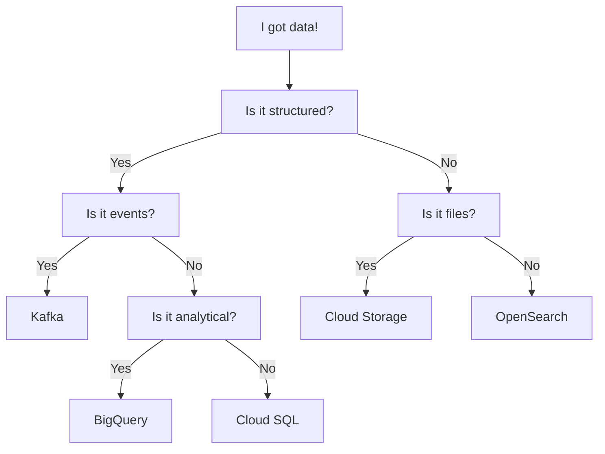

# Persistent Data

In this section we will discuss how to work with persistent data in your
applications and the different options available to you.

Persistent data is data that is stored on disk and survives application
restarts. This is in contrast to ephemeral data which is stored in memory
and is lost when the application is restarted.

## Responsibilities

The team is reponsible for any data that is stored in the various storage
options that are available through the platform. You can read more in the
[Data Responsibilities](./responsibilities.md) section.

## Availability

Some of the storage options are only available from certain environments. Make
sure to check what storage options are available in your environment in the
[Storage Comparison](#storage-comparison) section below.

## What should I choose?

Sequence of questions to ask yourself when choosing the right storage option.
Choose wisely.

## Storage Comparison

Below is a list of the different storage options available to you.

| Name                            | Type        | Recommendation | Availability | Backup |
|---------------------------------|-------------|:--------------:|:-----------:|:------:|
| [Kafka](#kafka)                 | Streaming   | ✅             | All         | Yes*   |
| [Cloud Storage](#cloud-storage) | Object      | ✅             | GCP         | Yes*   |
| [Cloud SQL](#cloud-sql)         | Relational  | ✅             | GCP         | Yes    |
| [BigQuery](#bigquery)           | Relational  | ✅             | GCP         | Yes*   |
| [Elasticsearch](#elasticsearch) | Document    | ⚠️              | All         | Yes    |
| [OpenSearch](#opensearch)       | Document    | ✅             | All         | Yes    |
| [InfluxDB](#influxdb)           | Time Series | ⚠️              | All         | Yes    |
| [IBM MQ](#ibm-mq)               | Message     | ⚠️              | All         | Yes*   |

\* Data is highly available and fault-tolerant but not backed up if deleted by
mistake.

## Kafka

Kafka is a streaming platform that is used for storing and processing data. It
is a very powerful tool that can be used for a wide variety of use cases. It is
also a very complex tool that requires a lot of knowledge to use effectively.

[:octicons-arrow-right-24: Getting started with Kafka](./kafka/README.md)

## Cloud Storage (Buckets)

Cloud Storage is a service that provides object storage. It is a very simple
service that is easy to use and provides a lot of flexibility. It is a good
choice for storing data that is not relational in nature.

[:octicons-arrow-right-24: Getting started with Cloud Storage](./buckets.md)

## Cloud SQL

Cloud SQL is a PostgreSQL relational database service that is provided by Google
Cloud Platform. It is a good choice for storing data that is relational in
nature.

[:octicons-arrow-right-24: Getting started with Cloud Storage](./postgres.md)

## BigQuery

BigQuery is a service that provides a relational database that is optimized for
analytical workloads. It is a good choice for storing data that is relational in
nature.

[:octicons-arrow-right-24: Getting started with Google BigQuery](./bigquery.md)

## OpenSearch

OpenSearch is a document database that is used for storing and searching data.
It is a good choice for storing data that is not relational in nature.
OpenSearch offers a drop-in replacement for Elasticsearch.

[:octicons-arrow-right-24: Getting started with OpenSearch](./open-search.md)

## InfluxDB

!!! warning "Deprecated"

    InfluxDB is deprecated and will be removed in the future. For many use cases
    [BigQuery](#bigquery) will be a suitable replacement.

InfluxDB is a time series database that is used for storing and querying data.
It is a good choice for storing data that is not relational in nature.

[:octicons-arrow-right-24: Getting started with InfluxDB](./influxdb.md)

## Redis

!!! warning "Unsupported"

    Redis is not officially supported by the platform. It is provided as a
    reference and operated by the application team.

Redis is a key value database that is used for storing and querying data. It is
a good choice for storing data that is not relational in nature.

[:octicons-arrow-right-24: Getting started with Redis](./redis.md)

## IBM MQ

!!! warning "Legacy"

    IBM MQ is considered legacy technology. Please use [Kafka](#kafka) instead.

ActiveMQ is a message broker that is used for storing and processing messages.
It is a good choice for storing data that is not relational in nature.

[:octicons-arrow-right-24: Getting started with ActiveMQ](./mq.md)

## MongoDB

!!! warning "Unsupported"

    MongoDB is not officially supported by the platform. It is provided as a
    reference. Please concider [Cloud SQL](#cloud-sql) and [PostgreSQL JSON
    Types][postgres-json-types] which are supported since PostgreSQL 10.

    [postgres-json-types]: https://www.postgresql.org/docs/current/datatype-json.html

MongoDB is a document database that is used for storing and searching data. It
is a good choice for storing data that is not relational in nature.

[:octicons-arrow-right-24: Run your own MongoDB in GCP](./mongodb-in-gcp.md)
