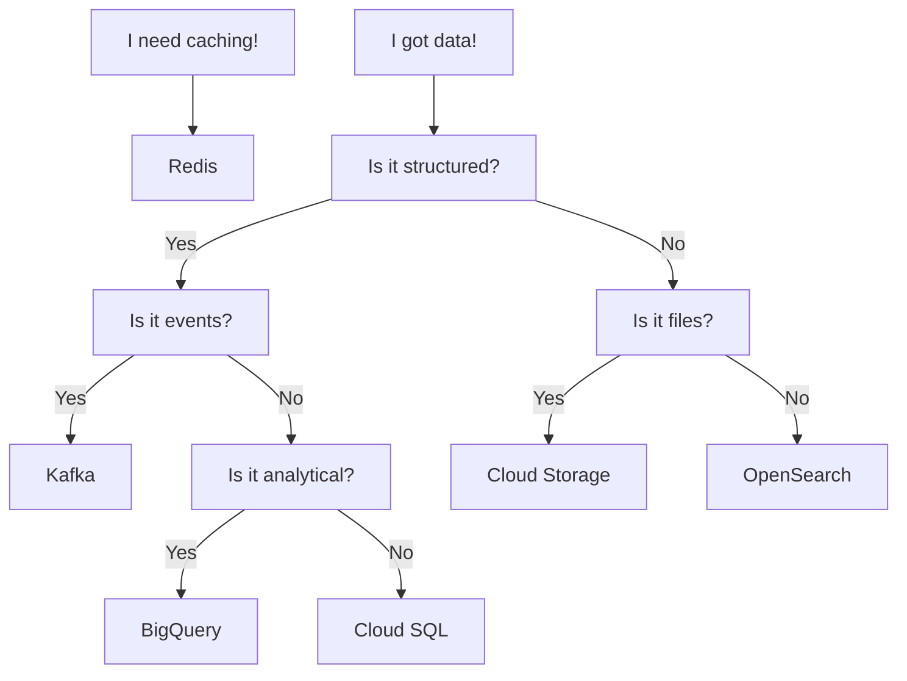

# Persistent Data Overview

In this section we will discuss how to work with persistent data in your
applications and the different options available to you.

Persistent data is data that is stored on disk and survives application
restarts. This is in contrast to ephemeral data which is stored in memory
and is lost when the application is restarted.

## Responsibilities

The team is responsible for any data that is stored in the various storage
options that are available through the platform. You can read more in the
[Data Responsibilities](explanations/responsibilities.md) section.

## Availability

Some of the storage options are only available from certain environments. Make
sure to check what storage options are available in your environment in the
[Storage Comparison](#storage-comparison) section below.

## What should I choose?

Sequence of questions to ask yourself when choosing the right storage option.
Choose wisely.

## Storage Comparison

Below is a list of the different storage options available to you.

| Name                                    | Type        | Availability | Backup |
|-----------------------------------------|-------------|:------------:|:------:|
| [Kafka](#kafka)                         | Streaming   |     All      |  Yes*  |
| [Cloud Storage](#cloud-storage-buckets) | Object      |     GCP      |  Yes*  |
| [Cloud SQL](#cloud-sql)                 | Relational  |     GCP      |  Yes   |
| [BigQuery](#bigquery)                   | Relational  |     GCP      |  Yes*  |
| [OpenSearch](#opensearch)               | Document    |     GCP      |  Yes   |
| [Redis](#redis)                         | Key/Value   |     GCP      |  Yes   |

\* Data is highly available and fault-tolerant but not backed up if deleted by
mistake.

## Kafka

Kafka is a streaming platform that is used for storing and processing data. It
is a very powerful tool that can be used for a wide variety of use cases. It is
also a very complex tool that requires a lot of knowledge to use effectively.

[:bulb: Learn more about Kafka](./kafka/README.md)

## Cloud Storage (Buckets)

Cloud Storage is a service that provides object storage. It is a very simple
service that is easy to use and provides a lot of flexibility. It is a good
choice for storing data that is not relational in nature.

[:bulb: Learn more about Cloud Storage](./buckets/README.md)

## Cloud SQL

Cloud SQL is a PostgreSQL relational database service that is provided by Google
Cloud Platform. It is a good choice for storing data that is relational in
nature.

[:bulb: Learn more about Cloud SQL](./postgres/README.md)

## BigQuery

BigQuery is a service that provides a relational database that is optimized for
analytical workloads. It is a good choice for storing data that is relational in
nature.

[:bulb: Learn more about Google BigQuery](./bigquery/README.md)

## OpenSearch

OpenSearch is a document database that is used for storing and searching data.
It is a good choice for storing data that is not relational in nature.
OpenSearch offers a drop-in replacement for Elasticsearch.

[:bulb: Learn more about OpenSearch](./opensearch/README.md)

## Redis

Redis is a key value database that is used for storing and querying data. It is
a good choice for storing data that is not relational in nature and often used
for caching.

[:bulb: Learn more about Redis](./redis/README.md)
