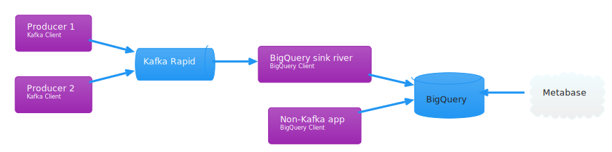

# InfluxDB

!!! info "Aiven discontinues InfluxDB"
    Aiven has informed us that they will discontinue support for InfluxDB. 
    The timeline is yet to be confirmed, but could be as early as end-of-year 2022. 
    We recommend that teams using InfluxDB today find other alternatives suitable for their use case.

## Suggested alternative

Team Digihot has spent some time piloting a concept that uses BigQuery and Metabase as a replacement for InfluxDB and Grafana.
They are very satisfied with the solution, and we have concluded that this is a viable replacement going forward.
In their case, all applications that sent data to InfluxDB also used Kafka, so their solution is based around Kafka.
Depending on the situation and use case, it would also be possible to send data to BigQuery directly from the applications.

Once the data is in BigQuery, you can use Metabase to create dashboards or dataproducts.



## Reference documentation for existing instances of InfluxDB

### Username and password
For now we are manually distributing the username and password for each instance.
There is only one user for Influxdb. Contact us in [#pig-aiven](https://nav-it.slack.com/archives/C018L1JATBQ) to get your credentials.

### Default database name
The default database name is `defaultdb`.

### Retention policies
The default database is created with a default retention policy of 30 days. You might want to adjust this by e.g. creating a new default retention policy with 1 year retention:

```
create retention policy "365d" on "defaultdb" duration 365d replication 1 shard duration 1w default
```

### Datasource in grafana.adeo.no
Let us know in [#pig-aiven](https://nav-it.slack.com/archives/C018L1JATBQ) if you want your Influxdb to be exposed at grafana.adeo.no.
This means that everyone can access your data.

### Access from Nais-app
If you need access from an application, you need to specify Inluxdb instance.
See [nais.yaml-reference](../nais-application/application.md#influxinstance).

#### Loading CA-certificate
Your application will also need an CA-certificate for your app to be able to connect to Aiven with SSL. The certificate will be loaded into your pod as an environment variable if you define a [`.spec.kafka.pool`](../nais-application/application.md#kafkapool) in your nais.yaml file.

### Access from laptop
With Naisdevice you have access to the _aiven-prod_ gateway.
This is a JITA (just in time access) gateway, so you need to describe why, but the access is automatically given.

```
influx -username avnadmin -password foo -host influx-instancename-nav-dev.aivencloud.com -port 26482 -ssl
```

PS: Remember to use Influxdb CLI pre v2. For example v1.8.3.

### Support
We do not offer support on Influxdb as software, but questions about Aiven and provisioning can be directed to [#pig_aiven](https://nav-it.slack.com/archives/C018L1JATBQ) on Slack.
