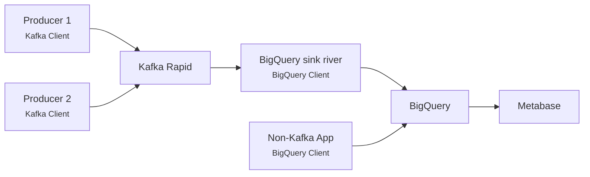

# InfluxDB

During 2021 Aiven informed us that they would probably stop supporting InfluxDB at some point in the next couple years, but that no final decision was made.
For that reason, we discouraged use of Aiven InfluxDB and recommended that teams instead build a solution based around BigQuery for these kinds of business metrics.

At the start of 2023, Aiven informed us that dropping InfluxDB was no longer in the roadmap, and that InfluxDB support would continue for the foreseeable future.
However, Aiven is still only supporting InfluxDB 1.8, and we have seen no plans to allow upgrading to InfluxDB 2.
For many use cases, the BigQuery alternative might be a better fit.

See the end of this document for a description of [the BigQuery alternative](#suggested-alternative).

## Reference documentation for Aiven InfluxDB

### Getting started

As there are few teams that need an InfluxDB instance we use a IaC-repo to provision each instance.
Head over to [aiven-iac](https://github.com/navikt/aiven-iac#influxdb) to learn how to get your own instance.

### Access from Nais-app

If you need access from an application, you need to specify InfluxDB instance.
See [nais.yaml-reference](../nais-application/application.md#influxinstance).

When an application requesting an InfluxDB instance is deployed, credentials will be provided as environment variables.
There is only one user for Influxdb, with complete access.
The service URI and the name of the database is also available, as well as the relevant project Certificate Authority.

| Environment variable | Description                 |
|----------------------|-----------------------------|
| INFLUXDB_USERNAME    | Username                    |
| INFLUXDB_PASSWORD    | Password                    |
| INFLUXDB_URI         | Service URI                 |
| INFLUXDB_NAME        | Database name               |
| AIVEN_CA             | Aiven certificate authority | 


### Retention policies
The default database is created with a default retention policy of 30 days. You might want to adjust this by e.g. creating a new default retention policy with 1 year retention:

```
create retention policy "365d" on "defaultdb" duration 365d replication 1 shard duration 1w default
```

### Datasource in Grafana

Let us know in [#nais](https://nav-it.slack.com/archives/C5KUST8N6) if you want your InfluxDB to be exposed in Grafana.
This means that everyone can access your data.

### Access from laptop

With Naisdevice you have access to the _aiven-prod_ gateway.
This is a JITA (just in time access) gateway, so you need to describe why, but the access is automatically given.

```
influx -username avnadmin -password foo -host influx-instancename-nav-dev.aivencloud.com -port 26482 -ssl
```

PS: Remember to use Influxdb CLI pre v2. For example v1.8.3.

### Support

We do not offer support on Influxdb as software, but questions about Aiven and provisioning can be directed to [#nais](https://nav-it.slack.com/archives/C5KUST8N6) on Slack.


## Suggested alternative

Team Digihot has spent some time piloting a concept that uses BigQuery and Metabase as a replacement for InfluxDB and Grafana.
They are very satisfied with the solution, and we have concluded that this is a viable replacement going forward.
In their case, all applications that sent data to InfluxDB also used Kafka, so their solution is based around Kafka.
Depending on the situation and use case, it would also be possible to send data to BigQuery directly from the applications.

Once the data is in BigQuery, you can use Metabase to create dashboards or dataproducts.



