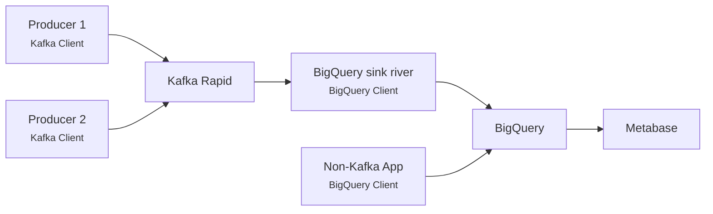

# InfluxDB

!!! warning "Deprcated"

    During 2021 Aiven informed us that they would probably stop supporting InfluxDB at some point in the next couple years, but that no final decision was made.
    For that reason, we discouraged use of Aiven InfluxDB and recommended that teams instead build a solution based around BigQuery for these kinds of business metrics.

    At the start of 2023, Aiven informed us that dropping InfluxDB was no longer in the roadmap, and that InfluxDB support would continue for the foreseeable future.
    However, Aiven is still only supporting InfluxDB 1.8, and they have no plans to allow upgrading to InfluxDB 2 because of licensing issues.

    For that reason, we still discourage use of Aiven InfluxDB for new use cases.
    For many use cases, the BigQuery alternative might be a better fit.

    See the end of this document for a description of [the BigQuery alternative](#suggested-alternative).

## Getting started

As there are few teams that need an InfluxDB instance we use a IaC-repo to provision each instance.
Head over to [aiven-iac](https://github.com/navikt/aiven-iac#influxdb) to learn how to get your own instance.

:dart: [Create an InfluxDB instance](how-to/create.md)

:dart: [Access InfluxDB from an application](how-to/access.md)

## Support

We do not offer support on Influxdb as software, but questions about Aiven and provisioning can be directed to [#nais](https://nav-it.slack.com/archives/C5KUST8N6) on Slack.

## Suggested alternative

Team Digihot has spent some time piloting a concept that uses BigQuery and Metabase as a replacement for InfluxDB and Grafana.
They are very satisfied with the solution, and we have concluded that this is a viable replacement going forward.
In their case, all applications that sent data to InfluxDB also used Kafka, so their solution is based around Kafka.
Depending on the situation and use case, it would also be possible to send data to BigQuery directly from the applications.

Once the data is in BigQuery, you can use Metabase to create dashboards or dataproducts.

