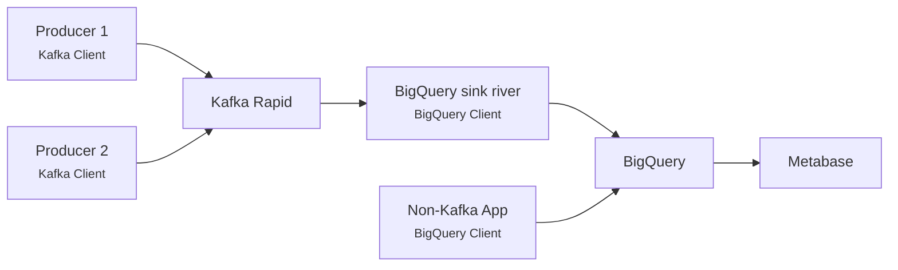

# InfluxDB

!!! warning "Deprcated"

    Aiven has announced end-of-life for InfluxDB as a service on April 30th, 2025. All existing instances will be terminated by that date.

## Suggested alternative

Team Digihot has spent some time piloting a concept that uses BigQuery and Metabase as a replacement for InfluxDB and Grafana.
They are very satisfied with the solution, and we have concluded that this is a viable replacement going forward.
In their case, all applications that sent data to InfluxDB also used Kafka, so their solution is based around Kafka.
Depending on the situation and use case, it would also be possible to send data to BigQuery directly from the applications.

Once the data is in BigQuery, you can use Metabase to create dashboards or dataproducts.

